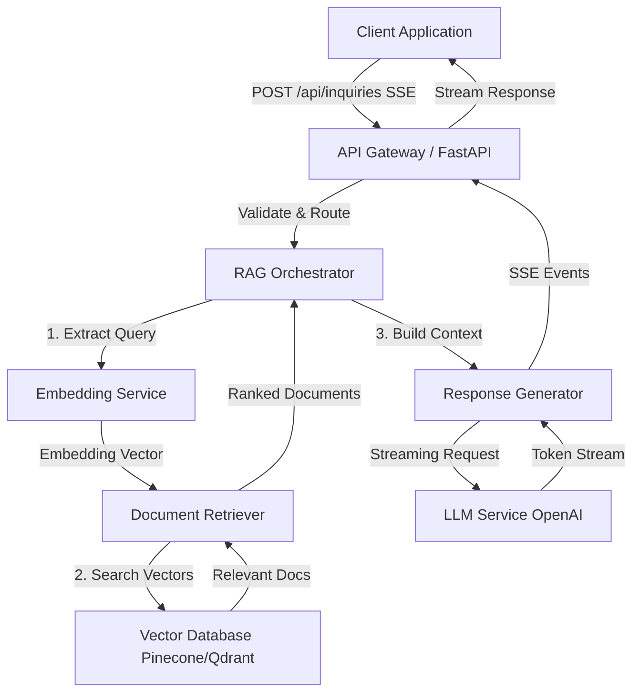
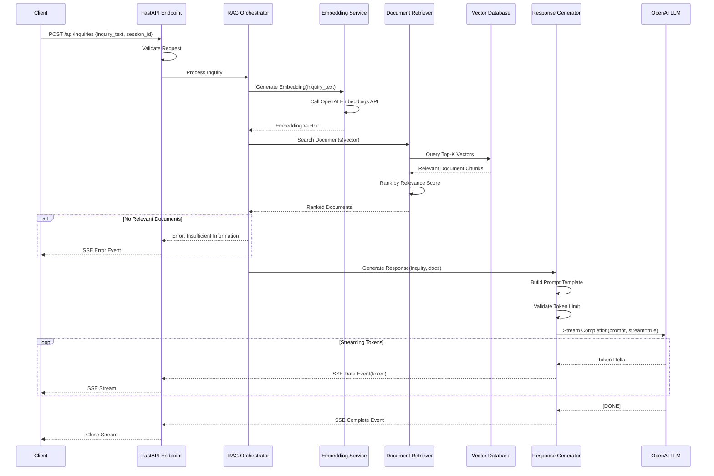
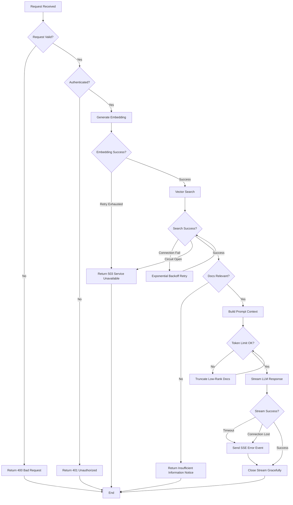
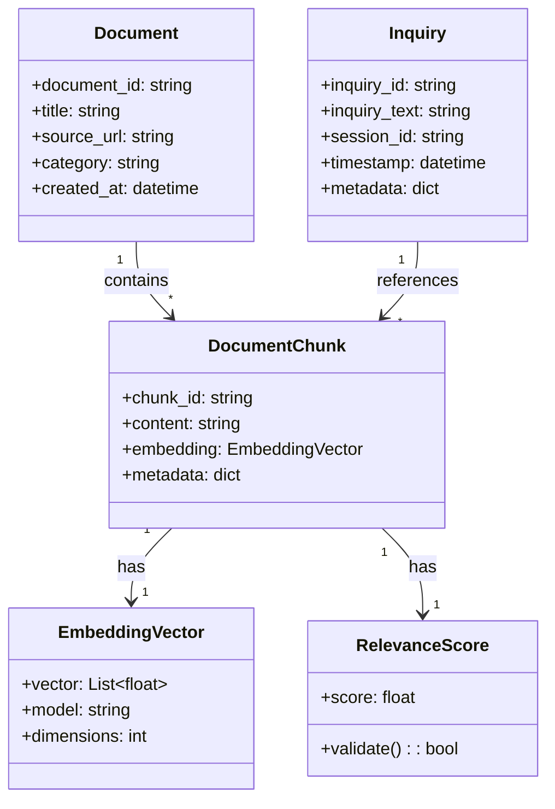

# Technical Design Document

## Overview

본 기능은 고객지원(Customer Support)에서의 문의 대응을 자동화하는 RAG(Retrieval-Augmented Generation) 기반 백엔드 API 서비스를 제공한다. 사용자의 문의를 수신하고, 벡터 데이터베이스에서 관련 문서를 시맨틱 검색한 뒤, LLM으로 답변을 생성하여 Server-Sent Events(SSE)로 스트리밍 전송한다.

**Purpose**: 문의 대응 자동화를 통해 서포트 팀의 효율을 높이고 고객 대기 시간을 단축한다.

**Users**: 고객지원 시스템의 프런트엔드, 챗봇, 문의 관리 툴이 본 API를 사용해 엔드유저에게 즉시 AI 생성 답변을 제공한다.

**Impact**: 기존의 수동 대응 또는 템플릿 답변에서 컨텍스트 기반의 동적 AI 답변 생성으로 전환하여, 답변 정확도와 응답 속도를 크게 개선한다.

### Goals

- 문의 내용에 기반해 관련 문서를 고정밀로 검색한다
- LLM으로 자연스럽고 정확한 답변을 실시간 스트리밍으로 생성한다
- 고부하 상황에서도 안정적인 성능과 확장성을 유지한다
- 안전한 인증과 입력 검증으로 시스템을 보호한다
- 포괄적인 모니터링과 관측 가능성(Observability)으로 운영 품질을 확보한다

### Non-Goals

- 대화 이력의 영속화(세션 관리는 외부 시스템에서 수행)
- 멀티턴 대화의 컨텍스트 관리(초기 구현은 싱글턴만)
- 문서 관리 기능(업로드, 업데이트, 삭제는 별도 서비스)
- 프런트엔드 UI 제공(API만 제공)
- 실시간 학습·파인튜닝(향후 확장)

## Architecture

### Architecture Pattern & Boundary Map

**선정 패턴**: Modular RAG Architecture

본 설계는 Retriever(검색), Generator(생성), Orchestrator(제어)를 독립 컴포넌트로 분리하는 Modular RAG 패턴을 채택한다. 이 패턴을 통해 각 컴포넌트의 책임이 명확해지고, 독립적인 테스트·배포·확장이 가능해진다.



**Domain Boundaries**:

- **API Layer**: 요청 수신, 인증, 밸리데이션, SSE 스트리밍 제어
- **Orchestrator**: RAG 플로우 제어, 에러 핸들링, 컨텍스트 관리
- **Retriever**: 벡터 검색, 랭킹, 문서 필터링
- **Generator**: LLM 호출, 프롬프트 구성, 스트리밍 제어
- **External Services**: Embedding API、Vector Database、LLM API

**Existing Patterns Preserved**: 신규 구현이므로 해당 없음

**New Components Rationale**:

- **RAG Orchestrator**: 검색과 생성 플로우를 조정하고, 에러 핸들링 및 재시도 로직을 집약
- **Document Retriever**: 벡터 검색 로직을 추상화하여 향후 하이브리드 검색 또는 리랭킹 확장에 대응
- **Response Generator**: LLM 스트리밍 처리를 분리해 프롬프트 템플릿 관리 및 토큰 제어를 책임으로 둔다

**Steering Compliance**: 신규 프로젝트이므로 기존 steering 룰은 없지만, 모듈러 설계, 타입 안정성, 관측 가능성 원칙을 준수한다.

### Technology Stack

| Layer | Choice / Version | Role in Feature | Notes |
|-------|------------------|-----------------|-------|
| Backend / Services | FastAPI 0.115+ | API 엔드포인트, 요청 처리, SSE 스트리밍 | Async/await 지원, Pydantic 타입 안정성, OpenAPI 자동 문서 |
| Backend / Services | Uvicorn 0.32+ | ASGI 서버 | FastAPI 실행 환경, 고속 비동기 처리 |
| Backend / Services | sse-starlette 2.2+ | SSE 구현 | W3C 준수, EventSourceResponse 제공 |
| Data / Storage | Pinecone(초기) / Qdrant(대안) | 벡터 DB | 시맨틱 검색, 확장성 |
| External API | OpenAI text-embedding-3-small | Embedding 생성 | 비용 효율 중심, $0.02/백만 토큰 |
| External API | OpenAI GPT-4o / GPT-4o-mini | LLM 답변 생성 | 스트리밍 지원, 고정밀 답변 생성 |
| Infrastructure / Runtime | Python 3.11+ | 런타임 환경 | Async/await 최적화, 타입 힌트 강화 |
| Infrastructure / Runtime | Docker | 컨테이너화 | 환경 일관성, 배포 단순화 |

**Technology Selection Rationale**:

- **FastAPI**: 2025년 기준 Python API 백엔드의 표준 선택지. Async 지원으로 SSE 및 LLM API 호출을 병렬로 처리하기 효율적. 자세한 내용은 `research.md`참조.
- **Pinecone vs Qdrant**: Pinecone은 완전 매니지드로 운영 부담이 최소, Qdrant는 셀프호스팅 가능해 비용 통제가 용이. 초기 구현은 Pinecone, 향후 마이그레이션 경로를 고려해 설계. 자세한 내용은 `research.md`의 "벡터 데이터베이스 선정 조사" 참조.
- **OpenAI Embeddings**: text-embedding-3-small은 비용과 성능의 균형이 좋다. 대안으로 Sentence-Transformers 로컬 구현도 가능. 자세한 내용은 `research.md`의 "Embedding 모델 선정 조사" 참조.
- **SSE Protocol**: WebSocket보다 가볍고 HTTP 호환성이 높아 단방향 스트리밍에 적합. 자세한 내용은 `research.md`의 "스트리밍 프로토콜 선정" 참조.

## System Flows

### Primary Flow: 문의 처리 및 스트리밍 응답 생성



**Flow-Level Decisions**:

- **재시도 로직**: Embedding/VectorDB/LLM 호출 실패 시 지수 백오프로 재시도(최대 3회)
- **타임아웃**: 각 외부 API 호출에 10초 타임아웃 설정, 전체 플로우는 30초 타임아웃
- **에러 게이팅**: 검색 결과가 임계치(relevance score < 0.7) 미만이면 "정보 부족" 에러 반환
- **토큰 제한**: 프롬프트 전체가 LLM 컨텍스트 윈도우(예: GPT-4o 128k tokens)의 80%를 초과하면, 낮은 랭크 문서를 단계적으로 제거

### Error Handling Flow



## Requirements Traceability

| Requirement | Summary | Components | Interfaces | Flows |
|-------------|---------|------------|------------|-------|
| 1 | 문의 수신 API | API Gateway, InquiryEndpoint | POST /api/inquiries | Primary Flow |
| 2 | 문서 검색 기능 | Embedding Service, Document Retriever, Vector Database | EmbeddingService, RetrieverService | Primary Flow |
| 3 | 스트리밍 답변 생성 | Response Generator, LLM Service, SSE Handler | GeneratorService, SSE Events | Primary Flow |
| 4 | 컨텍스트 관리 | RAG Orchestrator, Prompt Builder | OrchestratorService | Primary Flow |
| 5 | 에러 핸들링 및 레질리언스 | Circuit Breaker, Retry Manager, Error Handler | ErrorHandlerService | Error Handling Flow |
| 6 | 성능 및 확장성 | Connection Pool, Async Handlers | Health Check Endpoint | - |
| 7 | 보안 및 데이터 보호 | Authentication Middleware, Input Validator | Auth Middleware | - |
| 8 | 모니터링 및 관측 가능성 | Metrics Collector, Structured Logger | Metrics Endpoint | - |

## Components and Interfaces

### Component Summary

| Component | Domain/Layer | Intent | Req Coverage | Key Dependencies (Criticality) | Contracts |
|-----------|--------------|--------|--------------|--------------------------------|-----------|
| InquiryEndpoint | API Layer | 문의 요청 수신 및 SSE 스트리밍 | 1, 3, 7 | RAG Orchestrator (P0), Auth Middleware (P0) | API, SSE |
| RAG Orchestrator | Orchestration | RAG 플로우 제어 및 에러 핸들링 | 4, 5 | Embedding Service (P0), Document Retriever (P0), Response Generator (P0) | Service |
| Embedding Service | Integration | 텍스트 벡터화 | 2 | OpenAI Embeddings API (P0) | Service |
| Document Retriever | Retrieval | 벡터 검색 및 랭킹 | 2 | Vector Database (P0) | Service |
| Response Generator | Generation | LLM 응답 생성 및 스트리밍 | 3, 4 | OpenAI LLM API (P0) | Service, Event |
| Auth Middleware | Security | 인증 및 인가 | 7 | - | API Middleware |
| Metrics Collector | Observability | 메트릭 수집 및 공개 | 8 | - | API |
| Health Check Service | Observability | 헬스체크 | 6, 8 | All External Services (P1) | API |

### API Layer

#### InquiryEndpoint

| Field | Detail |
|-------|--------|
| Intent | 문의 요청을 수신하고 SSE로 스트리밍 응답을 반환한다 |
| Requirements | 1, 3, 7 |

**Responsibilities & Constraints**

- 요청 밸리데이션(필수 필드 확인, UTF-8 인코딩 검증)
- 인증 토큰 검증(API Key / JWT)
- RAG Orchestrator로 요청 위임
- SSE 스트리밍 제어 및 에러 핸들링

**Dependencies**

- Inbound: Client Applications — HTTP 요청 전송 (P0)
- Outbound: RAG Orchestrator — RAG 처리 실행 (P0)
- Outbound: Auth Middleware — 인증 검증 (P0)

**Contracts**: [x] API [ ] Service [x] Event [ ] Batch [ ] State

##### API Contract

| Method | Endpoint | Request | Response | Errors |
|--------|----------|---------|----------|--------|
| POST | /api/inquiries | InquiryRequest | SSE Stream | 400, 401, 503, 500 |
| GET | /health | - | HealthStatus | 503, 500 |
| GET | /metrics | - | MetricsData | 500 |

**InquiryRequest Schema**:

```typescript
interface InquiryRequest {
  inquiry_text: string;        // Required, max 10000 chars, UTF-8
  session_id: string;           // Required, UUID format
  metadata?: {                  // Optional
    user_id?: string;
    timestamp?: string;         // ISO 8601
  };
}
```

**SSE Event Schema**:

```typescript
// Success Events
interface ResponseTokenEvent {
  event: "token";
  data: {
    content: string;            // Token delta
    sequence: number;           // Token sequence number
  };
}

interface ResponseCompleteEvent {
  event: "complete";
  data: {
    total_tokens: number;
    sources: DocumentSource[];  // Referenced documents
  };
}

// Error Events
interface ErrorEvent {
  event: "error";
  data: {
    error_code: string;         // "INSUFFICIENT_INFO" | "TIMEOUT" | "SERVICE_UNAVAILABLE"
    message: string;
    retry_after?: number;       // Seconds
  };
}
```

**Error Response Codes**:

- **400 Bad Request**: 필수 필드 누락, 잘못된 포맷
- **401 Unauthorized**: 인증 실패, 무효 토큰
- **503 Service Unavailable**: 외부 서비스 장애(LLM/VectorDB), 재시도 권장
- **500 Internal Server Error**: 예기치 않은 서버 에러

##### Event Contract

- **Published events**: `token`, `complete`, `error` (SSE)
- **Subscribed events**: 없음
- **Ordering / delivery guarantees**: 토큰은 생성 순서대로 전송, 연결 끊김 시 클라이언트에서 재연결

**Implementation Notes**

- **Integration**: `sse-starlette`의 EventSourceResponse 사용, Async generator로 토큰 스트림 생성
- **Validation**: Pydantic 모델로 요청 검증, UTF-8 인코딩 확인, 글자 수 제한 체크
- **Risks**: Nginx/로드밸런서에서 버퍼링이 활성화되어 있으면 스트리밍이 지연될 수 있음(X-Accel-Buffering: no 설정 필수)

### Orchestration Layer

#### RAG Orchestrator

| Field | Detail |
|-------|--------|
| Intent | Embedding 생성, 문서 검색, 응답 생성의 일련 플로우를 제어한다 |
| Requirements | 4, 5 |

**Responsibilities & Constraints**

- RAG 전체 플로우 조정(Embedding → Retrieval → Generation)
- 에러 핸들링 및 재시도 로직(지수 백오프)
- 컨텍스트 구성 및 토큰 제한 관리
- 서킷 브레이커 패턴 구현

**Dependencies**

- Inbound: InquiryEndpoint — 문의 처리 요청 (P0)
- Outbound: Embedding Service — Embedding 생성 (P0)
- Outbound: Document Retriever — 문서 검색 (P0)
- Outbound: Response Generator — 응답 생성 (P0)

**Contracts**: [x] Service [ ] API [ ] Event [ ] Batch [ ] State

##### Service Interface

```typescript
interface RAGOrchestratorService {
  processInquiry(request: InquiryRequest): AsyncGenerator<ResponseEvent, void, void>;
}

interface InquiryRequest {
  inquiry_text: string;
  session_id: string;
  metadata?: Record<string, unknown>;
}

type ResponseEvent =
  | { type: "token"; content: string; sequence: number }
  | { type: "complete"; total_tokens: number; sources: DocumentSource[] }
  | { type: "error"; error_code: string; message: string; retry_after?: number };

interface DocumentSource {
  document_id: string;
  title: string;
  relevance_score: number;
  source_url?: string;
}
```

- **Preconditions**: 요청은 사전에 밸리데이션 완료, 인증 완료
- **Postconditions**: 스트리밍 완료 또는 에러 이벤트 송신, 리소스 정리
- **Invariants**: 외부 서비스 장애 시 반드시 재시도 또는 에러 반환, 컨텍스트 토큰 수는 항상 LLM 제한 미만

**Implementation Notes**

- **Integration**: Async/await 패턴으로 각 서비스를 비동기로 호출, 에러 발생 시 지수 백오프 재시도(초기 1초, 최대 8초, 최대 3회)
- **Validation**: relevance_score 임계치(0.7) 미만 결과는 "정보 부족" 에러, 토큰 수가 LLM 제한의 80% 초과 시 낮은 랭크 문서 제거
- **Risks**: 외부 서비스(Embedding/VectorDB/LLM) 동시 장애 시 연쇄 장애가 발생할 수 있음(서킷 브레이커로 완화)

### Integration Layer

#### Embedding Service

| Field | Detail |
|-------|--------|
| Intent | 텍스트를 벡터화하여 시맨틱 검색용 Embedding을 생성한다 |
| Requirements | 2 |

**Responsibilities & Constraints**

- OpenAI text-embedding-3-small API 호출로 Embedding 생성
- 레이트 리밋 대응(지수 백오프 재시도)
- 에러 핸들링 및 폴백

**Dependencies**

- Inbound: RAG Orchestrator — Embedding 생성 요청 (P0)
- External: OpenAI Embeddings API — Embedding 생성 (P0)

OpenAI Embeddings API의 상세(레이트 리밋, 가격, 차원 스펙)는 research.md의 "Embedding 모델 선정 조사"를 참조.

**Contracts**: [x] Service [ ] API [ ] Event [ ] Batch [ ] State

##### Service Interface

```typescript
interface EmbeddingService {
  generateEmbedding(text: string): Promise<Result<EmbeddingVector, EmbeddingError>>;
  generateEmbeddingBatch(texts: string[]): Promise<Result<EmbeddingVector[], EmbeddingError>>;
}

interface EmbeddingVector {
  vector: number[];             // Length: 1536 for text-embedding-3-small
  model: string;                // "text-embedding-3-small"
  usage: {
    prompt_tokens: number;
    total_tokens: number;
  };
}

type EmbeddingError =
  | { type: "RateLimitError"; retry_after: number }
  | { type: "InvalidInputError"; message: string }
  | { type: "ServiceUnavailableError"; message: string };
```

- **Preconditions**: 텍스트는 8191 토큰 이하(text-embedding-3-small 제한)
- **Postconditions**: 성공 시 EmbeddingVector 반환, 실패 시 에러 타입 반환
- **Invariants**: 레이트 리밋 초과 시 반드시 재시도, 무효 입력은 즉시 에러 반환

**Implementation Notes**

- **Integration**: OpenAI Python SDK 사용, 타임아웃 10초, 커넥션 풀 활성화
- **Validation**: 입력 텍스트 토큰 수를 사전 계산(tiktoken 사용), 제한 초과 시 에러 반환
- **Risks**: 레이트 리밋 재시도 대기 중 전체 플로우 타임아웃이 발생할 수 있음(Orchestrator 레벨 타임아웃 감시로 완화)

#### Document Retriever

| Field | Detail |
|-------|--------|
| Intent | 벡터 DB에서 관련 문서를 검색하고 관련도 기준으로 랭킹한다 |
| Requirements | 2 |

**Responsibilities & Constraints**

- 벡터 DB(Pinecone/Qdrant) 쿼리 수행
- Top-K 검색 및 스코어 기반 랭킹
- 커넥션 풀 및 재시도 관리

**Dependencies**

- Inbound: RAG Orchestrator — 문서 검색 요청 (P0)
- External: Vector Database (Pinecone/Qdrant) — 벡터 검색 (P0)

Pinecone/Qdrant의 선정 근거 및 API 스펙은 `research.md`의 "벡터 데이터베이스 선정 조사"를 참조.

**Contracts**: [x] Service [ ] API [ ] Event [ ] Batch [ ] State

##### Service Interface

```typescript
interface DocumentRetrieverService {
  searchDocuments(query: SearchQuery): Promise<Result<DocumentChunk[], RetrievalError>>;
}

interface SearchQuery {
  embedding: number[];
  top_k: number;                // Default: 5, Range: 1-20
  min_relevance_score: number;  // Default: 0.7, Range: 0.0-1.0
  filters?: MetadataFilter;     // Optional metadata filters
}

interface DocumentChunk {
  chunk_id: string;
  document_id: string;
  content: string;
  metadata: {
    title: string;
    source_url?: string;
    timestamp?: string;
    category?: string;
  };
  relevance_score: number;      // Cosine similarity score
}

type RetrievalError =
  | { type: "ConnectionError"; retry: boolean }
  | { type: "TimeoutError"; message: string }
  | { type: "NoResultsError"; message: string };
```

- **Preconditions**: 쿼리 Embedding은 유효 벡터(차원 수 일치)
- **Postconditions**: 관련도 내림차순 정렬된 문서 청크 반환, 임계치 미만은 제외
- **Invariants**: 검색 실패 시 재시도 또는 에러 반환, 커넥션 풀은 항상 활성 유지

**Implementation Notes**

- **Integration**: Pinecone Python SDK 사용(초기 구현), 커넥션 풀 최대 10, 타임아웃 5초
- **Validation**: top_k 범위 체크(1-20), relevance_score 임계치 적용(기본 0.7)
- **Risks**: VectorDB 장애 시 폴백 검색 없음(향후 키워드 검색 폴백 구현 검토)

#### Response Generator

| Field | Detail |
|-------|--------|
| Intent | LLM으로 답변을 생성하고 토큰을 스트리밍 전송한다 |
| Requirements | 3, 4 |

**Responsibilities & Constraints**

- 프롬프트 템플릿 구성(문의 + 검색 문서)
- 토큰 제한 관리 및 컨텍스트 트렁케이션
- OpenAI LLM API에 스트리밍 요청
- SSE 이벤트 생성 및 에러 핸들링

**Dependencies**

- Inbound: RAG Orchestrator — 응답 생성 요청 (P0)
- External: OpenAI LLM API (GPT-4o/GPT-4o-mini) — 스트리밍 생성 (P0)

OpenAI LLM API의 스트리밍 스펙은 `research.md`의 "LLM 스트리밍 API 조사"를 참조.

**Contracts**: [x] Service [ ] API [x] Event [ ] Batch [ ] State

##### Service Interface

```typescript
interface ResponseGeneratorService {
  generateStreamingResponse(request: GenerationRequest): AsyncGenerator<GenerationEvent, void, void>;
}

interface GenerationRequest {
  inquiry_text: string;
  documents: DocumentChunk[];
  session_id: string;
  model?: string;               // Default: "gpt-4o-mini"
  max_tokens?: number;          // Default: 2000
  temperature?: number;         // Default: 0.7
}

type GenerationEvent =
  | { type: "token"; content: string; sequence: number }
  | { type: "complete"; total_tokens: number; finish_reason: string }
  | { type: "error"; error_code: string; message: string };
```

- **Preconditions**: 문서 리스트는 관련도 기준 정렬 완료, 문의 텍스트는 사전 sanitize 완료
- **Postconditions**: 스트리밍 완료 또는 에러 이벤트 송신, API 리소스 해제
- **Invariants**: 프롬프트 전체는 LLM 컨텍스트 윈도우의 80% 미만, Prompt Injection 대응으로 입력 sanitize 수행

##### Event Contract

- **Published events**: `token`(토큰 전송), `complete`(생성 완료), `error`(에러 통지)
- **Subscribed events**: 없음
- **Ordering / delivery guarantees**: 토큰은 LLM 생성 순서로 전송, 네트워크 장애 시 에러 이벤트 전송 후 연결 종료

**Implementation Notes**

- **Integration**: OpenAI Python SDK 사용, `stream=True`로 스트리밍 활성화, 타임아웃 30초
- **Validation**: 프롬프트 구성 후 토큰 수 카운트(tiktoken 사용), 제한 초과 시 낮은 랭크 문서를 단계적으로 제거
- **Risks**: LLM API 타임아웃 시 클라이언트 에러 통지가 지연될 수 있음(Orchestrator 레벨 타임아웃 감시로 완화)

**Prompt Template**:

```
당신은 유능한 고객지원 담당자입니다. 아래의 관련 문서를 참고하여 사용자의 문의에 정확하고 정중하게 답변하세요.

## 문의 내용
{inquiry_text}

## 참고 문서
{documents}

## 답변 생성 규칙
- 문서 내용에 기반하여 답변하세요
- 문서에 없는 정보는 추측하지 말고, "문서에 기재되어 있지 않습니다"라고 안내하세요
- 정중하고 이해하기 쉬운 한국어로 답변하세요
- 참고한 문서의 출처를 명시하세요

## 답변
```

### Security Layer

#### Auth Middleware

| Field | Detail |
|-------|--------|
| Intent | 모든 API 요청을 인증 및 인가하여 비인가 접근을 방지한다 |
| Requirements | 7 |

**Responsibilities & Constraints**

- API Key 또는 JWT 토큰 검증
- 레이트 리밋( API Key당 1000 req/min )
- 인증 실패 시 에러 반환(상세 정보 노출 금지)

**Dependencies**

- Inbound: All API Endpoints — 인증 검증 요청 (P0)
- External: 없음(로컬 검증)

**Contracts**: [x] Service [x] API [ ] Event [ ] Batch [ ] State

##### Service Interface

```typescript
interface AuthMiddleware {
  authenticate(request: Request): Result<AuthContext, AuthError>;
}

interface AuthContext {
  api_key_id: string;
  permissions: string[];
  rate_limit: {
    requests_per_minute: number;
    current_usage: number;
  };
}

type AuthError =
  | { type: "InvalidTokenError"; message: string }
  | { type: "ExpiredTokenError"; message: string }
  | { type: "RateLimitExceededError"; retry_after: number };
```

- **Preconditions**: 요청 헤더에 `Authorization: Bearer <token>` 또는 `X-API-Key: <key>`존재
- **Postconditions**: 성공 시 AuthContext 반환, 실패 시 401 에러
- **Invariants**: 레이트 리밋 초과 시 반드시 429 반환, 인증 에러 상세는 로그에만 기록(응답에 포함하지 않음)

**Implementation Notes**

- **Integration**: FastAPI Dependency Injection으로 미들웨어 구현, API Key 검증은 인메모리 캐시 사용
- **Validation**: 토큰 서명 검증(JWT), 만료 체크, 레이트 리밋 카운터(Redis 사용)
- **Risks**: Redis 장애 시 레이트 리밋/인증 불가(폴백으로 메모리 카운터 사용 검토)

### Observability Layer

#### Metrics Collector

| Field | Detail |
|-------|--------|
| Intent | 성능 메트릭을 수집하고 Prometheus 포맷으로 공개한다 |
| Requirements | 8 |

**Responsibilities & Constraints**

- 응답 시간, 에러율, 처리량 측정
- 컴포넌트별 레이턴시 기록(Retrieval, Generation, Total)
- Prometheus 엔드포인트 제공

**Dependencies**

- Inbound: Monitoring Systems (Prometheus/Grafana) — 메트릭 수집 (P1)
- Outbound: All Services — 메트릭 수집 (P2)

**Contracts**: [ ] Service [x] API [ ] Event [ ] Batch [ ] State

##### API Contract

| Method | Endpoint | Request | Response | Errors |
|--------|----------|---------|----------|--------|
| GET | /metrics | - | Prometheus Text Format | 500 |

**Metrics Definitions**:

```
# Request metrics
http_requests_total{method, endpoint, status} counter
http_request_duration_seconds{method, endpoint} histogram

# Component-specific metrics
rag_retrieval_latency_seconds histogram
rag_generation_latency_seconds histogram
rag_total_latency_seconds histogram

# External service metrics
external_api_calls_total{service, status} counter
external_api_latency_seconds{service} histogram

# Error metrics
errors_total{type, component} counter
```

**Implementation Notes**

- **Integration**: `prometheus-client`라이브러리 사용, FastAPI 미들웨어로 자동 계측
- **Validation**: 메트릭 명은 Prometheus 네이밍 규칙 준수, 라벨 카디널리티 모니터링
- **Risks**: 고부하 시 메트릭 수집 오버헤드(샘플링 레이트 조정으로 완화)

#### Health Check Service

| Field | Detail |
|-------|--------|
| Intent | 시스템 및 의존 서비스의 헬스 상태를 확인해 모니터링 시스템에 제공한다 |
| Requirements | 6, 8 |

**Responsibilities & Constraints**

- 자체 진단(메모리 사용량, CPU 사용률)
- 외부 서비스 연결 확인(VectorDB, OpenAI API)
- 헬스 상태 판정 및 응답 반환

**Dependencies**

- Inbound: Load Balancers, Monitoring Systems — 헬스체크 요청 (P0)
- Outbound: Vector Database — 연결 확인 (P1)
- External: OpenAI API — 연결 확인 (P1)

**Contracts**: [ ] Service [x] API [ ] Event [ ] Batch [ ] State

##### API Contract

| Method | Endpoint | Request | Response | Errors |
|--------|----------|---------|----------|--------|
| GET | /health | - | HealthCheckResponse | 503, 500 |

**HealthCheckResponse Schema**:

```typescript
interface HealthCheckResponse {
  status: "healthy" | "degraded" | "unhealthy";
  timestamp: string;              // ISO 8601
  version: string;                // API version
  checks: {
    self: {
      status: "pass" | "fail";
      memory_usage_percent: number;
      cpu_usage_percent: number;
    };
    vector_database: {
      status: "pass" | "fail";
      latency_ms: number;
    };
    openai_api: {
      status: "pass" | "fail";
      latency_ms: number;
    };
  };
}
```

- **Preconditions**: 없음(인증 불필요)
- **Postconditions**: 100ms 이내 응답 반환(요건 6)
- **Invariants**: 일부 의존 서비스 장애 시 `degraded`, 전체 장애 시 `unhealthy`

**Implementation Notes**

- **Integration**: 각 외부 서비스에 경량 ping 요청 전송(타임아웃 500ms)
- **Validation**: 메모리 사용률 80% 초과 또는 CPU 사용률 90% 초과 시 `degraded`
- **Risks**: 외부 서비스 헬스체크 타임아웃으로 전체 응답 지연(병렬 실행으로 완화)

## Data Models

### Domain Model

본 시스템의 핵심 도메인 엔티티와 책임을 정의한다.

**Aggregates**:

- **Inquiry**: 문의 내용과 세션 정보를 보유(루트 엔티티)
- **Document**: 문서 전체 메타데이터와 소유권
- **DocumentChunk**: 문서의 검색 가능한 조각(Document의 하위 엔티티)

**Value Objects**:

- **EmbeddingVector**: 벡터 표현(불변)
- **RelevanceScore**: 관련도 점수(0.0-1.0)
- **PromptContext**: LLM에 전달할 컨텍스트(불변)

**Domain Events**:

- **InquiryReceived**: 문의 수신 시
- **DocumentsRetrieved**: 관련 문서 검색 완료 시
- **ResponseGenerated**: 답변 생성 완료 시
- **ErrorOccurred**: 에러 발생 시

**Business Rules & Invariants**:

- 문의 텍스트는 10000자 이내
- 검색 결과 relevance_score는 0.7 이상이어야 사용 가능
- 프롬프트 전체는 LLM 컨텍스트 윈도우의 80% 미만
- 토큰 스트리밍은 생성 순서를 보장



### Logical Data Model

**Vector Database Schema (Pinecone/Qdrant)**:

- **Index Name**: `customer-support-docs`
- **Dimensions**: 1536 (text-embedding-3-small)
- **Metric**: cosine similarity
- **Namespace**: `production`

**Vector Metadata**:

```typescript
interface VectorMetadata {
  document_id: string;          // UUID
  chunk_id: string;             // UUID
  title: string;                // Document title
  content: string;              // Chunk content (max 2000 chars)
  source_url?: string;          // Optional source URL
  category?: string;            // Optional category tag
  timestamp: string;            // ISO 8601
}
```

**Indexing Strategy**:

- 청크 사이즈: 500 토큰, 오버랩 50 토큰
- 메타데이터 필터링 지원(category, timestamp 범위 검색)
- 정기 인덱스 최적화(주 1회)

**No Persistence for Inquiry/Response**: 문의와 응답은 영속화하지 않으며, 세션 관리는 외부 시스템에서 수행(Non-Goal)

### Data Contracts & Integration

**API Data Transfer**:

- **Format**: JSON
- **Encoding**: UTF-8
- **Validation**: Pydantic models with strict type checking

**Request Schema**:

```typescript
interface InquiryRequest {
  inquiry_text: string;        // Required, 1-10000 chars
  session_id: string;          // Required, UUID v4
  metadata?: {
    user_id?: string;          // Optional, UUID v4
    timestamp?: string;        // Optional, ISO 8601
  };
}
```

**SSE Event Schemas** (앞서 기술한 SSE Event Schema 참조)

**Error Response Schema**:

```typescript
interface ErrorResponse {
  error: {
    code: string;              // "INVALID_REQUEST" | "UNAUTHORIZED" | "SERVICE_UNAVAILABLE" | "INTERNAL_ERROR"
    message: string;           // User-friendly message
    details?: string;          // Optional technical details (not exposed in production)
    request_id: string;        // Correlation ID
    timestamp: string;         // ISO 8601
  };
}
```

## Error Handling

### Error Strategy

본 시스템은 다층 에러 처리 전략을 채택해 각 레이어에서 적절한 에러 처리와 복구를 수행한다.

**Error Handling Layers**:

1. **Input Validation Layer**: 요청 검증, 즉시 에러 반환(400)
2. **Authentication Layer**: 인증/인가 에러, 즉시 에러 반환(401)
3. **Integration Layer**: 외부 서비스 장애, 재시도/폴백/서킷 브레이커
4. **Business Logic Layer**: 비즈니스 룰 위반, 에러 이벤트 전송
5. **Infrastructure Layer**: 인프라 장애, 503 반환

### Error Categories and Responses

**User Errors (4xx)**:

- **Invalid Input (400)**: 필드 단위 밸리데이션 에러 메시지와 수정 방법 안내
- **Unauthorized (401)**: 인증 실패, 토큰 재발급 권장(상세 정보는 비공개)
- **Rate Limit Exceeded (429)**: 레이트 리밋 초과, retry_after 초 제공

**System Errors (5xx)**:

- **Service Unavailable (503)**: 외부 서비스 장애(VectorDB/LLM API), 재시도 권장, retry_after 제공
- **Gateway Timeout (504)**: 외부 API 호출 타임아웃, 재시도 권장
- **Internal Server Error (500)**: 예기치 않은 에러, request_id 기반 트러블슈팅

**Business Logic Errors (422)**:

- **Insufficient Information**: 관련 문서 부족, 쿼리 재구성 권장
- **Context Overflow**: 토큰 제한 초과, 문의 텍스트 단축 권장

**Retry & Circuit Breaker**:

- **Exponential Backoff**: 1초, 2초, 4초, 8초(최대 3회 재시도)
- **Circuit Breaker**: 30초 내 5회 연속 실패 시 회로 오픈(30초 후 자동 리셋)
- **Timeout Settings**: Embedding API 10초, VectorDB 5초, LLM API 30초, 전체 플로우 60초

### Monitoring

**Error Tracking**:

- 모든 에러를 구조화 로그(JSON)로 기록
- 에러율 메트릭(`errors_total{type, component}`)
- 에러 발생 시 알림(에러율 5% 초과 시 통지)

**Logging Strategy**:

```typescript
interface ErrorLog {
  level: "ERROR" | "WARNING";
  timestamp: string;           // ISO 8601
  request_id: string;          // Correlation ID
  error_type: string;          // Error classification
  error_message: string;       // Error description
  component: string;           // Component where error occurred
  stack_trace?: string;        // Stack trace (development only)
  context: {
    user_id?: string;          // If available
    session_id?: string;
    inquiry_text?: string;     // Sanitized (no PII)
  };
}
```

**Health Monitoring**:

- 헬스체크 엔드포인트(/health)로 의존 서비스 상태 모니터링
- 외부 서비스 장애 시 `degraded`반환
- Prometheus 메트릭으로 에러율, 레이턴시, 처리량 추적

## Testing Strategy

### Unit Tests

- **EmbeddingService.generateEmbedding**: 정상(유효 텍스트), 비정상(토큰 제한 초과, 레이트 리밋 에러)
- **DocumentRetriever.searchDocuments**: Top-K 검색 정확도, relevance_score 임계치 필터링, 연결 에러 재시도
- **ResponseGenerator.generateStreamingResponse**: 프롬프트 구성 로직, 토큰 제한 관리, 스트리밍 이벤트 생성
- **AuthMiddleware.authenticate**: API Key 검증, JWT 검증, 레이트 리밋 체크
- **Prompt Template Builder**: 컨텍스트 구성, sanitize, 토큰 트렁케이션 로직

### Integration Tests

- **RAG Orchestrator End-to-End Flow**: Embedding 생성 → 문서 검색 → 응답 생성 전체 플로우
- **SSE Streaming**: 클라이언트 연결, 토큰 스트림 수신, 에러 이벤트 처리, 연결 종료
- **External Service Integration**: OpenAI API 호출(목 사용), VectorDB 연결(테스트 인덱스 사용)
- **Error Recovery**: 재시도 로직, 서킷 브레이커 동작, 폴백 처리
- **Authentication & Authorization**: API Key 검증, 레이트 리밋, 인증 실패 시 에러 반환

### E2E/API Tests

- **문의 전송 → 스트리밍 응답 수신**: 정상 플로우, SSE 이벤트 순서 검증
- **에러 시나리오**: 무효 요청(400), 인증 실패(401), 서비스 장애(503), 타임아웃(504)
- **동시 요청 처리**: 100 동시 요청에서 처리량과 응답시간 측정
- **헬스체크**: 정상/의존 서비스 장애 시 상태 확인

### Performance/Load Tests

- **부하 테스트**: 1000 req/min에서 안정성, p95 레이턴시 3초 이내(요건 6)
- **스트리밍 레이턴시**: 최초 토큰 수신까지 시간(TTFB) 측정, 3초 이내 확인
- **벡터 검색 성능**: 10000 문서 인덱스에서 검색 레이턴시 2초 이내(요건 6)
- **스케일링**: 수평 확장(3 인스턴스)에서 부하 분산 및 처리량 향상 확인

## Security Considerations

### Authentication & Authorization

- **API Key 인증**: X-API-Key 헤더 기반의 단순 인증(초기 구현)
- **JWT 인증**: Bearer 토큰 기반의 스테이트리스 인증(향후 확장)
- **Rate Limiting**: API Key당 1000 req/min 제한, 초과 시 429 에러

### Input Validation & Sanitization

- **요청 밸리데이션**: Pydantic 모델로 타입 검증, 필수 필드 확인, 길이 제한
- **Prompt Injection 대응**: 문의 텍스트 sanitize, 시스템 프롬프트 고정, 사용자 입력과 시스템 지시를 명확히 분리
- **SQL Injection 대응**: 벡터 DB 쿼리는 SDK 파라미터 기능 사용(해당 없음: 직접 SQL 미사용)

### Data Protection

- **TLS 1.3**: 모든 API 통신 HTTPS 암호화
- **PII 보호**: 로그 출력 시 개인정보 마스킹, 문의 텍스트는 sanitize 후에만 기록
- **API Key 보호**: 환경 변수로 관리, 소스코드 하드코딩 금지, 정기 로테이션 권장

### Threat Mitigation

- **DDoS 대응**: 레이트 리밋, 커넥션 수 제한, Cloudflare/AWS WAF 사용 권장
- **Prompt Injection**: 입력 sanitize, 시스템 프롬프트 고정, 출력 검증
- **데이터 유출**: 인증 실패 시 상세 정보 미반환, 에러 로그에 PII 미포함

## Performance & Scalability

### Target Metrics

- **헬스체크 응답**: 100ms 이내(요건 6.1)
- **문서 검색**: p95 레이턴시 2초 이내(요건 6.2)
- **스트리밍 시작**: 문의 수신부터 최초 토큰 전송까지 3초 이내(요건 6.3)
- **처리량**: 1000 req/min(단일 인스턴스)

### Scaling Approaches

- **수평 확장**: 스테이트리스 설계로 API 인스턴스 추가 시 처리량 향상
- **커넥션 풀링**: VectorDB, OpenAI API 커넥션 풀로 오버헤드 감소
- **Async 처리**: FastAPI async/await로 병렬 요청 처리
- **로드밸런싱**: ALB/Nginx로 인스턴스 간 트래픽 분산

### Caching Strategies

- **Embedding Cache**: 동일 문의 텍스트 Embedding을 Redis 캐시(TTL: 1시간)
- **Document Cache**: 자주 조회되는 문서 청크를 메모리 캐시(LRU, 최대 1000개)
- **API Key Cache**: 인증 결과를 메모리 캐시(TTL: 5분)

**Note**: 캐시 전략은 초기 구현에서는 미구현이며, 성능 테스트 후 우선순위를 결정한다

## Supporting References

### Type Definitions

**Full Type Definitions for Key Interfaces**:

상세 타입 정의는 본 섹션에 집약하고, 본문에서는 간략 타입만 기재한다.

```typescript
// Complete Error Type Definitions
type Result<T, E> =
  | { success: true; value: T }
  | { success: false; error: E };

type APIError =
  | { type: "ValidationError"; field: string; message: string }
  | { type: "AuthenticationError"; message: string }
  | { type: "AuthorizationError"; message: string }
  | { type: "RateLimitError"; retry_after: number; message: string }
  | { type: "ResourceNotFoundError"; resource: string; message: string }
  | { type: "ServiceUnavailableError"; service: string; retry_after?: number; message: string }
  | { type: "TimeoutError"; operation: string; timeout_ms: number; message: string }
  | { type: "InternalServerError"; request_id: string; message: string };

// Complete Request/Response Schemas (앞서 기술한 스키마를 통합)
```

### Configuration Reference

**Environment Variables**:

```bash
# OpenAI API Configuration
OPENAI_API_KEY=sk-...
OPENAI_EMBEDDING_MODEL=text-embedding-3-small
OPENAI_LLM_MODEL=gpt-4o-mini
OPENAI_MAX_TOKENS=2000
OPENAI_TEMPERATURE=0.7
OPENAI_TIMEOUT_SECONDS=30

# Vector Database Configuration (Pinecone)
PINECONE_API_KEY=...
PINECONE_ENVIRONMENT=us-east-1-aws
PINECONE_INDEX_NAME=customer-support-docs
PINECONE_NAMESPACE=production

# Vector Database Configuration (Qdrant, alternative)
QDRANT_URL=http://localhost:6333
QDRANT_API_KEY=...
QDRANT_COLLECTION_NAME=customer_support_docs

# API Configuration
API_HOST=0.0.0.0
API_PORT=8000
API_WORKERS=4
API_TIMEOUT_SECONDS=60
API_MAX_CONNECTIONS=1000

# Security Configuration
API_KEY_HEADER=X-API-Key
JWT_SECRET_KEY=...
JWT_ALGORITHM=HS256
RATE_LIMIT_PER_MINUTE=1000

# Observability Configuration
LOG_LEVEL=INFO
LOG_FORMAT=json
METRICS_ENABLED=true
TRACING_ENABLED=true

# Feature Flags
ENABLE_EMBEDDING_CACHE=false
ENABLE_DOCUMENT_CACHE=false
ENABLE_CIRCUIT_BREAKER=true
```

**Architecture Decision Records (ADRs)**:

본 설계의 주요 의사결정은 `research.md`의 "Design Decisions" 섹션을 참조:

- 스트리밍 프로토콜 선정(SSE vs WebSocket)
- 벡터 DB 선정(Pinecone vs Qdrant vs pgvector)
- Embedding 모델 선정(OpenAI vs Sentence-Transformers)
- 백엔드 프레임워크 선정(FastAPI)
