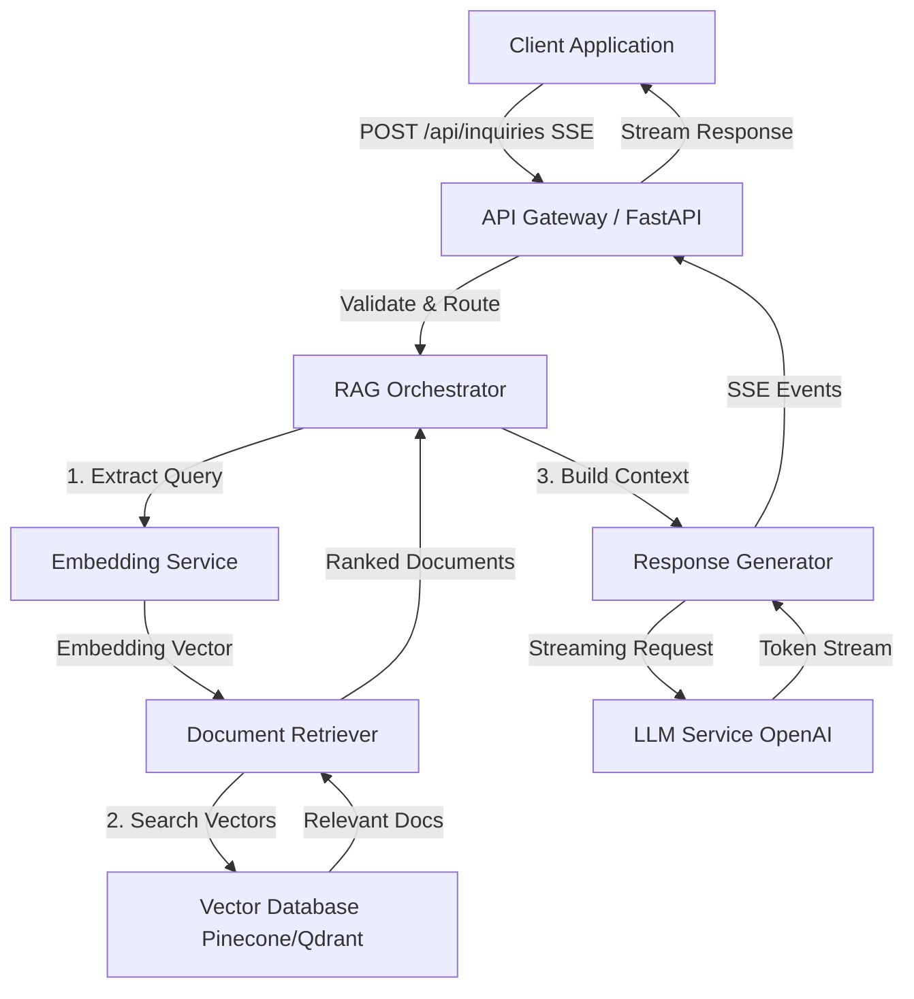
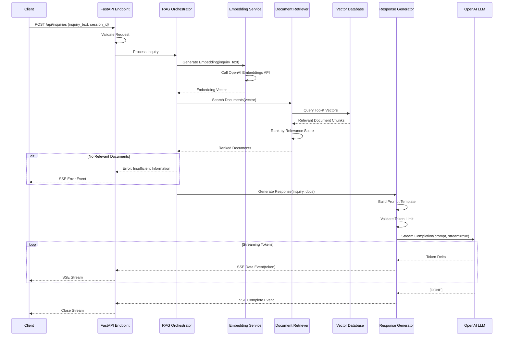
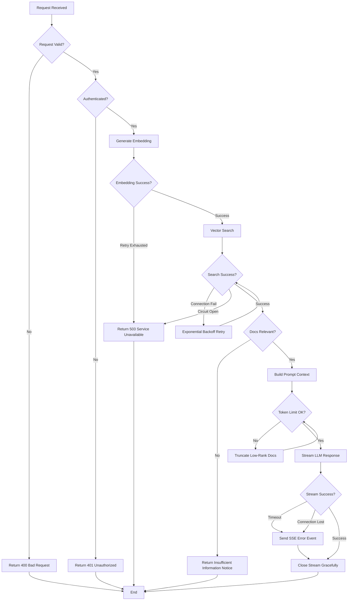
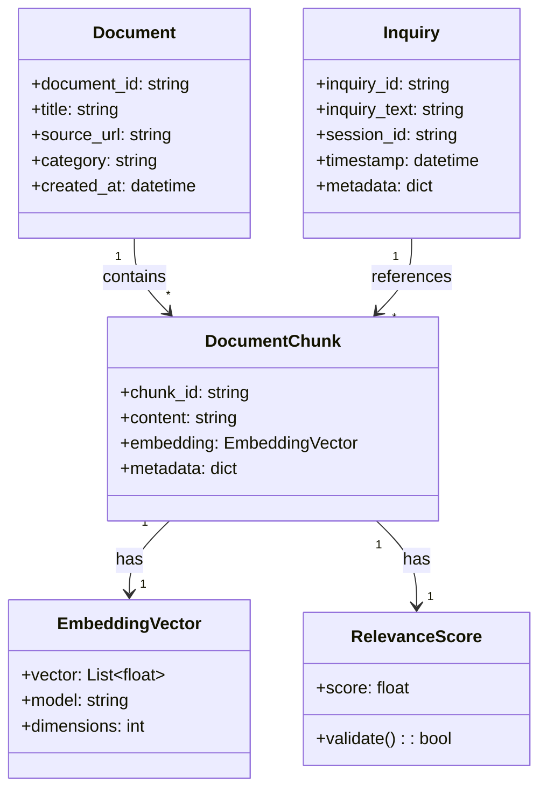

# Technical Design Document

## Overview

본 기능은 고객 지원의 문의 대응을 자동화하는 RAG(Retrieval-Augmented Generation, 검색 증강 생성) 기반 백엔드 API 서비스를 제공한다. 사용자로부터 문의를 받아, 벡터 데이터베이스에서 관련 문서를 시맨틱 검색하고, LLM을 사용하여 답변을 생성하여 Server-Sent Events(SSE)로 스트리밍 전송한다.

**Purpose**: 문의 대응의 자동화를 통해, 지원팀의 효율 향상과 고객의 대기 시간 단축을 실현한다.

**Users**: 고객 지원 시스템의 프론트엔드, 챗봇, 문의 관리 도구가 본 API를 이용하여, 엔드 유저에게 즉시 AI 생성 답변을 제공한다.

**Impact**: 종래의 수동 대응 또는 템플릿 답변에서, 컨텍스트에 기반한 동적인 AI 답변 생성으로 이행하여, 답변 정확도와 응답 속도를 큰 폭으로 개선한다.

### Goals

- 문의 내용에 기반하여 관련 문서를 고정밀도로 검색한다
- LLM에 의한 자연스럽고 정확한 답변을 실시간 스트리밍으로 생성한다
- 고부하 시에도 안정된 성능과 확장성을 유지한다
- 안전한 인증과 입력 검증으로 시스템을 보호한다
- 포괄적인 모니터링과 관측 가능성으로 운영 품질을 확보한다

### Non-Goals

- 대화 기록의 영속화(Session 관리는 외부 시스템에서 실시)
- 멀티턴 대화의 컨텍스트 관리(초기 구현은 싱글턴만)
- 문서 관리 기능(업로드, 갱신, 삭제는 별도 서비스)
- 프론트엔드 UI의 제공(API만)
- 실시간 학습·파인튜닝(향후의 확장)

## Architecture

### Architecture Pattern & Boundary Map

**선정 패턴**: Modular RAG Architecture

본 설계에서는 Retriever(검색), Generator(생성), Orchestrator(제어)를 독립 컴포넌트로 분리하는 Modular RAG 패턴을 채택한다. 이 패턴에 의해, 각 컴포넌트의 책무가 명확화되고, 독립된 테스트·배포·확장이 가능해진다.


```mermaid
graph TB
    Client[Client Application]
    API[API Gateway / FastAPI]
    Orchestrator[RAG Orchestrator]
    Retriever[Document Retriever]
    Generator[Response Generator]
    VectorDB[Vector Database Pinecone/Qdrant]
    EmbedService[Embedding Service]
    LLM[LLM Service OpenAI]

    Client -->|POST /api/inquiries SSE| API
    API -->|Validate & Route| Orchestrator
    Orchestrator -->|1. Extract Query| EmbedService
    EmbedService -->|Embedding Vector| Retriever
    Retriever -->|2. Search Vectors| VectorDB
    VectorDB -->|Relevant Docs| Retriever
    Retriever -->|Ranked Documents| Orchestrator
    Orchestrator -->|3. Build Context| Generator
    Generator -->|Streaming Request| LLM
    LLM -->|Token Stream| Generator
    Generator -->|SSE Events| API
    API -->|Stream Response| Client
```

**Domain Boundaries**:

- **API Layer**: 요청 접수, 인증, 검증, SSE 스트리밍 제어
- **Orchestrator**: RAG 플로우의 제어, 에러 처리, 컨텍스트 관리
- **Retriever**: 벡터 검색, 랭킹, 문서 필터링
- **Generator**: LLM 호출, 프롬프트 구축, 스트리밍 제어
- **External Services**: Embedding API, Vector Database, LLM API

**Existing Patterns Preserved**: 신규 구현이므로 해당 없음

**New Components Rationale**:

- **RAG Orchestrator**: 검색과 생성의 플로우를 조정하고, 에러 처리와 재시도 로직을 집약
- **Document Retriever**: 벡터 검색 로직을 추상화하여, 향후의 하이브리드 검색이나 리랭킹 확장에 대응
- **Response Generator**: LLM 스트리밍 처리를 독립시켜, 프롬프트 템플릿 관리와 토큰 제어를 책무로 함

**Steering Compliance**: 신규 프로젝트이므로 기존 steering 룰은 존재하지 않지만, 모듈러 설계, 타입 안전성, 관측 가능성의 원칙에 준거한다.

### Technology Stack

| Layer | Choice / Version | Role in Feature | Notes |
|-------|------------------|-----------------|-------|
| Backend / Services | FastAPI 0.115+ | API 엔드포인트, 요청 처리, SSE 스트리밍 | Async/await 대응, Pydantic 타입 안전, 자동 OpenAPI 문서 |
| Backend / Services | Uvicorn 0.32+ | ASGI 서버 | FastAPI 실행 환경, 고속 비동기 처리 |
| Backend / Services | sse-starlette 2.2+ | SSE 구현 | W3C 준거, EventSourceResponse 제공 |
| Data / Storage | Pinecone(초기) / Qdrant(대안) | 벡터 데이터베이스 | 시맨틱 검색, 확장성 |
| External API | OpenAI text-embedding-3-small | 임베딩 생성 | 비용 효율 중시, $0.02/백만 토큰 |
| External API | OpenAI GPT-4o / GPT-4o-mini | LLM 응답 생성 | 스트리밍 대응, 고정밀 답변 생성 |
| Infrastructure / Runtime | Python 3.11+ | 런타임 환경 | Async/await 최적화, 타입 힌트 강화 |
| Infrastructure / Runtime | Docker | 컨테이너화 | 환경 일관성, 배포 단순화 |

**Technology Selection Rationale**:

- **FastAPI**: 2025년 시점에서 Python API 백엔드의 표준 선택지. Async 대응에 의해 SSE와 LLM API 호출의 병렬 처리가 효율적. 상세는 `research.md` 참조.
- **Pinecone vs Qdrant**: Pinecone은 풀 매니지드로 운영 부담 최소, Qdrant는 셀프 호스팅 가능하여 비용 제어가 용이. 초기 구현은 Pinecone, 향후의 마이그레이션 경로를 설계. 상세는 `research.md`의 "벡터 데이터베이스 선정 조사" 참조.
- **OpenAI Embeddings**: text-embedding-3-small은 비용과 성능의 균형이 우수. 대안으로 Sentence-Transformers의 로컬 구현도 가능. 상세는 `research.md`의 "임베딩 모델 선정 조사" 참조.
- **SSE Protocol**: WebSocket보다 가볍고 HTTP 호환성이 높으며, 단방향 스트리밍에 최적. 상세는 `research.md`의 "스트리밍 프로토콜 선정" 참조.

## System Flows

### Primary Flow: 문의 처리 및 스트리밍 응답 생성


```mermaid
sequenceDiagram
    participant Client
    participant API as FastAPI Endpoint
    participant Orch as RAG Orchestrator
    participant Embed as Embedding Service
    participant Retr as Document Retriever
    participant VectorDB as Vector Database
    participant Gen as Response Generator
    participant LLM as OpenAI LLM

    Client->>API: POST /api/inquiries {inquiry_text, session_id}
    API->>API: Validate Request
    API->>Orch: Process Inquiry

    Orch->>Embed: Generate Embedding(inquiry_text)
    Embed->>Embed: Call OpenAI Embeddings API
    Embed-->>Orch: Embedding Vector

    Orch->>Retr: Search Documents(vector)
    Retr->>VectorDB: Query Top-K Vectors
    VectorDB-->>Retr: Relevant Document Chunks
    Retr->>Retr: Rank by Relevance Score
    Retr-->>Orch: Ranked Documents

    alt No Relevant Documents
        Orch-->>API: Error: Insufficient Information
        API-->>Client: SSE Error Event
    end

    Orch->>Gen: Generate Response(inquiry, docs)
    Gen->>Gen: Build Prompt Template
    Gen->>Gen: Validate Token Limit
    Gen->>LLM: Stream Completion(prompt, stream=true)

    loop Streaming Tokens
        LLM-->>Gen: Token Delta
        Gen-->>API: SSE Data Event(token)
        API-->>Client: SSE Stream
    end

    LLM-->>Gen: [DONE]
    Gen-->>API: SSE Complete Event
    API-->>Client: Close Stream
```

**Flow-Level Decisions**:

- **재시도 로직**: Embedding/VectorDB/LLM 호출 실패 시에는 지수 백오프로 재시도(최대 3회)
- **타임아웃**: 각 외부 API 호출에 10초의 타임아웃을 설정, 전체 플로우는 30초로 타임아웃
- **에러 게이팅**: 검색 결과가 임계값(relevance score < 0.7) 미만인 경우에는 "정보 부족" 에러를 반환
- **토큰 제한**: 프롬프트 전체가 LLM의 컨텍스트 윈도우(예: GPT-4o 128k tokens)의 80%를 초과하는 경우, 낮은 랭크 문서를 단계적으로 잘라냄

### Error Handling Flow


```mermaid
flowchart TB
    Start[Request Received] --> Validate{Request Valid?}
    Validate -->|No| Return400[Return 400 Bad Request]
    Validate -->|Yes| Auth{Authenticated?}
    Auth -->|No| Return401[Return 401 Unauthorized]
    Auth -->|Yes| Embed[Generate Embedding]

    Embed --> EmbedFail{Embedding Success?}
    EmbedFail -->|Retry Exhausted| Return503[Return 503 Service Unavailable]
    EmbedFail -->|Success| Search[Vector Search]

    Search --> SearchFail{Search Success?}
    SearchFail -->|Connection Fail| Retry[Exponential Backoff Retry]
    Retry --> SearchFail
    SearchFail -->|Circuit Open| Return503
    SearchFail -->|Success| CheckRelevance{Docs Relevant?}

    CheckRelevance -->|No| ReturnInsufficient[Return Insufficient Information Notice]
    CheckRelevance -->|Yes| BuildContext[Build Prompt Context]

    BuildContext --> TokenCheck{Token Limit OK?}
    TokenCheck -->|No| Truncate[Truncate Low-Rank Docs]
    Truncate --> TokenCheck
    TokenCheck -->|Yes| StreamLLM[Stream LLM Response]

    StreamLLM --> StreamFail{Stream Success?}
    StreamFail -->|Timeout| SendErrorEvent[Send SSE Error Event]
    StreamFail -->|Connection Lost| SendErrorEvent
    StreamFail -->|Success| CloseStream[Close Stream Gracefully]

    SendErrorEvent --> CloseStream
    CloseStream --> End[End]
    Return400 --> End
    Return401 --> End
    Return503 --> End
    ReturnInsufficient --> End
```

## Requirements Traceability

| Requirement | Summary | Components | Interfaces | Flows |
|-------------|---------|------------|------------|-------|
| 1 | 문의 접수 API | API Gateway, InquiryEndpoint | POST /api/inquiries | Primary Flow |
| 2 | 문서 검색 기능 | Embedding Service, Document Retriever, Vector Database | EmbeddingService, RetrieverService | Primary Flow |
| 3 | 스트리밍 답변 생성 | Response Generator, LLM Service, SSE Handler | GeneratorService, SSE Events | Primary Flow |
| 4 | 컨텍스트 관리 | RAG Orchestrator, Prompt Builder | OrchestratorService | Primary Flow |
| 5 | 에러 처리와 회복력 | Circuit Breaker, Retry Manager, Error Handler | ErrorHandlerService | Error Handling Flow |
| 6 | 성능과 확장성 | Connection Pool, Async Handlers | Health Check Endpoint | - |
| 7 | 보안과 데이터 보호 | Authentication Middleware, Input Validator | Auth Middleware | - |
| 8 | 모니터링과 관측 가능성 | Metrics Collector, Structured Logger | Metrics Endpoint | - |

## Components and Interfaces

### Component Summary

| Component | Domain/Layer | Intent | Req Coverage | Key Dependencies (Criticality) | Contracts |
|-----------|--------------|--------|--------------|--------------------------------|-----------|
| InquiryEndpoint | API Layer | 문의 요청 접수와 SSE 스트리밍 | 1, 3, 7 | RAG Orchestrator (P0), Auth Middleware (P0) | API, SSE |
| RAG Orchestrator | Orchestration | RAG 플로우 제어와 에러 처리 | 4, 5 | Embedding Service (P0), Document Retriever (P0), Response Generator (P0) | Service |
| Embedding Service | Integration | 텍스트의 벡터화 | 2 | OpenAI Embeddings API (P0) | Service |
| Document Retriever | Retrieval | 벡터 검색과 랭킹 | 2 | Vector Database (P0) | Service |
| Response Generator | Generation | LLM 응답 생성과 스트리밍 | 3, 4 | OpenAI LLM API (P0) | Service, Event |
| Auth Middleware | Security | 인증과 권한 부여 | 7 | - | API Middleware |
| Metrics Collector | Observability | 메트릭 수집과 공개 | 8 | - | API |
| Health Check Service | Observability | 헬스 체크 | 6, 8 | All External Services (P1) | API |

### API Layer

#### InquiryEndpoint

| Field | Detail |
|-------|--------|
| Intent | 문의 요청을 접수하고, SSE로 스트리밍 응답을 반환한다 |
| Requirements | 1, 3, 7 |

**Responsibilities & Constraints**

- 요청 검증(필수 필드 확인, UTF-8 인코딩 검증)
- 인증 토큰 검증(API Key / JWT)
- RAG Orchestrator로의 요청 위임
- SSE 스트리밍 제어와 에러 처리

**Dependencies**

- Inbound: Client Applications — HTTP 요청 송신 (P0)
- Outbound: RAG Orchestrator — RAG 처리 실행 (P0)
- Outbound: Auth Middleware — 인증 검증 (P0)

**Contracts**: [x] API [ ] Service [x] Event [ ] Batch [ ] State

##### API Contract

| Method | Endpoint | Request | Response | Errors |
|--------|----------|---------|----------|--------|
| POST | /api/inquiries | InquiryRequest | SSE Stream | 400, 401, 503, 500 |
| GET | /health | - | HealthStatus | 503, 500 |
| GET | /metrics | - | MetricsData | 500 |

**InquiryRequest Schema**:

```typescript
interface InquiryRequest {
  inquiry_text: string;        // Required, max 10000 chars, UTF-8
  session_id: string;           // Required, UUID format
  metadata?: {                  // Optional
    user_id?: string;
    timestamp?: string;         // ISO 8601
  };
}
```

**SSE Event Schema**:

```typescript
// Success Events
interface ResponseTokenEvent {
  event: "token";
  data: {
    content: string;            // Token delta
    sequence: number;           // Token sequence number
  };
}

interface ResponseCompleteEvent {
  event: "complete";
  data: {
    total_tokens: number;
    sources: DocumentSource[];  // Referenced documents
  };
}

// Error Events
interface ErrorEvent {
  event: "error";
  data: {
    error_code: string;         // "INSUFFICIENT_INFO" | "TIMEOUT" | "SERVICE_UNAVAILABLE"
    message: string;
    retry_after?: number;       // Seconds
  };
}
```

**Error Response Codes**:

- **400 Bad Request**: 필수 필드 누락, 부정한 포맷
- **401 Unauthorized**: 인증 실패, 무효한 토큰
- **503 Service Unavailable**: 외부 서비스 장애(LLM/VectorDB), 재시도 권장
- **500 Internal Server Error**: 예기치 않은 서버 에러

##### Event Contract

- **Published events**: `token`, `complete`, `error` (SSE)
- **Subscribed events**: 없음
- **Ordering / delivery guarantees**: 토큰은 생성 순서로 전송, 연결 단절 시에는 클라이언트 측에서 재연결

**Implementation Notes**

- **Integration**: `sse-starlette`의 EventSourceResponse를 사용, Async generator로 토큰 스트림 생성
- **Validation**: Pydantic 모델로 요청 검증, UTF-8 인코딩 확인, 문자 수 제한 체크
- **Risks**: Nginx/로드 밸런서에서 버퍼링이 활성화된 경우, 스트리밍이 지연될 가능성(X-Accel-Buffering: no 설정이 필수)

### Orchestration Layer

#### RAG Orchestrator

| Field | Detail |
|-------|--------|
| Intent | 임베딩 생성, 문서 검색, 응답 생성의 일련의 플로우를 제어한다 |
| Requirements | 4, 5 |

**Responsibilities & Constraints**

- RAG 플로우 전체의 조정(Embedding → Retrieval → Generation)
- 에러 처리와 재시도 로직(지수 백오프)
- 컨텍스트 구축과 토큰 제한 관리
- 서킷 브레이커 패턴 구현

**Dependencies**

- Inbound: InquiryEndpoint — 문의 처리 요청 (P0)
- Outbound: Embedding Service — 임베딩 생성 (P0)
- Outbound: Document Retriever — 문서 검색 (P0)
- Outbound: Response Generator — 응답 생성 (P0)

**Contracts**: [x] Service [ ] API [ ] Event [ ] Batch [ ] State

##### Service Interface

```typescript
interface RAGOrchestratorService {
  processInquiry(request: InquiryRequest): AsyncGenerator<ResponseEvent, void, void>;
}

interface InquiryRequest {
  inquiry_text: string;
  session_id: string;
  metadata?: Record<string, unknown>;
}

type ResponseEvent =
  | { type: "token"; content: string; sequence: number }
  | { type: "complete"; total_tokens: number; sources: DocumentSource[] }
  | { type: "error"; error_code: string; message: string; retry_after?: number };

interface DocumentSource {
  document_id: string;
  title: string;
  relevance_score: number;
  source_url?: string;
}
```

- **Preconditions**: 요청은 사전에 검증 완료, 인증 완료
- **Postconditions**: 스트리밍 완료 또는 에러 이벤트 송신, 리소스 클린업
- **Invariants**: 외부 서비스 장애 시에는 반드시 재시도 또는 에러 반환, 컨텍스트 토큰 수는 항상 LLM 제한 미만

**Implementation Notes**

- **Integration**: Async/await 패턴으로 각 서비스를 비동기 호출, 에러 발생 시에는 지수 백오프 재시도(초회 1초, 최대 8초, 최대 3회)
- **Validation**: relevance_score 임계값(0.7) 미만의 검색 결과는 "정보 부족" 에러, 토큰 수가 LLM 제한의 80% 초과 시에는 낮은 랭크 문서를 잘라냄
- **Risks**: 외부 서비스(Embedding/VectorDB/LLM)의 동시 장애 시에 캐스케이드 장애가 발생할 가능성(서킷 브레이커로 완화)

### Integration Layer

#### Embedding Service

| Field | Detail |
|-------|--------|
| Intent | 텍스트를 벡터화하여, 시맨틱 검색용 임베딩을 생성한다 |
| Requirements | 2 |

**Responsibilities & Constraints**

- OpenAI text-embedding-3-small API를 호출하여 임베딩 생성
- 레이트 제한 대책(지수 백오프 재시도)
- 에러 처리와 폴백

**Dependencies**

- Inbound: RAG Orchestrator — 임베딩 생성 요청 (P0)
- External: OpenAI Embeddings API — 임베딩 생성 (P0)

OpenAI Embeddings API의 상세(레이트 제한, 가격, 차원 사양)는 `research.md`의 "임베딩 모델 선정 조사"를 참조.

**Contracts**: [x] Service [ ] API [ ] Event [ ] Batch [ ] State

##### Service Interface

```typescript
interface EmbeddingService {
  generateEmbedding(text: string): Promise<Result<EmbeddingVector, EmbeddingError>>;
  generateEmbeddingBatch(texts: string[]): Promise<Result<EmbeddingVector[], EmbeddingError>>;
}

interface EmbeddingVector {
  vector: number[];             // Length: 1536 for text-embedding-3-small
  model: string;                // "text-embedding-3-small"
  usage: {
    prompt_tokens: number;
    total_tokens: number;
  };
}

type EmbeddingError =
  | { type: "RateLimitError"; retry_after: number }
  | { type: "InvalidInputError"; message: string }
  | { type: "ServiceUnavailableError"; message: string };
```

- **Preconditions**: 텍스트는 8191 토큰 이하(text-embedding-3-small 제한)
- **Postconditions**: 성공 시에는 EmbeddingVector 반환, 실패 시에는 에러 타입 반환
- **Invariants**: 레이트 제한 초과 시에는 반드시 재시도, 무효 입력 시에는 즉시 에러 반환

**Implementation Notes**

- **Integration**: OpenAI Python SDK를 사용, 타임아웃 10초 설정, 커넥션 풀링 활성화
- **Validation**: 입력 텍스트의 토큰 수를 사전 카운트(tiktoken 사용), 제한 초과 시에는 에러 반환
- **Risks**: 레이트 제한 초과 시의 재시도 대기 중에 전체 플로우가 타임아웃될 가능성(Orchestrator 레벨의 타임아웃 모니터링으로 완화)

#### Document Retriever

| Field | Detail |
|-------|--------|
| Intent | 벡터 데이터베이스에서 관련 문서를 검색하고, 관련도로 랭킹한다 |
| Requirements | 2 |

**Responsibilities & Constraints**

- 벡터 데이터베이스(Pinecone/Qdrant)로의 쿼리 실행
- Top-K 검색과 스코어 기반 랭킹
- 커넥션 풀링과 재시도 관리

**Dependencies**

- Inbound: RAG Orchestrator — 문서 검색 요청 (P0)
- External: Vector Database (Pinecone/Qdrant) — 벡터 검색 (P0)

Pinecone/Qdrant의 선정 근거와 API 사양은 `research.md`의 "벡터 데이터베이스 선정 조사"를 참조.

**Contracts**: [x] Service [ ] API [ ] Event [ ] Batch [ ] State

##### Service Interface

```typescript
interface DocumentRetrieverService {
  searchDocuments(query: SearchQuery): Promise<Result<DocumentChunk[], RetrievalError>>;
}

interface SearchQuery {
  embedding: number[];
  top_k: number;                // Default: 5, Range: 1-20
  min_relevance_score: number;  // Default: 0.7, Range: 0.0-1.0
  filters?: MetadataFilter;     // Optional metadata filters
}

interface DocumentChunk {
  chunk_id: string;
  document_id: string;
  content: string;
  metadata: {
    title: string;
    source_url?: string;
    timestamp?: string;
    category?: string;
  };
  relevance_score: number;      // Cosine similarity score
}

type RetrievalError =
  | { type: "ConnectionError"; retry: boolean }
  | { type: "TimeoutError"; message: string }
  | { type: "NoResultsError"; message: string };
```

- **Preconditions**: 쿼리 임베딩은 유효한 벡터(차원 수 일치)
- **Postconditions**: 관련도 내림차순으로 정렬된 문서 청크를 반환, 임계값 미만은 제외
- **Invariants**: 검색 실패 시에는 재시도 또는 에러 반환, 커넥션 풀은 항상 유효

**Implementation Notes**

- **Integration**: Pinecone Python SDK 사용(초기 구현), 커넥션 풀 최대 10 연결, 타임아웃 5초
- **Validation**: top_k 범위 체크(1-20), relevance_score 임계값 적용(기본값 0.7)
- **Risks**: VectorDB 연결 장애 시에 폴백 검색 없음(향후 키워드 검색 폴백 구현을 검토)

#### Response Generator

| Field | Detail |
|-------|--------|
| Intent | LLM을 사용하여 답변을 생성하고, 토큰을 스트리밍 전송한다 |
| Requirements | 3, 4 |

**Responsibilities & Constraints**

- 프롬프트 템플릿 구축(문의 + 검색 문서)
- 토큰 수 제한 관리와 컨텍스트 잘라내기
- OpenAI LLM API로의 스트리밍 요청
- SSE 이벤트 생성과 에러 처리

**Dependencies**

- Inbound: RAG Orchestrator — 응답 생성 요청 (P0)
- External: OpenAI LLM API (GPT-4o/GPT-4o-mini) — 스트리밍 생성 (P0)

OpenAI LLM API의 스트리밍 사양은 `research.md`의 "LLM 스트리밍 API 조사"를 참조.

**Contracts**: [x] Service [ ] API [x] Event [ ] Batch [ ] State

##### Service Interface

```typescript
interface ResponseGeneratorService {
  generateStreamingResponse(request: GenerationRequest): AsyncGenerator<GenerationEvent, void, void>;
}

interface GenerationRequest {
  inquiry_text: string;
  documents: DocumentChunk[];
  session_id: string;
  model?: string;               // Default: "gpt-4o-mini"
  max_tokens?: number;          // Default: 2000
  temperature?: number;         // Default: 0.7
}

type GenerationEvent =
  | { type: "token"; content: string; sequence: number }
  | { type: "complete"; total_tokens: number; finish_reason: string }
  | { type: "error"; error_code: string; message: string };
```

- **Preconditions**: 문서 리스트는 관련도로 정렬 완료, 문의 텍스트는 새니타이즈 완료
- **Postconditions**: 스트리밍 완료 또는 에러 이벤트 송신, API 리소스 해방
- **Invariants**: 프롬프트 전체는 LLM 컨텍스트 윈도우의 80% 미만, Prompt Injection 대책으로서 입력 새니타이즈 실시

##### Event Contract

- **Published events**: `token`(토큰 전송), `complete`(생성 완료), `error`(에러 통지)
- **Subscribed events**: 없음
- **Ordering / delivery guarantees**: 토큰은 LLM 생성 순서로 전송, 네트워크 장애 시에는 에러 이벤트 송신 후에 연결 종료

**Implementation Notes**

- **Integration**: OpenAI Python SDK 사용, `stream=True`로 스트리밍 활성화, 타임아웃 30초
- **Validation**: 프롬프트 구축 후에 토큰 수 카운트(tiktoken 사용), 제한 초과 시에는 낮은 랭크 문서를 단계적으로 삭제
- **Risks**: LLM API 타임아웃 시에 클라이언트로의 에러 통지가 지연될 가능성(Orchestrator 레벨의 타임아웃 모니터링으로 완화)

**Prompt Template**:

```
당신은 우수한 고객 지원 담당자입니다. 아래의 관련 문서를 참조하여, 사용자의 문의에 정확하고 정중하게 답변해 주세요.

## 문의 내용
{inquiry_text}

## 참조 문서
{documents}

## 답변 생성 규칙
- 문서 내용에 기반하여 답변해 주세요
- 문서에 기재되어 있지 않은 정보는 추측하지 말고, "문서에 기재가 없습니다"라고 전해 주세요
- 정중하고 알기 쉬운 한국어로 답변해 주세요
- 참조한 문서의 출처를 명시해 주세요

## 답변
```

### Security Layer

#### Auth Middleware

| Field | Detail |
|-------|--------|
| Intent | 모든 API 요청을 인증·인가하여, 부정 액세스를 방지한다 |
| Requirements | 7 |

**Responsibilities & Constraints**

- API Key 또는 JWT 토큰 검증
- 레이트 제한(1000 req/min per API key)
- 인증 실패 시의 에러 반환(상세 정보를 누설하지 않음)

**Dependencies**

- Inbound: All API Endpoints — 인증 검증 요청 (P0)
- External: 없음(로컬 검증)

**Contracts**: [x] Service [x] API [ ] Event [ ] Batch [ ] State

##### Service Interface

```typescript
interface AuthMiddleware {
  authenticate(request: Request): Result<AuthContext, AuthError>;
}

interface AuthContext {
  api_key_id: string;
  permissions: string[];
  rate_limit: {
    requests_per_minute: number;
    current_usage: number;
  };
}

type AuthError =
  | { type: "InvalidTokenError"; message: string }
  | { type: "ExpiredTokenError"; message: string }
  | { type: "RateLimitExceededError"; retry_after: number };
```

- **Preconditions**: 요청 헤더에 `Authorization: Bearer <token>` 또는 `X-API-Key: <key>`가 존재
- **Postconditions**: 성공 시에는 AuthContext 반환, 실패 시에는 401 에러
- **Invariants**: 레이트 제한 초과 시에는 반드시 429 에러 반환, 인증 에러 상세는 로그에만 기록(응답에 포함하지 않음)

**Implementation Notes**

- **Integration**: FastAPI의 Dependency Injection으로 미들웨어 구현, API Key 검증은 인메모리 캐시 사용
- **Validation**: 토큰 서명 검증(JWT), 유효 기한 체크, 레이트 제한 카운터(Redis 사용)
- **Risks**: 레이트 제한 카운터의 Redis 장애 시에 인증 불가(폴백으로 메모리 기반 카운터 사용을 검토)

### Observability Layer

#### Metrics Collector

| Field | Detail |
|-------|--------|
| Intent | 성능 메트릭을 수집하고, Prometheus 포맷으로 공개한다 |
| Requirements | 8 |

**Responsibilities & Constraints**

- 응답 시간, 에러율, 스루풋 측정
- 컴포넌트별 레이턴시 기록(Retrieval, Generation, Total)
- Prometheus 엔드포인트 공개

**Dependencies**

- Inbound: Monitoring Systems (Prometheus/Grafana) — 메트릭 수집 (P1)
- Outbound: All Services — 메트릭 수집 (P2)

**Contracts**: [ ] Service [x] API [ ] Event [ ] Batch [ ] State

##### API Contract

| Method | Endpoint | Request | Response | Errors |
|--------|----------|---------|----------|--------|
| GET | /metrics | - | Prometheus Text Format | 500 |

**Metrics Definitions**:

```
# Request metrics
http_requests_total{method, endpoint, status} counter
http_request_duration_seconds{method, endpoint} histogram

# Component-specific metrics
rag_retrieval_latency_seconds histogram
rag_generation_latency_seconds histogram
rag_total_latency_seconds histogram

# External service metrics
external_api_calls_total{service, status} counter
external_api_latency_seconds{service} histogram

# Error metrics
errors_total{type, component} counter
```

**Implementation Notes**

- **Integration**: `prometheus-client` 라이브러리 사용, FastAPI 미들웨어로 자동 계측
- **Validation**: 메트릭 이름은 Prometheus 명명 규칙 준거, 라벨 카디널리티 모니터링
- **Risks**: 고부하 시의 메트릭 수집 오버헤드(샘플링 레이트 조정으로 완화)

#### Health Check Service

| Field | Detail |
|-------|--------|
| Intent | 시스템과 의존 서비스의 헬스 상태를 확인하고, 모니터링 시스템에 제공한다 |
| Requirements | 6, 8 |

**Responsibilities & Constraints**

- 자기 진단(메모리 사용량, CPU 사용률)
- 외부 서비스 소통 확인(VectorDB, OpenAI API)
- 헬스 상태 판정과 응답 반환

**Dependencies**

- Inbound: Load Balancers, Monitoring Systems — 헬스 체크 요청 (P0)
- Outbound: Vector Database — 소통 확인 (P1)
- External: OpenAI API — 소통 확인 (P1)

**Contracts**: [ ] Service [x] API [ ] Event [ ] Batch [ ] State

##### API Contract

| Method | Endpoint | Request | Response | Errors |
|--------|----------|---------|----------|--------|
| GET | /health | - | HealthCheckResponse | 503, 500 |

**HealthCheckResponse Schema**:

```typescript
interface HealthCheckResponse {
  status: "healthy" | "degraded" | "unhealthy";
  timestamp: string;              // ISO 8601
  version: string;                // API version
  checks: {
    self: {
      status: "pass" | "fail";
      memory_usage_percent: number;
      cpu_usage_percent: number;
    };
    vector_database: {
      status: "pass" | "fail";
      latency_ms: number;
    };
    openai_api: {
      status: "pass" | "fail";
      latency_ms: number;
    };
  };
}
```

- **Preconditions**: 없음(인증 불필요)
- **Postconditions**: 100ms 이내에 응답 반환(요구사항 6)
- **Invariants**: 의존 서비스의 일부 장애 시에는 `degraded` 상태, 전체 장애 시에는 `unhealthy`

**Implementation Notes**

- **Integration**: 각 외부 서비스에 경량의 ping 요청 송신(타임아웃 500ms)
- **Validation**: 메모리 사용률 80% 초과, CPU 사용률 90% 초과로 `degraded` 판정
- **Risks**: 외부 서비스의 헬스 체크 타임아웃으로 전체 응답이 지연(병렬 실행으로 완화)

## Data Models

### Domain Model

본 시스템의 중심적인 도메인 엔티티와 책무를 정의한다.

**Aggregates**:

- **Inquiry**: 문의 내용과 세션 정보를 보유(루트 엔티티)
- **Document**: 문서 전체의 메타데이터와 소유권
- **DocumentChunk**: 문서의 검색 가능한 단편(Document의 자식 엔티티)

**Value Objects**:

- **EmbeddingVector**: 벡터 표현(불변)
- **RelevanceScore**: 관련도 스코어(0.0-1.0)
- **PromptContext**: LLM에 전달하는 컨텍스트(불변)

**Domain Events**:

- **InquiryReceived**: 문의 수신 시
- **DocumentsRetrieved**: 관련 문서 검색 완료 시
- **ResponseGenerated**: 답변 생성 완료 시
- **ErrorOccurred**: 에러 발생 시

**Business Rules & Invariants**:

- 문의 텍스트는 10000자 이내
- 검색 결과의 relevance_score는 0.7 이상이어야 사용 가능
- 프롬프트 전체는 LLM 컨텍스트 윈도우의 80% 미만
- 토큰 스트리밍은 생성 순서를 보존


```mermaid
classDiagram
    class Inquiry {
        +inquiry_id: string
        +inquiry_text: string
        +session_id: string
        +timestamp: datetime
        +metadata: dict
    }

    class Document {
        +document_id: string
        +title: string
        +source_url: string
        +category: string
        +created_at: datetime
    }

    class DocumentChunk {
        +chunk_id: string
        +content: string
        +embedding: EmbeddingVector
        +metadata: dict
    }

    class EmbeddingVector {
        +vector: List~float~
        +model: string
        +dimensions: int
    }

    class RelevanceScore {
        +score: float
        +validate(): bool
    }

    Document "1" --> "*" DocumentChunk : contains
    DocumentChunk "1" --> "1" EmbeddingVector : has
    Inquiry "1" --> "*" DocumentChunk : references
    DocumentChunk "1" --> "1" RelevanceScore : has
```

### Logical Data Model

**Vector Database Schema (Pinecone/Qdrant)**:

- **Index Name**: `customer-support-docs`
- **Dimensions**: 1536 (text-embedding-3-small)
- **Metric**: cosine similarity
- **Namespace**: `production`

**Vector Metadata**:

```typescript
interface VectorMetadata {
  document_id: string;          // UUID
  chunk_id: string;             // UUID
  title: string;                // Document title
  content: string;              // Chunk content (max 2000 chars)
  source_url?: string;          // Optional source URL
  category?: string;            // Optional category tag
  timestamp: string;            // ISO 8601
}
```

**Indexing Strategy**:

- 청크 사이즈: 500 토큰, 오버랩 50 토큰
- 메타데이터 필터링 대응(category, timestamp 범위 검색)
- 정기적인 인덱스 최적화(주차)

**No Persistence for Inquiry/Response**: 문의와 응답은 영속화하지 않으며, 세션 관리는 외부 시스템에서 실시(Non-Goal)

### Data Contracts & Integration

**API Data Transfer**:

- **Format**: JSON
- **Encoding**: UTF-8
- **Validation**: Pydantic models with strict type checking

**Request Schema**:

```typescript
interface InquiryRequest {
  inquiry_text: string;        // Required, 1-10000 chars
  session_id: string;          // Required, UUID v4
  metadata?: {
    user_id?: string;          // Optional, UUID v4
    timestamp?: string;        // Optional, ISO 8601
  };
}
```

**SSE Event Schemas** (앞에서 기술한 SSE Event Schema를 참조)

**Error Response Schema**:

```typescript
interface ErrorResponse {
  error: {
    code: string;              // "INVALID_REQUEST" | "UNAUTHORIZED" | "SERVICE_UNAVAILABLE" | "INTERNAL_ERROR"
    message: string;           // User-friendly message
    details?: string;          // Optional technical details (not exposed in production)
    request_id: string;        // Correlation ID
    timestamp: string;         // ISO 8601
  };
}
```

## Error Handling

### Error Strategy

본 시스템은 다층 에러 처리 전략을 채택하여, 각 계층에서 적절한 에러 처리와 복구를 실시한다.

**Error Handling Layers**:

1. **Input Validation Layer**: 요청 검증, 즉시 에러 반환(400)
2. **Authentication Layer**: 인증·권한 부여 에러, 즉시 에러 반환(401)
3. **Integration Layer**: 외부 서비스 장애, 재시도·폴백·서킷 브레이커
4. **Business Logic Layer**: 비즈니스 룰 위반, 에러 이벤트 송신
5. **Infrastructure Layer**: 인프라 장애, 503 에러 반환

### Error Categories and Responses

**User Errors (4xx)**:

- **Invalid Input (400)**: 필드 레벨 검증 에러 메시지, 수정 절차를 명시
- **Unauthorized (401)**: 인증 실패, 토큰 재취득을 권장(상세 정보는 비공개)
- **Rate Limit Exceeded (429)**: 레이트 제한 초과, retry_after 초수를 제공

**System Errors (5xx)**:

- **Service Unavailable (503)**: 외부 서비스 장애(VectorDB/LLM API), 재시도 권장, retry_after 제공
- **Gateway Timeout (504)**: 외부 API 호출 타임아웃, 재시도 권장
- **Internal Server Error (500)**: 예기치 않은 에러, request_id로 트러블슈팅

**Business Logic Errors (422)**:

- **Insufficient Information**: 관련 문서 부족, 쿼리의 재구성을 권장
- **Context Overflow**: 토큰 제한 초과, 문의 텍스트의 단축을 권장

**Retry & Circuit Breaker**:

- **Exponential Backoff**: 초회 1초, 2초, 4초, 8초(최대 3회 재시도)
- **Circuit Breaker**: 30초 동안 5회 연속 실패로 회로 오픈(30초 후에 자동 리셋)
- **Timeout Settings**: Embedding API 10초, VectorDB 5초, LLM API 30초, 전체 플로우 60초

### Monitoring

**Error Tracking**:

- 모든 에러를 구조화된 로그에 기록(JSON 형식)
- 에러율 메트릭(`errors_total{type, component}`)
- 에러 발생 시의 알림(에러율 5% 초과로 통지)

**Logging Strategy**:

```typescript
interface ErrorLog {
  level: "ERROR" | "WARNING";
  timestamp: string;           // ISO 8601
  request_id: string;          // Correlation ID
  error_type: string;          // Error classification
  error_message: string;       // Error description
  component: string;           // Component where error occurred
  stack_trace?: string;        // Stack trace (development only)
  context: {
    user_id?: string;          // If available
    session_id?: string;
    inquiry_text?: string;     // Sanitized (no PII)
  };
}
```

**Health Monitoring**:

- 헬스 체크 엔드포인트(/health)에서 의존 서비스 상태를 모니터링
- 외부 서비스 장애 시에는 `degraded` 상태 반환
- Prometheus 메트릭으로 에러율, 레이턴시, 스루풋을 추적

## Testing Strategy

### Unit Tests

- **EmbeddingService.generateEmbedding**: 정상계(유효 텍스트), 이상계(토큰 제한 초과, 레이트 제한 에러)
- **DocumentRetriever.searchDocuments**: Top-K 검색 정밀도, relevance_score 임계값 필터링, 연결 에러 재시도
- **ResponseGenerator.generateStreamingResponse**: 프롬프트 구축 로직, 토큰 제한 관리, 스트리밍 이벤트 생성
- **AuthMiddleware.authenticate**: API Key 검증, JWT 검증, 레이트 제한 체크
- **Prompt Template Builder**: 컨텍스트 구축, 새니타이제이션, 토큰 잘라내기 로직

### Integration Tests

- **RAG Orchestrator End-to-End Flow**: 임베딩 생성 → 문서 검색 → 응답 생성의 일련의 플로우
- **SSE Streaming**: 클라이언트 연결, 토큰 스트림 수신, 에러 이벤트 처리, 연결 종료
- **External Service Integration**: OpenAI API 호출(목 사용), VectorDB 연결(테스트 인덱스 사용)
- **Error Recovery**: 재시도 로직, 서킷 브레이커 동작, 폴백 처리
- **Authentication & Authorization**: API Key 검증, 레이트 제한, 인증 실패 시의 에러 반환

### E2E/API Tests

- **문의 송신 → 스트리밍 응답 수신**: 정상계 풀 플로우, SSE 이벤트 순서 검증
- **에러 시나리오**: 무효 요청(400), 인증 실패(401), 서비스 장애(503), 타임아웃(504)
- **동시 요청 처리**: 100 동시 요청에서의 스루풋과 응답 시간 측정
- **헬스 체크**: 정상 시, 의존 서비스 장애 시의 상태 확인

### Performance/Load Tests

- **부하 테스트**: 1000 req/min에서의 안정성, p95 레이턴시 3초 이내(요구사항 6)
- **스트리밍 레이턴시**: 최초의 토큰 전송까지의 시간(TTFB)을 측정, 3초 이내를 확인
- **벡터 검색 성능**: 10000 문서 인덱스에서의 검색 레이턴시 2초 이내(요구사항 6)
- **확장성**: 수평 확장(3 인스턴스)에서의 부하 분산과 스루풋 향상 확인

## Security Considerations

### Authentication & Authorization

- **API Key 인증**: X-API-Key 헤더에서의 단순한 인증(초기 구현)
- **JWT 인증**: Bearer 토큰에서의 스테이트리스 인증(향후의 확장)
- **Rate Limiting**: API Key별로 1000 req/min 제한, 초과 시에는 429 에러

### Input Validation & Sanitization

- **요청 검증**: Pydantic 모델로 타입 검증, 필수 필드 확인, 문자 수 제한
- **Prompt Injection 대책**: 문의 텍스트를 새니타이즈, 시스템 프롬프트 고정화, 사용자 입력과 시스템 지시를 명확히 분리
- **SQL 인젝션 대책**: 벡터 DB 쿼리는 SDK의 파라미터화 기능을 사용(해당 없음: 직접 SQL 미사용)

### Data Protection

- **TLS 1.3**: 전체 API 통신을 HTTPS 암호화
- **PII 보호**: 로그 출력 시에 개인 정보를 마스킹, 문의 텍스트는 새니타이즈 후만 기록
- **API Key 보호**: 환경 변수로 관리, 소스 코드에 하드코딩 금지, 정기적인 로테이션 권장

### Threat Mitigation

- **DDoS 대책**: 레이트 제한, 연결 수 제한, Cloudflare/AWS WAF 사용 권장
- **Prompt Injection**: 입력 새니타이제이션, 시스템 프롬프트 고정화, 출력 검증
- **데이터 누출**: 인증 실패 시에 상세 정보를 반환하지 않음, 에러 로그에 PII 포함하지 않음

## Performance & Scalability

### Target Metrics

- **헬스 체크 응답**: 100ms 이내(요구사항 6.1)
- **문서 검색**: p95 레이턴시 2초 이내(요구사항 6.2)
- **스트리밍 시작**: 문의 수신부터 최초의 토큰 전송까지 3초 이내(요구사항 6.3)
- **스루풋**: 1000 req/min(단일 인스턴스)

### Scaling Approaches

- **수평 확장**: 스테이트리스 설계에 의해 API 인스턴스를 추가하여 스루풋 향상
- **커넥션 풀링**: VectorDB, OpenAI API로의 커넥션 풀로 연결 오버헤드 삭감
- **Async 처리**: FastAPI의 async/await로 동시 요청 처리
- **부하 분산**: ALB/Nginx로 인스턴스 간의 트래픽 분산

### Caching Strategies

- **Embedding Cache**: 동일 문의 텍스트의 임베딩을 Redis에 캐시(TTL: 1시간)
- **Document Cache**: 빈번하게 액세스되는 문서 청크를 메모리 캐시(LRU, 최대 1000건)
- **API Key Cache**: 인증 결과를 메모리 캐시(TTL: 5분)

**Note**: 캐시 전략은 초기 구현에서는 미구현, 성능 테스트 후에 우선순위를 결정

## Supporting References

### Type Definitions

**Full Type Definitions for Key Interfaces**:

상세한 타입 정의는 본 섹션에 집약하고, 본문에서는 간결한 타입만 기재한다.

```typescript
// Complete Error Type Definitions
type Result<T, E> =
  | { success: true; value: T }
  | { success: false; error: E };

type APIError =
  | { type: "ValidationError"; field: string; message: string }
  | { type: "AuthenticationError"; message: string }
  | { type: "AuthorizationError"; message: string }
  | { type: "RateLimitError"; retry_after: number; message: string }
  | { type: "ResourceNotFoundError"; resource: string; message: string }
  | { type: "ServiceUnavailableError"; service: string; retry_after?: number; message: string }
  | { type: "TimeoutError"; operation: string; timeout_ms: number; message: string }
  | { type: "InternalServerError"; request_id: string; message: string };

// Complete Request/Response Schemas (앞에서 기술한 스키마를 통합)
```

### Configuration Reference

**Environment Variables**:

```bash
# OpenAI API Configuration
OPENAI_API_KEY=sk-...
OPENAI_EMBEDDING_MODEL=text-embedding-3-small
OPENAI_LLM_MODEL=gpt-4o-mini
OPENAI_MAX_TOKENS=2000
OPENAI_TEMPERATURE=0.7
OPENAI_TIMEOUT_SECONDS=30

# Vector Database Configuration (Pinecone)
PINECONE_API_KEY=...
PINECONE_ENVIRONMENT=us-east-1-aws
PINECONE_INDEX_NAME=customer-support-docs
PINECONE_NAMESPACE=production

# Vector Database Configuration (Qdrant, alternative)
QDRANT_URL=http://localhost:6333
QDRANT_API_KEY=...
QDRANT_COLLECTION_NAME=customer_support_docs

# API Configuration
API_HOST=0.0.0.0
API_PORT=8000
API_WORKERS=4
API_TIMEOUT_SECONDS=60
API_MAX_CONNECTIONS=1000

# Security Configuration
API_KEY_HEADER=X-API-Key
JWT_SECRET_KEY=...
JWT_ALGORITHM=HS256
RATE_LIMIT_PER_MINUTE=1000

# Observability Configuration
LOG_LEVEL=INFO
LOG_FORMAT=json
METRICS_ENABLED=true
TRACING_ENABLED=true

# Feature Flags
ENABLE_EMBEDDING_CACHE=false
ENABLE_DOCUMENT_CACHE=false
ENABLE_CIRCUIT_BREAKER=true
```

**Architecture Decision Records (ADRs)**:

본 설계의 주요 판단에 대해서는 `research.md`의 "Design Decisions" 섹션을 참조:

- 스트리밍 프로토콜 선정(SSE vs WebSocket)
- 벡터 데이터베이스 선정(Pinecone vs Qdrant vs pgvector)
- 임베딩 모델 선정(OpenAI vs Sentence-Transformers)
- 백엔드 프레임워크 선정(FastAPI)
