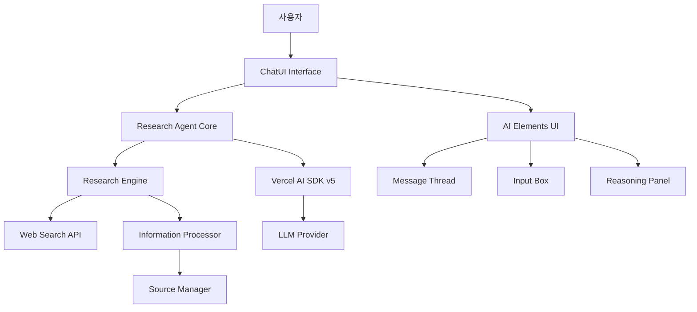
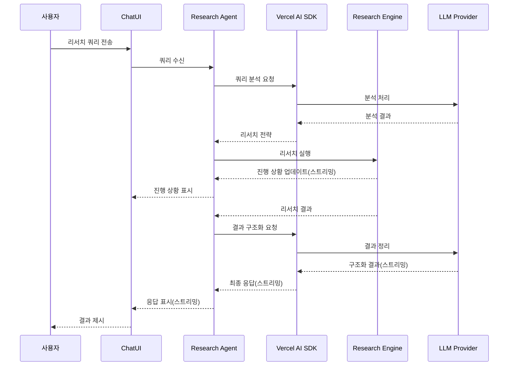
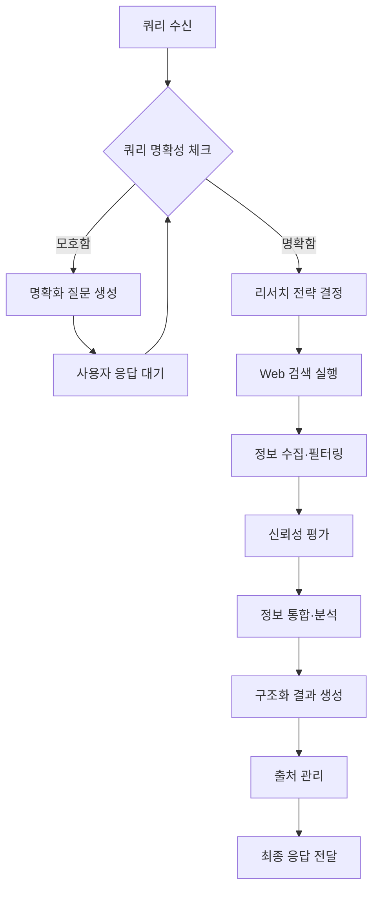
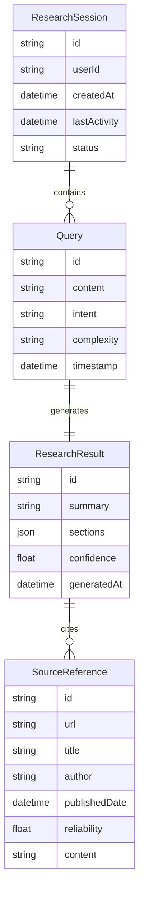
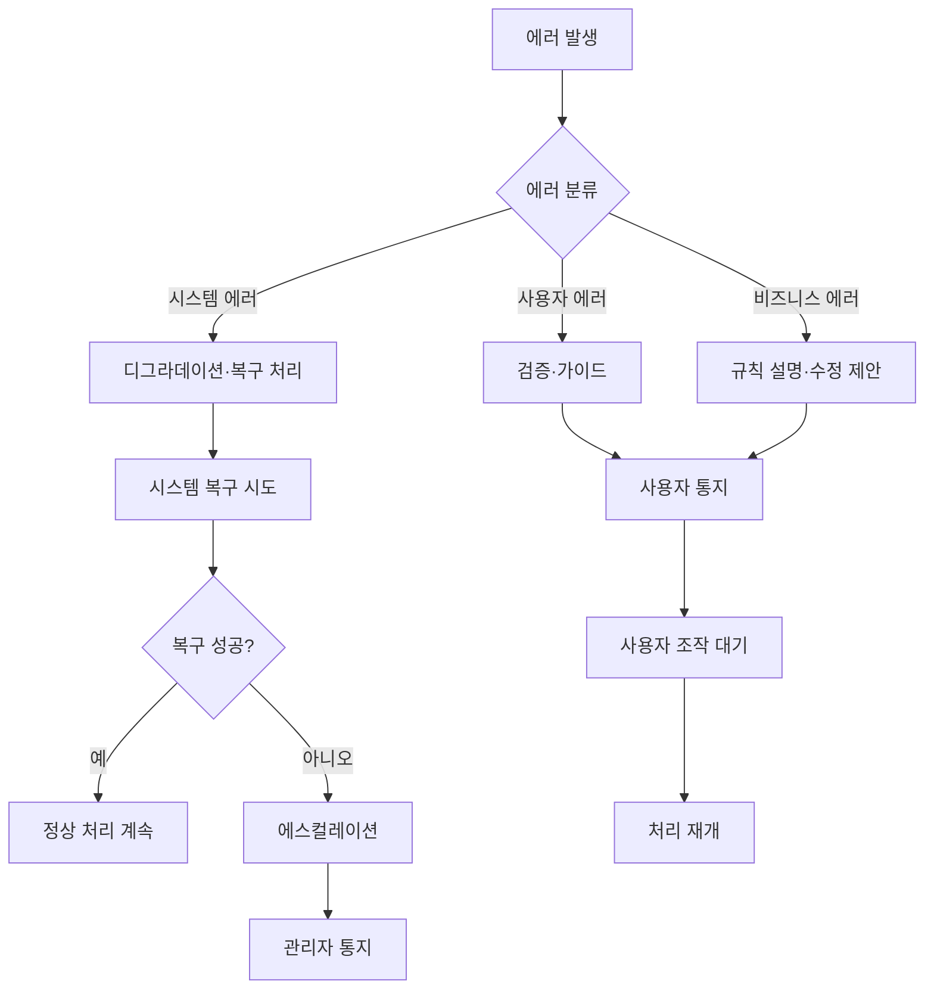

# Technical Design Document

## 개요

이 기능은 Vercel AI SDK v5와 AI Elements를 활용하여, 사용자의 리서치 쿼리에 대해 자동으로 정보 수집과 분석을 수행하는 고도화된 ChatUI Research Agent를 제공합니다.

**목적**: 사용자가 복잡한 리서치 태스크를 자연스러운 대화 형식으로 의뢰할 수 있고, AI가 자동으로 Web 검색, 정보 수집, 분석을 수행하여 포괄적인 조사 결과를 제공한다.

**사용자**: 연구자, 분석가, 콘텐츠 제작자, 학생 등 정보 수집을 필요로 하는 사용자가 효율적인 리서치 워크플로를 실현하기 위해 이용한다.

**영향**: 기존의 수동 검색 프로세스에서, AI 에이전트에 의한 자동화된 포괄적 리서치 프로세스로의 전환을 실현한다.

### 목표
- 자연스러운 대화 인터페이스를 통한 리서치 쿼리 처리
- AI 주도의 자동 정보 수집과 분석
- 실시간 스트리밍 응답을 통한 사용자 경험 향상
- 신뢰성 높은 정보 출처 관리 및 출처 표시

### 비목표
- 실시간 협업 편집 기능
- 대용량 파일 업로드 기능
- 멀티 유저 채팅룸 기능
- 외부 시스템과의 복잡한 API 인테그레이션 (1단계에서는 제외)

## 아키텍처

### 고수준 아키텍처


```mermaid
graph TB
    User[사용자] --> ChatUI[ChatUI Interface]
    ChatUI --> AgentCore[Research Agent Core]
    AgentCore --> VercelSDK[Vercel AI SDK v5]
    AgentCore --> ResearchEngine[Research Engine]
    ResearchEngine --> WebSearch[Web Search API]
    ResearchEngine --> InfoProcessor[Information Processor]
    VercelSDK --> LLMProvider[LLM Provider]
    InfoProcessor --> SourceManager[Source Manager]
    ChatUI --> AIElements[AI Elements UI]
    AIElements --> MessageThread[Message Thread]
    AIElements --> InputBox[Input Box]
    AIElements --> ReasoningPanel[Reasoning Panel]
```

### 기술 스택·설계 결정

#### 프론트엔드 기술
- **React 18**: TypeScript 지원, 컴포넌트 기반 UI 개발
- **Next.js 15**: App Router를 통한 모던 풀스택 개발
- **AI Elements**: Vercel 공식 ChatUI 컴포넌트 라이브러리
- **Tailwind CSS**: 효율적인 스타일링, AI Elements와의 통합

#### 백엔드·AI 기술
- **Vercel AI SDK v5**: 멀티 프로바이더 AI 통합, 스트리밍 지원
- **Next.js API Routes**: 서버 사이드 처리와 API 통합
- **Node.js**: 서버 사이드 JavaScript 실행 환경

#### 주요 설계 결정

**결정 1: Vercel AI SDK v5 채택**
- **결정**: Vercel AI SDK v5를 AI 기능의 핵심으로 채택
- **컨텍스트**: 멀티 프로바이더 지원과 스트리밍 기능이 필요
- **대안**: OpenAI SDK 직접 사용, LangChain, 자체 AI 통합 레이어
- **선택한 접근법**: Vercel AI SDK v5의 통합형 접근법
- **근거**: 통일된 API, 프레임워크 통합, 스트리밍 지원, 향후 프로바이더 변경에 대한 대응력
- **트레이드오프**: 높은 유연성과 유지보수성을 얻는 대신, 특정 프로바이더의 고유 기능에 대한 직접 접근이 제한된다

**결정 2: AI Elements를 통한 전용 UI 컴포넌트**
- **결정**: AI Elements를 ChatUI의 기반으로 채택
- **컨텍스트**: AI 챗 특유의 UX 패턴과 실시간 업데이트가 필요
- **대안**: 범용 UI 라이브러리(MUI, Chakra UI), 커스텀 컴포넌트 개발
- **선택한 접근법**: AI Elements + shadcn/ui 기반의 커스터마이징
- **근거**: AI 챗 최적화 완료, Vercel AI SDK와의 깊은 통합, 높은 커스터마이징성
- **트레이드오프**: AI 특화의 최적 UX를 얻는 대신, 새로운 라이브러리에 대한 학습 비용이 발생한다

**결정 3: Research Engine 분리 아키텍처**
- **결정**: 리서치 로직을 독립된 엔진으로 분리
- **컨텍스트**: 복잡한 리서치 전략과 향후 기능 확장이 필요
- **대안**: ChatUI 내에서 직접 처리, 서드 파티 리서치 API 이용
- **선택한 접근법**: 전용 Research Engine을 통한 모듈러 설계
- **근거**: 책임 분리, 테스트 용이성, 향후 확장성, 독립적인 스케일링
- **트레이드오프**: 아키텍처의 복잡성 증가와 맞바꿔, 높은 유지보수성과 확장성을 실현한다

## 시스템 플로우

### 사용자 인터랙션 플로우


```mermaid
sequenceDiagram
    participant U as 사용자
    participant UI as ChatUI
    participant Agent as Research Agent
    participant SDK as Vercel AI SDK
    participant Engine as Research Engine
    participant LLM as LLM Provider

    U->>UI: 리서치 쿼리 전송
    UI->>Agent: 쿼리 수신
    Agent->>SDK: 쿼리 분석 요청
    SDK->>LLM: 분석 처리
    LLM-->>SDK: 분석 결과
    SDK-->>Agent: 리서치 전략
    Agent->>Engine: 리서치 실행
    Engine-->>Agent: 진행 상황 업데이트(스트리밍)
    Agent-->>UI: 진행 상황 표시
    Engine-->>Agent: 리서치 결과
    Agent->>SDK: 결과 구조화 요청
    SDK->>LLM: 결과 정리
    LLM-->>SDK: 구조화 결과(스트리밍)
    SDK-->>Agent: 최종 응답(스트리밍)
    Agent-->>UI: 응답 표시(스트리밍)
    UI-->>U: 결과 제시
```

### 리서치 프로세스 플로우


```mermaid
flowchart TD
    A[쿼리 수신] --> B{쿼리 명확성 체크}
    B -->|모호함| C[명확화 질문 생성]
    C --> D[사용자 응답 대기]
    D --> B
    B -->|명확함| E[리서치 전략 결정]
    E --> F[Web 검색 실행]
    F --> G[정보 수집·필터링]
    G --> H[신뢰성 평가]
    H --> I[정보 통합·분석]
    I --> J[구조화 결과 생성]
    J --> K[출처 관리]
    K --> L[최종 응답 전달]
```

## 요구사항 추적성

| 요구사항 | 요구사항 개요 | 컴포넌트 | 인터페이스 | 플로우 |
|------|----------|----------------|------------------|--------|
| 1.1-1.4 | ChatUI 인터페이스 | ChatUI, AI Elements | useChat, Message API | 사용자 인터랙션 |
| 2.1-2.4 | Research Agent 기능 | Research Agent, Research Engine | ResearchService, ProgressAPI | 리서치 프로세스 |
| 3.1-3.4 | Vercel AI SDK 통합 | AI Integration Layer | StreamingAPI, ModelAPI | SDK 통합 플로우 |
| 4.1-4.4 | AI Elements 활용 | Message Thread, Reasoning Panel | ElementsAPI, RenderAPI | UI 표시 플로우 |
| 5.1-5.4 | 정보 소스 관리 | Source Manager | SourceAPI, CitationAPI | 소스 관리 플로우 |
| 6.1-6.4 | 성능·신뢰성 | 전체 컴포넌트 | ErrorAPI, HealthAPI | 에러 처리 플로우 |

## 컴포넌트·인터페이스

### 프론트엔드 레이어

#### ChatUI Interface

**책임·경계**
- **주요 책임**: 사용자와의 챗 인터페이스 제공 및 실시간 표시 관리
- **도메인 경계**: 사용자 인터랙션과 프레젠테이션 계층
- **데이터 소유권**: UI 상태, 메시지 이력, 표시 설정
- **트랜잭션 경계**: 프론트엔드 상태 관리 스코프

**의존성**
- **인바운드**: 사용자 조작, 브라우저 이벤트
- **아웃바운드**: Research Agent API, AI Elements 컴포넌트
- **외부**: 없음

**계약 정의**

**Service Interface**:
```typescript
interface ChatUIService {
  sendMessage(message: string): Result<MessageResponse, UIError>;
  streamResponse(responseId: string): Result<Stream<ResponseChunk>, UIError>;
  getMessageHistory(): Result<Message[], UIError>;
  clearHistory(): Result<void, UIError>;
}

interface Message {
  id: string;
  role: 'user' | 'assistant';
  content: string;
  timestamp: Date;
  sources?: SourceReference[];
}

interface ResponseChunk {
  id: string;
  content: string;
  isComplete: boolean;
  progress?: ResearchProgress;
}
```

- **사전 조건**: 사용자 세션이 유효할 것
- **사후 조건**: 메시지가 이력에 저장되고, 적절한 응답이 시작될 것
- **불변 조건**: 메시지 순서성과 사용자 경험의 일관성

#### AI Elements Integration

**책임·경계**
- **주요 책임**: AI 특화 UI 컴포넌트의 통합과 표시 최적화
- **도메인 경계**: AI 챗 특유의 UI/UX 패턴
- **데이터 소유권**: 컴포넌트 상태, 렌더링 설정
- **트랜잭션 경계**: 컴포넌트 라이프사이클

**의존성**
- **인바운드**: ChatUI Interface
- **아웃바운드**: AI Elements 라이브러리, shadcn/ui
- **외부**: AI Elements (@ai-elements/*), shadcn/ui

**계약 정의**

**Component Interface**:
```typescript
interface AIElementsService {
  renderMessageThread(messages: Message[]): Result<JSX.Element, RenderError>;
  renderReasoningPanel(reasoning: ReasoningData): Result<JSX.Element, RenderError>;
  renderInputBox(config: InputConfig): Result<JSX.Element, RenderError>;
  handleStreamingUpdate(chunk: ResponseChunk): Result<void, RenderError>;
}

interface ReasoningData {
  steps: ReasoningStep[];
  currentStep: number;
  isComplete: boolean;
}

interface InputConfig {
  placeholder: string;
  onSubmit: (message: string) => void;
  isDisabled: boolean;
}
```

### 백엔드 레이어

#### Research Agent Core

**책임·경계**
- **주요 책임**: 리서치 쿼리 조정, 전략 결정, 결과 통합
- **도메인 경계**: 리서치 도메인의 핵심 비즈니스 로직
- **데이터 소유권**: 리서치 세션 상태, 전략 설정
- **트랜잭션 경계**: 단일 리서치 세션의 정합성

**의존성**
- **인바운드**: ChatUI Interface API 호출
- **아웃바운드**: Vercel AI SDK, Research Engine, Source Manager
- **외부**: 없음(내부 통합만)

**계약 정의**

**Service Interface**:
```typescript
interface ResearchAgentService {
  processQuery(query: string, sessionId: string): Result<Stream<ResearchProgress>, AgentError>;
  analyzeQueryClarity(query: string): Result<ClarityAnalysis, AgentError>;
  generateClarificationQuestions(query: string): Result<Question[], AgentError>;
  streamResults(researchId: string): Result<Stream<ResearchResult>, AgentError>;
}

interface ResearchProgress {
  stage: 'analyzing' | 'searching' | 'processing' | 'synthesizing' | 'complete';
  progress: number; // 0-100
  currentActivity: string;
  sources?: SourceReference[];
}

interface ClarityAnalysis {
  isComplete: boolean;
  confidence: number;
  missingAspects: string[];
}

interface ResearchResult {
  summary: string;
  sections: ResultSection[];
  sources: SourceReference[];
  confidence: number;
  limitations?: string[];
}
```

- **사전 조건**: 유효한 세션 ID와 비어있지 않은 쿼리
- **사후 조건**: 리서치 프로세스가 시작되고, 진행 상황이 스트리밍으로 전달된다
- **불변 조건**: 세션 내에서의 리서치 결과의 일관성

#### Vercel AI SDK Integration

**책임·경계**
- **주요 책임**: AI SDK 통합, 모델 호출, 스트리밍 관리
- **도메인 경계**: AI/LLM과의 인터페이스 계층
- **데이터 소유권**: AI 세션 상태, 프로바이더 설정
- **트랜잭션 경계**: AI API 호출의 원자성

**의존성**
- **인바운드**: Research Agent Core, ChatUI Interface
- **아웃바운드**: LLM 프로바이더(OpenAI, Anthropic 등)
- **외부**: Vercel AI SDK (@ai-sdk/core, @ai-sdk/react)

**외부 의존성 조사**:
- **Vercel AI SDK**: 스트리밍, 툴 호출, 멀티 프로바이더 지원 확인 완료
- **인증 방식**: API 키 기반 인증, 프로바이더별 설정
- **레이트 제한**: 프로바이더 의존, SDK 측 재시도 기능 있음
- **버전 호환성**: v5.0 이후, 하위 호환성은 제한적
- **성능**: 스트리밍 응답으로 낮은 레이턴시 실현

**계약 정의**

**Service Interface**:
```typescript
interface AISDKService {
  generateResponse(prompt: string, context: ResearchContext): Result<Stream<string>, AIError>;
  analyzeQuery(query: string): Result<QueryAnalysis, AIError>;
  structureResults(data: ResearchData): Result<StructuredResult, AIError>;
  cancelGeneration(sessionId: string): Result<void, AIError>;
}

interface ResearchContext {
  sessionId: string;
  previousMessages: Message[];
  researchData?: ResearchData;
}

interface QueryAnalysis {
  intent: 'research' | 'clarification' | 'summary';
  complexity: 'simple' | 'moderate' | 'complex';
  requiredSources: SourceType[];
  estimatedDuration: number;
}
```

#### Research Engine

**책임·경계**
- **주요 책임**: Web 검색, 정보 수집, 데이터 처리 실행
- **도메인 경계**: 정보 검색·처리 도메인
- **데이터 소유권**: 검색 결과, 처리된 정보, 임시 캐시
- **트랜잭션 경계**: 단일 검색·처리 작업의 정합성

**의존성**
- **인바운드**: Research Agent Core
- **아웃바운드**: Web Search APIs, Information Processor
- **외부**: 검색 API(조사 필요), 스크래핑 도구

**외부 의존성 조사**:
- **검색 API**: Google Search API, Bing Search API, Tavily 등 비교 검토 필요
- **구현 시 조사 필요**: 구체적인 API 선정, 인증 플로우, 레이트 제한 대응
- **스크래핑**: Puppeteer/Playwright 등 도구 선정 필요

**계약 정의**

**Service Interface**:
```typescript
interface ResearchEngineService {
  executeSearch(query: string, params: SearchParams): Result<Stream<SearchResult>, EngineError>;
  processInformation(sources: Source[]): Result<ProcessedInformation, EngineError>;
  evaluateSourceReliability(source: Source): Result<ReliabilityScore, EngineError>;
}

interface SearchParams {
  maxResults: number;
  sourceTypes: SourceType[];
  timeframe?: string;
  language: string;
}

interface ProcessedInformation {
  extractedContent: ContentBlock[];
  keyPoints: string[];
  relationships: ConceptRelation[];
}
```

#### Source Manager

**책임·경계**
- **주요 책임**: 정보 출처 관리, 신뢰성 평가, 인용 생성
- **도메인 경계**: 정보의 출처·품질 관리
- **데이터 소유권**: 소스 정보, 신뢰성 데이터, 인용 형식
- **트랜잭션 경계**: 소스 정보의 정합성

**의존성**
- **인바운드**: Research Engine, Research Agent Core
- **아웃바운드**: 없음(도메인 서비스)
- **외부**: 없음

**계약 정의**

**Service Interface**:
```typescript
interface SourceManagerService {
  registerSource(source: RawSource): Result<SourceReference, SourceError>;
  evaluateReliability(sourceId: string): Result<ReliabilityAssessment, SourceError>;
  generateCitation(sourceId: string, format: CitationFormat): Result<string, SourceError>;
  getSourcesByReliability(threshold: number): Result<SourceReference[], SourceError>;
}

interface SourceReference {
  id: string;
  url: string;
  title: string;
  author?: string;
  publishedDate?: Date;
  reliability: ReliabilityScore;
  extractedContent: string;
}

interface ReliabilityAssessment {
  score: number; // 0-1
  factors: ReliabilityFactor[];
  confidence: number;
  warnings?: string[];
}
```

## 데이터 모델

### 도메인 모델

**핵심 개념**:
- **ResearchSession**: 리서치 세션의 집약 루트, 트랜잭션 경계
- **Query**: 사용자 쿼리 엔티티, 의도와 컨텍스트 관리
- **ResearchResult**: 리서치 결과의 값 객체, 불변성 보장
- **SourceReference**: 정보 출처 참조, 신뢰성 정보를 포함

**비즈니스 규칙·불변 조건**:
- 세션 내에서 쿼리와 그 결과의 대응 관계는 필수
- 소스의 신뢰성 스코어는 0-1 범위로 제약
- 리서치 결과는 최소 1개의 검증 가능한 소스를 가져야 한다
- 사용자의 비공개 정보는 세션 종료 시 삭제된다


```mermaid
erDiagram
    ResearchSession ||--o{ Query : contains
    Query ||--|| ResearchResult : generates
    ResearchResult ||--o{ SourceReference : cites
    ResearchSession {
        string id
        string userId
        datetime createdAt
        datetime lastActivity
        string status
    }
    Query {
        string id
        string content
        string intent
        string complexity
        datetime timestamp
    }
    ResearchResult {
        string id
        string summary
        json sections
        float confidence
        datetime generatedAt
    }
    SourceReference {
        string id
        string url
        string title
        string author
        datetime publishedDate
        float reliability
        string content
    }
```

### 논리 데이터 모델

**구조 정의**:
- ResearchSession (1) : Query (N) - 세션 내 다중 쿼리 지원
- Query (1) : ResearchResult (1) - 1대1 결과 생성
- ResearchResult (N) : SourceReference (M) - 다대다 인용 관계
- User (1) : ResearchSession (N) - 사용자별 세션 관리

**정합성·완전성**:
- 참조 정합성: 모든 외래 키 관계의 강제
- 캐스케이드 삭제: 세션 삭제 시 관련 데이터 완전 삭제
- 시계열 정합성: 타임스탬프의 논리적 순서 보장

### 물리 데이터 모델

**Key-Value Store(Redis) 선택 근거**:
- 고속 세션 상태 관리
- 스트리밍 데이터의 임시 저장
- TTL 기능을 통한 프라이버시 보호

**세션 관리**:
```typescript
interface SessionData {
  sessionId: string;
  userId: string;
  messages: Message[];
  currentQuery?: Query;
  researchState: ResearchState;
  ttl: number; // 24시간 자동 삭제
}
```

**검색 결과 캐시**:
```typescript
interface SearchCache {
  queryHash: string;
  results: SearchResult[];
  sources: SourceReference[];
  cachedAt: Date;
  ttl: number; // 1시간 캐시
}
```

### 데이터 계약·통합

**API 데이터 전송**:
- JSON 형식에 의한 표준화된 API 통신
- GraphQL 스타일의 쿼리 기반 부분 취득 지원
- 스트리밍 데이터의 NDJSON 형식

**이벤트 스키마**:
- 리서치 진행 상황 이벤트의 정의
- 소스 발견·평가 이벤트
- 결과 생성 완료 이벤트

**크로스 서비스 데이터 관리**:
- Saga 패턴을 통한 분산 트랜잭션
- 최종 정합성을 통한 유연한 결합도
- 이벤트 소싱을 통한 상태 변경 트래킹

## 에러 핸들링

### 에러 전략

**계층화된 에러 핸들링**을 통한 포괄적인 에러 관리를 구현한다. 각 레이어에서 적절한 추상화 수준으로 에러를 처리하고, 상위 레이어에 의미 있는 정보를 제공한다.

### 에러 카테고리와 대응

**사용자 에러(4xx)**:
- **잘못된 입력**: 필드 레벨 검증, 구체적인 개선 제안
- **인증 에러**: 인증 가이드, 재인증 플로우
- **리소스 미발견**: 네비게이션 지원, 대안 제시

**시스템 에러(5xx)**:
- **인프라 장애**: 그레이스풀 디그라데이션, 대체 서비스 전환
- **타임아웃**: 서킷 브레이커, 지수 백오프
- **리소스 고갈**: 레이트 제한, 우선순위 제어

**비즈니스 로직 에러(422)**:
- **규칙 위반**: 조건 설명, 수정 가이드
- **상태 충돌**: 트랜잭션 재시도, 낙관적 잠금

**프로세스 플로우 시각화**:


```mermaid
flowchart TD
    A[에러 발생] --> B{에러 분류}
    B -->|사용자 에러| C[검증·가이드]
    B -->|시스템 에러| D[디그라데이션·복구 처리]
    B -->|비즈니스 에러| E[규칙 설명·수정 제안]
    C --> F[사용자 통지]
    D --> G[시스템 복구 시도]
    E --> F
    G --> H{복구 성공?}
    H -->|예| I[정상 처리 계속]
    H -->|아니오| J[에스컬레이션]
    F --> K[사용자 조작 대기]
    J --> L[관리자 통지]
    K --> M[처리 재개]
```

### 모니터링

**에러 트래킹**: Structured logging, 에러 분류 태그, 컨텍스트 정보
**헬스 모니터링**: 각 서비스의 생존성 모니터링, 의존성 체크, 응답 시간 측정
**알림 설정**: 임계값 기반 통지, 이상 감지, 에스컬레이션 룰

## 테스트 전략

### 유닛 테스트
- **Research Agent Core**: 쿼리 분석, 전략 결정 로직, 결과 통합 처리
- **Source Manager**: 신뢰성 평가 알고리즘, 인용 생성, 소스 관리
- **AI SDK Integration**: 프롬프트 생성, 응답 해석, 에러 처리
- **Information Processor**: 데이터 추출, 구조화, 품질 평가
- **Search Query Builder**: 검색 쿼리 최적화, 파라미터 설정

### 인테그레이션 테스트
- **AI SDK - LLM 프로바이더**: 각 프로바이더와의 통신, 스트리밍 처리
- **Research Engine - Search APIs**: 검색 API 통합, 결과 해석, 에러 핸들링
- **ChatUI - Research Agent**: UI 반응성, 스트리밍 표시, 상태 동기화
- **데이터 플로우 통합**: 세션 관리, 이력 저장, 캐시 정합성
- **에러 전파**: 각 레이어 간의 에러 핸들링 연계

### E2E/UI 테스트
- **기본 리서치 플로우**: 쿼리 입력→검색→결과 표시까지의 완전한 사용자 여정
- **스트리밍 경험**: 실시간 진행 상황 표시, 점진적 결과 업데이트
- **에러 시나리오**: 네트워크 장애, API 제한, 잘못된 입력에 대한 대응
- **반응형 UI**: 모바일/데스크톱에서의 사용성
- **접근성**: 키보드 내비게이션, 스크린 리더 지원

### 성능/부하 테스트
- **동시 세션 처리**: 100개 병렬 세션, 메모리 사용량 모니터링
- **스트리밍 성능**: 낮은 레이턴시 응답, 백프레셔 제어
- **검색 API 제한**: 레이트 제한 하에서의 처리 능력, 큐잉 효과
- **대용량 결과 처리**: 장문 리서치 결과, 다중 소스 통합 성능

## 성능·확장성

### 타깃 메트릭·측정 전략

**응답 시간 목표**:
- 초기 응답: 5초 이내(요구사항 6.2)
- 페이지 로드: 3초 이내(요구사항 6.1)  
- 스트리밍 지연: 100ms 이내
- 검색 결과 취득: 10초 이내

**처리량 목표**:
- 동시 활성 세션: 500세션
- 1일당 쿼리 처리: 50,000쿼리
- API 호출 성공률: 99.5%

### 스케일링 접근법

**수평 스케일링**:
- Next.js Serverless Functions를 통한 자동 스케일링
- Redis Cluster를 통한 세션 데이터 분산
- CDN을 통한 정적 리소스 전달 최적화

**수직 스케일링**:
- 메모리 최적화: 스트리밍 버퍼 사이즈 조정
- CPU 최적화: 병렬 처리, 워커 풀 활용

### 캐싱 전략·최적화 기법

**다층 캐싱**:
- **L1 (메모리)**: 활성 세션 상태, 자주 사용되는 쿼리 결과
- **L2 (Redis)**: 검색 결과, 소스 정보, 분석 완료 쿼리
- **L3 (CDN)**: 정적 리소스, 범용 검색 결과

**최적화 기법**:
- 예측적 프리페칭: 관련 쿼리의 사전 준비
- 결과 부분 전달: 중요 섹션 우선 표시
- 적응형 배칭: API 호출 최적화
- 인텔리전트 캐싱: 사용 빈도 기반 TTL 조정

## 보안 고려 사항

### 위협 모델링

**주요 위협**:
- **인젝션 공격**: 프롬프트 인젝션, 쿼리 인젝션
- **정보 누출**: 검색 이력, 개인 정보, API 키 노출
- **서비스 거부**: 대량 요청, 리소스 고갈 공격
- **인증 우회**: 세션 하이재킹, 권한 상승

### 보안 제어

**인증·권한 부여 패턴**:
- JWT 기반 세션 관리, 토큰 갱신 기능
- 레이트 제한: 사용자별, IP별, 엔드포인트별
- 입력 검증: 쿼리 새니타이제이션, SQLi/XSS 방지

**데이터 보호·프라이버시 고려 사항**:
- **암호화**: API 통신은 HTTPS, 기밀 데이터는 AES-256
- **데이터 최소화**: 필요 최소한의 정보 수집, 자동 삭제 설정
- **익명화**: 검색 로그의 개인 식별 정보 제거
- **GDPR 대응**: 데이터 삭제권, 포터빌리티권의 구현
