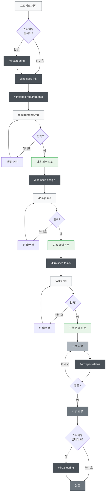
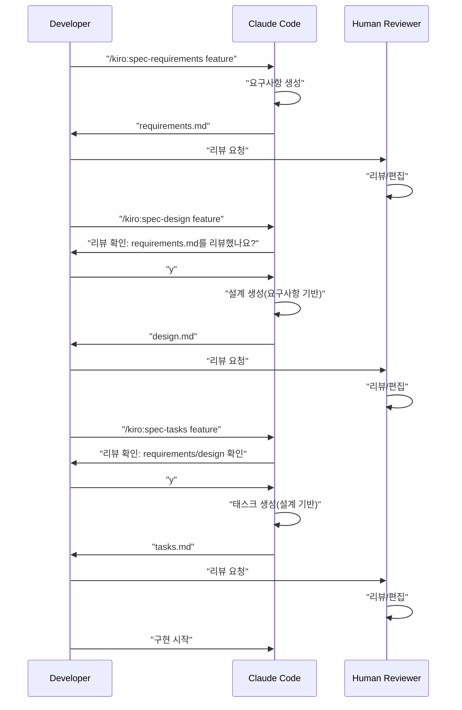

# Multi-Platform Spec-Driven Development

> ⚠️ **구버전 문서(아카이브)입니다.** 이 페이지는 초기 k-sdd 워크플로우를 다룹니다. 최신 정보는 README.md를 참고하세요.

> 🚀 **지원 플랫폼**  
> **Claude Code** | **Cursor** | **Gemini CLI** | **Codex CLI**

> [!Warning]
> 초기 버전이므로, 사용하면서 필요에 따라 적절히 개선해 나갈 예정입니다.

Claude Code, Cursor, Gemini CLI, Codex CLI의 4개 플랫폼에 대응하는 Spec-Driven Development 도구 세트입니다. Kiro IDE에 내장된 Spec-Driven Development를 각 플랫폼에서 실천하기 위한 프로젝트입니다.

Kiro IDE와 높은 호환성 — 기존 Kiro 스타일 SDD의 사양·워크플로우·디렉터리 구조를 그대로 활용할 수 있습니다.

## 개요

이 프로젝트는 여러 AI 개발 플랫폼(Claude Code, Cursor, Gemini CLI, Codex CLI, GitHub Copilot, Qwen Code, Windsurf)에 대응하는 Slash Commands를 활용하여, 사양 기반 개발(Spec-Driven Development)을 효율적으로 수행하기 위한 도구 세트를 제공합니다. 각 개발 단계에서 적절한 커맨드를 사용함으로써, 플랫폼에 상관없이 체계적이고 품질 높은 개발 프로세스를 구현할 수 있습니다.

## 셋업

### 내 프로젝트에 도입하기

사용 중인 플랫폼에 따라, 해당 디렉터리를 복사하기만 하면 도입할 수 있습니다.

#### 플랫폼별 디렉터리
- **Claude Code**: `.claude/commands/` - Claude Code용 Slash Commands 정의
- **Codex CLI**: `.codex/prompts/` - OpenAI Codex용 프롬프트 정의
- **Cursor**: `.cursor/commands/` - Cursor용 커맨드 정의
- **Gemini CLI**: `.gemini/commands/` - Gemini CLI용 TOML 파일
- **GitHub Copilot**: `.github/prompts/` - Copilot용 프롬프트 정의
- **Qwen Code**: `.qwen/commands/kiro/` - Qwen Code용 커맨드 정의
- **Windsurf IDE**: `.windsurf/workflows/` - Windsurf용 워크플로우 정의

#### 공통 설정 파일
- **설정 파일**: 플랫폼에 맞는 설정 파일(`CLAUDE.md`、`AGENTS.md`등)을 복사


### 최초 셋업 절차

1. **플랫폼 선택**: 사용하는 AI 개발 환경에 맞는 디렉터리를 복사
2. **설정 파일 조정**: 플랫폼 고유 설정 파일을 프로젝트에 맞게 조정
3. **첫 커맨드 실행** (플랫폼 공통):
   ```bash
   # 옵션: 스티어링 문서를 생성
   /kiro:steering
   
   # 첫 기능 사양을 생성
   /kiro:spec-init "당신의 프로젝트에 대한 상세한 설명"
   ```

### 멀티 플랫폼 대응 디렉터리 구조

커맨드를 실행하면, 아래 디렉터리가 자동 생성됩니다:

```
당신의 프로젝트/
├── 플랫폼별 디렉터리(사용하는 것만 복사)
│   ├── .claude/commands/kiro/ # Claude Code용 커맨드 정의
│   ├── .codex/prompts/        # Codex CLI용 프롬프트 정의
│   ├── .cursor/commands/kiro/ # Cursor용 커맨드 정의
│   ├── .gemini/commands/kiro/ # Gemini CLI용 TOML 설정
│   ├── .github/prompts/       # GitHub Copilot용 프롬프트 정의
│   ├── .qwen/commands/kiro/   # Qwen Code용 커맨드 정의
│   └── .windsurf/workflows/   # Windsurf용 워크플로우 정의
├── .kiro/
│   ├── steering/              # 자동 생성되는 스티어링 문서
│   └── specs/                 # 자동 생성되는 기능 사양
├── 플랫폼별 설정 파일
│   ├── CLAUDE.md              # Claude Code 설정
│   ├── CLAUDE_en.md           # 영어판 Claude Code 설정
│   ├── CLAUDE_zh-TW.md        # 번체판 Claude Code 설정
│   └── AGENTS.md              # Cursor용 설정
├── README.md                  # 한국어 README
└── (당신의 프로젝트 파일)
```

## 사용 방법

### 1. 신규 프로젝트인 경우

```bash
# 옵션: 프로젝트 스티어링 생성(권장하지만 필수는 아님)
/kiro:steering

# Step 1: 신규 기능의 사양 작성 시작(상세 설명 포함)
/kiro:spec-init "사용자가 PDF를 업로드하고, 그 안의 도표를 추출한 뒤, AI가 내용을 설명하는 기능을 만들고 싶습니다. 기술 스택은 Next.js, TypeScript, Tailwind CSS를 사용합니다."

# Step 2: 요구사항 정의(자동 생성된 feature-name 사용)
/kiro:spec-requirements pdf-diagram-extractor
# → .kiro/specs/pdf-diagram-extractor/requirements.md 를 리뷰/편집

# Step 3: 기술 설계(대화형 승인)
/kiro:spec-design pdf-diagram-extractor
# → "requirements.md를 리뷰했나요? [y/N]"에 응답
# → .kiro/specs/pdf-diagram-extractor/design.md 를 리뷰/편집

# Step 4: 태스크 생성(대화형 승인)
/kiro:spec-tasks pdf-diagram-extractor
# → requirements와 design 리뷰 확인에 응답
# → .kiro/specs/pdf-diagram-extractor/tasks.md 를 리뷰/편집

# Step 5: 구현 시작
```

### 2. 기존 프로젝트에 기능 추가

```bash
# 옵션: 스티어링 생성/업데이트
# 신규 생성이든 업데이트든 동일 커맨드를 사용
/kiro:steering

# Step 1: 신규 기능의 사양 작성 시작
/kiro:spec-init "새 기능의 상세 설명을 여기에 작성"
# 이후는 신규 프로젝트와 동일
```

### 3. 진행 상황 확인

```bash
# 특정 기능의 진행 상황 확인
/kiro:spec-status my-feature

# 현재 페이즈, 승인 상태, 태스크 진행 상황이 표시됨
```

## Spec-Driven Development 프로세스

### 프로세스 플로우 다이어그램

이 플로우에서는 각 페이즈마다 “리뷰/승인”이 필요합니다.

**스티어링 문서**는 프로젝트에 대한 영속적인 지식(아키텍처, 기술 스택, 코드 규약 등)을 기록하는 문서입니다. 생성/업데이트는 옵션이지만, 프로젝트의 장기 유지보수성을 높이기 위해 권장됩니다.



## 슬래시 커맨드 목록

### Phase 0: 프로젝트 스티어링(옵션)

| 커맨드 | 용도 | 사용 시점 |
|---------|------|---------------|
| `/kiro:steering` | 스티어링 문서의 스마트 생성/업데이트 | 모든 상황(신규/업데이트 모두) |
| `/kiro:steering-custom` | 커스텀 스티어링 문서 생성 | 특수한 규약/가이드라인이 필요할 때 |

**주의**: 스티어링 문서는 권장되지만 필수는 아닙니다. 소규모 기능 추가나 실험적 개발에서는 생략할 수 있습니다.

#### 스티어링 문서 종류
- **product.md**: 제품 개요, 기능, 유스케이스
- **tech.md**: 아키텍처, 기술 스택, 개발 환경
- **structure.md**: 디렉터리 구조, 코드 규약, 네이밍 규칙
- **커스텀 문서**: API 규약, 테스트 방침, 보안 정책 등

### Phase 1: 사양 작성

| 커맨드 | 용도 | 사용 시점 |
|---------|------|---------------|
| `/kiro:spec-init [상세한 프로젝트 설명]` | 프로젝트 설명으로부터 사양 구조 초기화 | 신규 기능 개발 시작 시 |
| `/kiro:spec-requirements [feature-name]` | 요구사항 정의서 생성 | 사양 초기화 직후 |
| `/kiro:spec-design [feature-name]` | 기술 설계서 생성 | 요구사항 승인 후 |
| `/kiro:spec-tasks [feature-name]` | 구현 태스크 생성 | 설계 승인 후 |

### Phase 2: 진행 관리

| 커맨드 | 용도 | 사용 시점 |
|---------|------|---------------|
| `/kiro:spec-status [feature-name]` | 현재 진행 상황과 페이즈 확인 | 개발 중 수시 |

## 3단계 승인 워크플로우

이 시스템의 핵심은, 각 페이즈에서 사람의 리뷰와 승인을 필수로 하는 것입니다.



## 베스트 프랙티스

### ✅ 권장 사항

1. **항상 스티어링부터 시작**
   - 모든 상황에서 `/kiro:steering` 사용(스마트하게 신규 생성/업데이트를 판단)
   - 통합 커맨드는 기존 파일을 보호하면서 적절히 처리

2. **페이즈를 건너뛰지 않기**
   - 요구사항 → 설계 → 태스크 순서를 엄수
   - 각 페이즈에서 반드시 사람 리뷰를 수행

3. **정기적으로 진행 확인**
   - `/kiro:spec-status`로 현재 상태 파악
   - 태스크 완료 상태를 적절히 업데이트

4. **스티어링 유지보수**
   - 큰 변경 후에는 `/kiro:steering` 실행(자동으로 업데이트 판단)
   - 프로젝트 성장에 맞춰 업데이트

### ❌ 피해야 할 것

1. **승인 없이 다음 페이즈로 이동**
   - 프롬프트 확인 응답을 잊지 않기

2. **스티어링 문서를 방치**
   - 오래된 정보는 개발을 방해

3. **태스크 상태 미업데이트**
   - 진행이 불명확해져 관리가 어려워짐

## 프로젝트 구조

```
.
├── 멀티 플랫폼 대응 디렉터리
│   ├── .claude/commands/kiro/     # Claude Code용 커맨드
│   │   ├── spec-init.md
│   │   ├── spec-requirements.md
│   │   ├── spec-design.md
│   │   ├── spec-tasks.md
│   │   ├── spec-status.md
│   │   ├── spec-impl.md
│   │   ├── steering.md
│   │   └── steering-custom.md
│   ├── .cursor/commands/kiro/     # Cursor용 커맨드
│   │   ├── spec-init.md
│   │   ├── spec-requirements.md
│   │   ├── spec-design.md
│   │   ├── spec-tasks.md
│   │   ├── spec-status.md
│   │   └── spec-impl.md
│   ├── .gemini/commands/kiro/     # Gemini CLI용 TOML
│   │   ├── spec-init.toml
│   │   ├── spec-requirements.toml
│   │   ├── spec-design.toml
│   │   ├── spec-tasks.toml
│   │   ├── spec-status.toml
│   │   └── spec-impl.toml
│   └── .codex/commands/           # Codex CLI용 프롬프트
│       ├── spec-init.md
│       ├── spec-requirements.md
│       ├── spec-design.md
│       ├── spec-tasks.md
│       └── spec-impl.md
├── .kiro/                         # 공통 사양 관리 디렉터리
│   ├── steering/                  # 스티어링 문서
│   │   ├── product.md
│   │   ├── tech.md
│   │   └── structure.md
│   └── specs/                     # 기능 사양
│       └── [feature-name]/
│           ├── spec.json          # 페이즈 승인 상태
│           ├── requirements.md    # 요구사항 정의서
│           ├── design.md          # 기술 설계서
│           └── tasks.md           # 구현 태스크
├── プラットフォーム別設定ファイル
│   ├── CLAUDE.md                  # Claude Code 설정(메인)
│   ├── CLAUDE_en.md               # 영어판 Claude Code 설정
│   └── AGENTS.md                  # Cursor용 설정
├── README.md                      # 한국어 README
├── README_en.md                   # 영어 README
└── (당신의 프로젝트 파일)
```

## 플랫폼별 특징

### Claude Code
- 훅 기능을 통한 자동화(태스크 진행 추적, 사양 준수 체크)
- CLAUDE.md로 영속 컨텍스트 관리
- 풍부한 Slash Commands 기능

### Cursor
- AGENTS.md를 통한 에이전트 설정
- IDE 통합을 통한 직접 코드 생성
- 비주얼한 인터페이스

### ⚡ Gemini CLI  
- TOML 설정 파일을 통한 구조화 정의
- Google AI와의 직접 통합
- 빠른 응답

### 🧠 Codex CLI
- GPT-5 대응의 고도화된 프롬프트 설계
- 생략 방지 기능을 통한 완전 출력
- OpenAI API와의 직접 연동

## 트러블슈팅

### 커맨드가 동작하지 않는 경우
1. 플랫폼 대응 디렉터리 존재 여부 확인
   - Claude Code: `.claude/commands/`
   - Cursor: `.cursor/commands/`
   - Gemini CLI: `.gemini/commands/`
   - Codex CLI: `.codex/commands/`
2. 커맨드 파일 네이밍 규칙 확인
3. 각 플랫폼의 최신 버전을 사용 중인지 확인

### 승인 플로우에서 막힌 경우
1. 리뷰 확인 프롬프트에 올바르게 응답했는지 확인
2. 이전 페이즈 승인이 완료됐는지 확인
3. `/kiro:spec-status`로 현재 상태 진단
4. 필요 시 `spec.json`을 수동으로 확인/편집

## 정리

멀티 플랫폼 대응 Spec-Driven Development로 아래를 달성할 수 있습니다:

- 체계적인 개발 프로세스
- 품질 보장을 위한 단계별 승인
- 투명성 높은 진행 관리
- 지속적인 문서 업데이트
- AI 보조를 통한 효율화
- 🚀 **멀티 플랫폼 지원** - 선호하는 개발 환경에서 동일 워크플로우

Claude Code, Cursor, Gemini CLI, Codex CLI 중 무엇을 사용하더라도 동일하게 고품질 개발 프로세스를 구현할 수 있습니다. 플랫폼 고유의 특징을 살리면서, 통일된 사양 기반 개발을 경험해 보세요.
