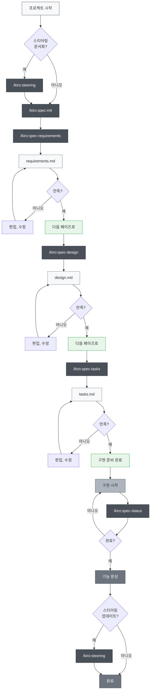
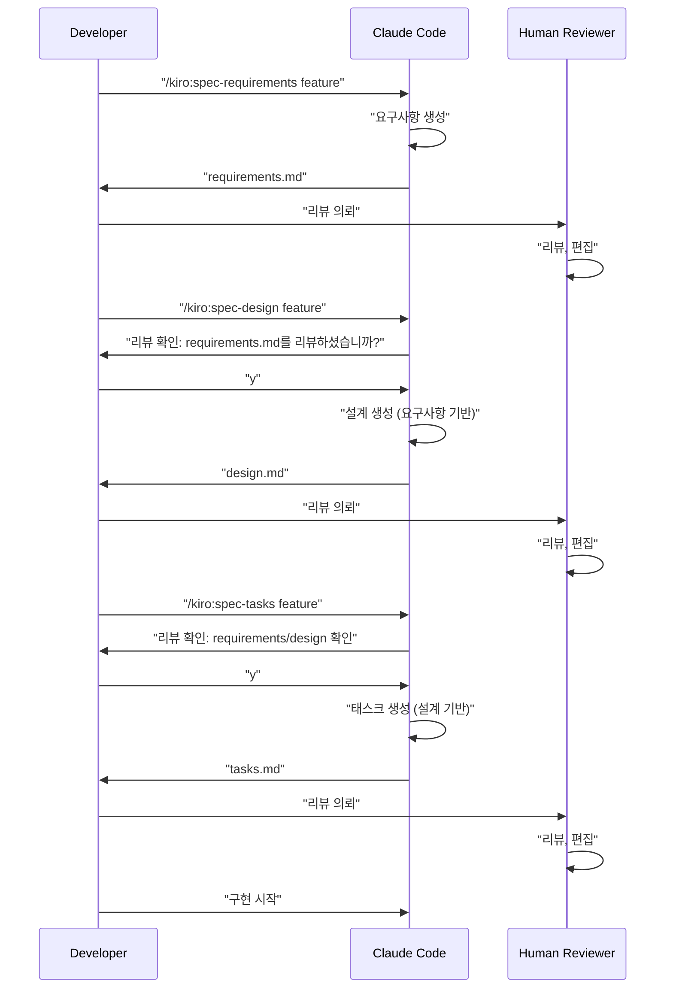

# Multi-Platform Spec-Driven Development

> ⚠️ **구버전 문서 (아카이브)입니다.** 본 페이지는 초기의 k-sdd 워크플로를 다루고 있습니다. 최신 정보는 [README.md](../../README.md)를 참조하세요.

> 🌐 **Language**  
> 📖 **[English Version](README_en.md)** | 📖 **한국어판 README** (이 페이지)

> 🚀 **지원 플랫폼**  
> 🤖 **Claude Code** | 🔮 **Cursor** | ⚡ **Gemini CLI** | 🧠 **Codex CLI**

> [!Warning]
> 초기 버전이므로, 사용하면서 적절히 개선해 나갈 예정

📝 **관련 기사**  
**[Kiro의 사양서 주도 개발 프로세스를 Claude Code로 철저히 재현했다](https://zenn.dev/gaebalai/articles/3db0621ce3d6d2)** - Zenn 기사

Claude Code, Cursor, Gemini CLI, Codex CLI의 4개 플랫폼에 대응한 Spec-Driven Development 도구 세트. Kiro IDE에 내장되어 있는 Spec-Driven Development를 각 플랫폼에서 실천하기 위한 프로젝트.

**Kiro IDE와 높은 호환성** — 기존 Kiro 류 SDD의 사양, 워크플로, 디렉터리 구성을 그대로 활용할 수 있습니다.

## 개요

이 프로젝트는 다수의 AI 개발 플랫폼 (Claude Code, Cursor, Gemini CLI, Codex CLI, GitHub Copilot, Qwen Code, Windsurf)에 대응한 Slash Commands를 활용하여, 사양 주도 개발 (Spec-Driven Development)을 효율적으로 진행하기 위한 도구 세트를 제공합니다. 각 개발 단계에서 적절한 명령을 사용함으로써, 플랫폼을 가리지 않고 체계적이며 품질 높은 개발 프로세스를 실현할 수 있습니다.

## 셋업

### 자신의 프로젝트에 도입한다

사용 중인 플랫폼에 따라, 대응하는 디렉터리를 복사하기만 하면 도입할 수 있습니다:

#### 플랫폼별 디렉터리

- **🤖 Claude Code**: `.claude/commands/` - Claude Code용 Slash Commands 정의
- **🧠 Codex CLI**: `.codex/prompts/` - OpenAI Codex용 프롬프트 정의
- **🔮 Cursor**: `.cursor/commands/` - Cursor용 명령 정의
- **⚡ Gemini CLI**: `.gemini/commands/` - Gemini CLI용 TOML 파일
- **🐙 GitHub Copilot**: `.github/prompts/` - Copilot용 프롬프트 정의
- **🔧 Qwen Code**: `.qwen/commands/kiro/` - Qwen Code용 명령 정의
- **🌊 Windsurf IDE**: `.windsurf/workflows/` - Windsurf용 워크플로 정의

#### 공통 설정 파일

- **설정 파일**: 플랫폼에 따른 설정 파일 (`CLAUDE.md`, `AGENTS.md` 등)을 복사

### 첫 셋업 절차

1. **플랫폼 선택**: 사용 중인 AI 개발 환경에 따른 디렉터리를 복사
2. **설정 파일 조정**: 플랫폼 고유의 설정 파일을 프로젝트에 맞춰 조정
3. **첫 명령을 실행** (플랫폼 공통):

   ```bash
   # 옵션: 스티어링 문서를 작성
   /kiro:steering

   # 첫 기능 사양을 작성
   /kiro:spec-init "당신 프로젝트의 상세한 설명"
   ```

### 멀티 플랫폼 대응 디렉터리 구조

명령을 실행하면, 다음 디렉터리가 자동적으로 작성됩니다:

```
당신의프로젝트/
├── 플랫폼별 디렉터리 (사용할 것을 복사)
│   ├── .claude/commands/kiro/ # Claude Code용 명령 정의
│   ├── .codex/prompts/       # Codex CLI용 프롬프트 정의
│   ├── .cursor/commands/kiro/# Cursor용 명령 정의
│   ├── .gemini/commands/kiro/# Gemini CLI용 TOML 설정
│   ├── .github/prompts/      # GitHub Copilot용 프롬프트 정의
│   ├── .qwen/commands/kiro/  # Qwen Code용 명령 정의
│   └── .windsurf/workflows/  # Windsurf용 워크플로 정의
├── .kiro/
│   ├── steering/              # 자동 생성되는 스티어링 문서
│   └── specs/                 # 자동 생성되는 기능 사양
├── 플랫폼별 설정 파일
│   ├── CLAUDE.md              # Claude Code 설정
│   ├── CLAUDE_en.md           # 영어판 Claude Code 설정
│   ├── CLAUDE_zh-TW.md        # 번체자판 Claude Code 설정
│   └── AGENTS.md              # Cursor용 설정
├── README.md                  # 한국어판 README
├── README_en.md               # 영어판 README
└── (당신의 프로젝트 파일)
```

## 사용법

### 1. 신규 프로젝트의 경우

```bash
# 옵션: 프로젝트 스티어링 생성 (추천하지만 필수는 아님)
/kiro:steering

# 스텝 1: 새 기능의 사양 작성 시작 (상세한 설명을 포함)
/kiro:spec-init "사용자가 PDF를 업로드하여, 그 안의 도표를 추출하고, AI가 내용을 설명하는 기능을 만들고 싶다. 기술 스택은 Next.js, TypeScript, Tailwind CSS를 사용."

# 스텝 2: 요구사항 정의 (자동 생성된 feature-name을 사용)
/kiro:spec-requirements pdf-diagram-extractor
# → .kiro/specs/pdf-diagram-extractor/requirements.md를 리뷰, 편집

# 스텝 3: 기술 설계 (인터랙티브 승인)
/kiro:spec-design pdf-diagram-extractor
# → "requirements.md를 리뷰하셨습니까? [y/N]"에 응답
# → .kiro/specs/pdf-diagram-extractor/design.md를 리뷰, 편집

# 스텝 4: 태스크 생성 (인터랙티브 승인)
/kiro:spec-tasks pdf-diagram-extractor
# → requirements와 design의 리뷰 확인에 응답
# → .kiro/specs/pdf-diagram-extractor/tasks.md를 리뷰, 편집

# 스텝 5: 구현 시작
```

### 2. 기존 프로젝트로의 기능 추가

```bash
# 옵션: 스티어링 작성, 업데이트
# 신규 작성의 경우도, 업데이트의 경우도 같은 명령을 사용
/kiro:steering

# 스텝 1: 새 기능의 사양 작성 시작
/kiro:spec-init "새로운 기능의 상세한 설명을 여기에 기술"
# 이후는 신규 프로젝트와 동일
```

### 3. 진척 확인

```bash
# 특정 기능의 진척 확인
/kiro:spec-status my-feature

# 현재의 페이즈, 승인 상황, 태스크 진척이 표시된다
```

## Spec-Driven Development 프로세스

### 프로세스 플로 도

이 플로에서는, 각 페이즈에서 「리뷰, 승인」이 필요하다.

**스티어링 문서**는, 프로젝트에 관한 영속적인 지식 (아키텍처, 기술 스택, 코드 규약 등)을 기록하는 문서입니다. 작성, 업데이트는 옵션이지만, 프로젝트의 장기적인 유지 보수성을 높이기 위해 추천된다.



## 슬래시 명령 일람

### 🚀 Phase 0: 프로젝트 스티어링 (옵션)

| 명령                    | 용도                                  | 사용 타이밍                            |
| ----------------------- | ------------------------------------- | -------------------------------------- |
| `/kiro:steering`        | 스티어링 문서의 스마트 작성, 업데이트 | 모든 장면 (신규, 업데이트 모두)        |
| `/kiro:steering-custom` | 커스텀 스티어링 문서의 작성           | 특수한 규약이나 가이드라인이 필요할 때 |

**주의**: 스티어링 문서는 추천되지만 필수는 아니다. 소규모의 기능 추가나 시험적인 개발에서는 생략 가능.

#### 스티어링 문서의 종류

- **product.md**: 프로덕트 개요, 기능, 유스케이스
- **tech.md**: 아키텍처, 기술 스택, 개발 환경
- **structure.md**: 디렉터리 구조, 코드 규약, 명명 규칙
- **커스텀 문서**: API 규약, 테스트 방침, 보안 정책 등

### 📋 Phase 1: 사양 작성

| 명령                                     | 용도                                 | 사용 타이밍          |
| ---------------------------------------- | ------------------------------------ | -------------------- |
| `/kiro:spec-init [상세한 프로젝트 설명]` | 프로젝트 설명에서 사양 구조를 초기화 | 새 기능 개발 시작 시 |
| `/kiro:spec-requirements [feature-name]` | 요구사항 정의서의 생성               | 사양 초기화 직후     |
| `/kiro:spec-design [feature-name]`       | 기술 설계서의 생성                   | 요구사항 승인 후     |
| `/kiro:spec-tasks [feature-name]`        | 구현 태스크의 생성                   | 설계 승인 후         |

### 📊 Phase 2: 진척 관리

| 명령                               | 용도                      | 사용 타이밍  |
| ---------------------------------- | ------------------------- | ------------ |
| `/kiro:spec-status [feature-name]` | 현재의 진척과 페이즈 확인 | 개발 중 수시 |

## 3페이즈 승인 워크플로

이 시스템의 핵심은, 각 페이즈에서 사람에 의한 리뷰와 승인을 필수로 한다



## 베스트 프랙티스

### ✅ 추천 사항

1. **항상 스티어링부터 시작**
   - 모든 장면에서 `/kiro:steering`을 사용 (스마트하게 신규 작성, 업데이트를 판단)
   - 통합 명령은 기존 파일을 보호하면서 적절히 처리

2. **페이즈를 건너뛰지 않는다**
   - 요구사항 → 설계 → 태스크의 순서를 엄수
   - 각 페이즈에서 반드시 사람에 의한 리뷰를 실시

3. **정기적인 진척 확인**
   - `/kiro:spec-status`로 현재의 상황을 파악
   - 태스크의 완료 상황을 적절히 업데이트

4. **스티어링의 유지 보수**
   - 큰 변경 후에는 `/kiro:steering`을 실행 (자동적으로 업데이트를 판단)
   - 프로젝트의 성장에 맞춰 업데이트

### ❌ 피해야 할 것

1. **승인 없이 다음 페이즈로 이동**
   - 프롬프트의 확인 응답을 잊지 않는다

2. **스티어링 문서의 방치**
   - 오래된 정보는 개발의 방해가 된다

3. **태스크 스테이터스의 미업데이트**
   - 진척이 불명확해져 관리가 곤란해진다

## 프로젝트 구조

```
.
├── 멀티 플랫폼 대응 디렉터리
│   ├── .claude/commands/kiro/     # Claude Code용 명령
│   │   ├── spec-init.md
│   │   ├── spec-requirements.md
│   │   ├── spec-design.md
│   │   ├── spec-tasks.md
│   │   ├── spec-status.md
│   │   ├── spec-impl.md
│   │   ├── steering.md
│   │   └── steering-custom.md
│   ├── .cursor/commands/kiro/     # Cursor용 명령
│   │   ├── spec-init.md
│   │   ├── spec-requirements.md
│   │   ├── spec-design.md
│   │   ├── spec-tasks.md
│   │   ├── spec-status.md
│   │   └── spec-impl.md
│   ├── .gemini/commands/kiro/     # Gemini CLI용 TOML
│   │   ├── spec-init.toml
│   │   ├── spec-requirements.toml
│   │   ├── spec-design.toml
│   │   ├── spec-tasks.toml
│   │   ├── spec-status.toml
│   │   └── spec-impl.toml
│   └── .codex/commands/           # Codex CLI용 프롬프트
│       ├── spec-init.md
│       ├── spec-requirements.md
│       ├── spec-design.md
│       ├── spec-tasks.md
│       └── spec-impl.md
├── .kiro/                         # 공통 사양 관리 디렉터리
│   ├── steering/                  # 스티어링 문서
│   │   ├── product.md
│   │   ├── tech.md
│   │   └── structure.md
│   └── specs/                     # 기능 사양
│       └── [feature-name]/
│           ├── spec.json          # 페이즈 승인 상태
│           ├── requirements.md    # 요구사항 정의서
│           ├── design.md         # 기술 설계서
│           └── tasks.md          # 구현 태스크
├── 플랫폼별 설정 파일
│   ├── CLAUDE.md                  # Claude Code 설정 (메인)
│   ├── CLAUDE_en.md               # 영어판 Claude Code 설정
│   ├── CLAUDE_zh-TW.md            # 번체자판 Claude Code 설정
│   └── AGENTS.md                  # Cursor용 설정
├── README.md                      # 한국어판 README
├── README_en.md                   # 영어판 README
└── (당신의 프로젝트 파일)
```

## 플랫폼별 특징

### 🤖 Claude Code

- 훅 기능에 의한 자동화 (태스크 진척 추적, 사양 준수 체크)
- CLAUDE.md에 의한 영속적 컨텍스트 관리
- 풍부한 Slash Commands 기능

### 🔮 Cursor

- AGENTS.md에 의한 에이전트 설정
- IDE 통합에 의한 직접 코드 생성
- 비주얼한 인터페이스

### ⚡ Gemini CLI

- TOML 설정 파일에 의한 구조화 정의
- Google AI와의 직접 통합
- 고속 응답

### 🧠 Codex CLI

- GPT-5 대응의 고도한 프롬프트 설계
- 생략 방지 기능에 의한 완전 출력
- OpenAI API와의 직접 연계

## 트러블슈팅

### 명령이 동작하지 않는 경우

1. 플랫폼 대응 디렉터리의 존재를 확인
   - Claude Code: `.claude/commands/`
   - Cursor: `.cursor/commands/`
   - Gemini CLI: `.gemini/commands/`
   - Codex CLI: `.codex/commands/`
2. 명령 파일의 명명 규칙을 확인
3. 각 플랫폼의 최신 버전을 사용하고 있는지 확인

### 승인 플로에서 막힌 경우

1. 리뷰 확인 프롬프트에 올바르게 응답하고 있는지 확인
2. 이전 페이즈의 승인이 완료되어 있는지 확인
3. `/kiro:spec-status`로 현재의 상태를 진단
4. 필요에 따라 `spec.json`을 수동으로 확인, 편집

## 정리

멀티 플랫폼 대응의 Spec-Driven Development에 의해, 다음이 실현 가능합니다:

- 📐 체계적인 개발 프로세스
- ✅ 품질 보증을 위한 단계적 승인
- 📊 투명성 높은 진척 관리
- 🔄 지속적인 문서 업데이트
- 🤖 AI 어시스트에 의한 효율화
- 🚀 **다수 플랫폼 대응** - 선호하는 개발 환경에서 동일한 워크플로

Claude Code, Cursor, Gemini CLI, Codex CLI 어느 것을 사용하고 있어도, 동일한 고품질의 개발 프로세스를 실현할 수 있습니다. 플랫폼 고유의 특징을 살리면서, 통일된 사양 주도 개발을 경험해 주세요.
