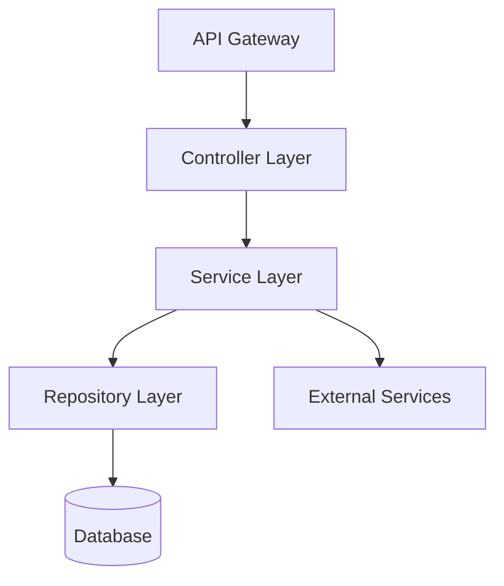

# 커스터마이징 가이드

> 📖 **English guide:** [Customization Guide](../customization-guide.md)

k-sdd의 템플릿과 룰을 편집해, 팀 고유 워크플로우에 맞추는 방법을 설명한다.

## 시작하기

k-sdd는 2개의 커스터마이징 포인트를 제공한다:

- **templates/** - AI가 생성하는 문서의 **구조/포맷**을 정의
- **rules/** - AI의 **판단 기준/생성 원칙**을 정의

둘 다 `{{KIRO_DIR}}/settings/`하위에 있으며, 프로젝트 전체에서 공유된다.

---

## 커스터마이징 2가지 접근 방식

### 📄 templates/ - 출력 포맷 커스터마이징

**위치**: `{{KIRO_DIR}}/settings/templates/specs/`

**역할**: AI가 생성하는 **문서 구조**를 정의한다. 템플릿에 추가한 섹션이나 필드는 AI가 자동으로 채워서 출력한다.

**편집 대상 파일**:
- `requirements.md` - 요구사항 문서 구조
- `design.md` - 설계 문서 구조
- `tasks.md` - 태스크 분해 구조

**커스터마이징 예시**:
- PRD 스타일 섹션 추가(Product Overview, Success Metrics 등)
- 승인 체크리스트 추가
- JIRA 필드 추가

---

### rules/ - AI 판단 기준 커스터마이징

**위치**: `{{KIRO_DIR}}/settings/rules/`

**역할**: AI의 **생성 룰/원칙**을 정의한다. 룰을 편집하면 AI의 판단 기준이나 생성 스타일이 바뀐다.

**편집 대상 파일**:
- `ears-format.md` - EARS 형식 요구사항 작성 룰
- `design-principles.md` - 설계 원칙과 문서 표준
- `tasks-generation.md` - 태스크 분해의 단위(그레뉼러리티)와 구조 룰
- `tasks-parallel-analysis.md` - 병렬 실행 가능성 판단 기준
- 기타(`design-discovery-*.md`, `gap-analysis.md`등)

**커스터마이징 예시**:
- 태스크 단위 조정(1–3시간 → 4–8시간 등)
- 설계 원칙 추가(보안, 성능 요구사항 등)
- 요구사항 우선순위 판단 기준

---

## 반드시 유지해야 하는 구조

k-sdd의 커맨드는 AI 에이전트를 통해 문서를 읽고 이해한다. 아래 요소는 반드시 유지해야 한다:

| 파일 | 필수 요소 | 이유 |
|---------|---------|------|
| **requirements.md** | 번호가 붙은 기준(`1.`, `2.`, `3.`...) | 기준 개수/구조를 AI가 인식 |
| | 템플릿과의 일관성 | AI가 템플릿에서 구조를 학습 |
| **design.md** | **파일 존재 자체** | 커맨드가 읽어야 하므로 |
| **tasks.md** | `- [ ] N.` 체크박스 형식 | 태스크 실행 엔진이 인식 |
| | `_Requirements: X, Y_` 참조 | 요구사항 트레이서빌리티(추적성) |
| | 계층 구조(1, 1.1, 1.2...) | 의존성 분석 |

**중요**: requirements.md의 헤딩은 자유롭게 변경 가능하다. AI는 템플릿에 정의된 구조 패턴을 학습하고, 동일한 패턴으로 생성한다.

### requirements.md의 유연성(중요)

requirements.md는 매우 유연하게 커스터마이징할 수 있다:

#### 1. 헤딩명 커스터마이징

**헤딩명은 자유롭게 변경 가능**하다. AI는 템플릿에서 구조를 학습한다:

- ✅ **영어**: `### Requirement 1:` / `#### Acceptance Criteria`
- ✅ **한국어**: `### 요구사항 1:` / `#### 수용기준`
- ✅ **커스텀**: `### REQ-1:` / `#### 검증기준`

**중요 포인트**:
- 번호 패턴(`N:`의 N)을 유지
- 계층 구조(`###`와 `####`)를 유지
- 템플릿과 생성된 파일 사이에서 일관성을 유지

#### 2. 수용 기준(acceptance criteria) 작성 형식

**EARS 형식은 권장이지만 필수는 아니다**：

- ✅ **EARS 형식 권장**: `WHEN [event] THEN [system] SHALL [action]` - AI 생성 시 기본값
- ✅ **다른 형식도 가능**:
  - 심플 형식: `시스템은 OO에 응답한다`
  - BDD 형식: `GIVEN [context] WHEN [event] THEN [outcome]`
  - 커스텀 형식: 팀 고유 템플릿
- ✅ **번호가 중요**: `1.`, `2.`, `3.`형식을 유지하면 내용은 자유

**EARS 형식의 장점**:
- 테스트 가능성이 높다(조건과 기대 결과가 명확)
- AI가 이해하기 쉽다(design/tasks 생성 정확도 향상)
- 업계 표준(리뷰어가 읽기 쉽다)

**필수는 구조뿐**: AI는 구조 패턴을 학습하지만, 구체적인 문자열을 파싱하지 않는다.

### requirements.md 커스터마이징 예시

#### 예시1: 한국어 헤딩 + EARS 형식(권장)

```markdown
### 요구사항 1: 사용자 인증

#### 수용 기준
1. WHEN 사용자가 로그인 버튼을 클릭 THEN 시스템은 인증 화면을 표시한다
2. IF 유효하지 않은 인증 정보가 입력되면 THEN 시스템은 에러 메시지를 표시한다
3. WHILE 인증 처리 중 THEN 시스템은 로딩 인디케이터를 표시한다
```

**템플릿 설정**:
```markdown
# templates/specs/requirements.md
### 요구사항 1: {{REQUIREMENT_AREA_1}}
#### 수용 기준
```

#### 예시2: 영어 헤딩 + BDD 형식

```markdown
### Requirement 1: 사용자 인증

#### Acceptance Criteria
1. GIVEN 사용자가 로그인 페이지에 있음 WHEN 로그인 버튼을 클릭 THEN 인증 화면이 표시된다
2. GIVEN 유효하지 않은 인증 정보 WHEN 로그인 시도 THEN 에러 메시지가 표시된다
3. GIVEN 인증 처리 중 WHEN 화면 표시 THEN 로딩 인디케이터가 표시된다
```

#### 예시3: 커스텀 ID + 심플 형식

```markdown
### REQ-001: 사용자 인증

#### 검증 기준
1. 사용자가 로그인 버튼을 클릭하면, 시스템은 인증 화면을 표시한다
2. 유효하지 않은 인증 정보가 입력된 경우, 시스템은 에러 메시지를 표시한다
3. 인증 처리 중에는, 시스템은 로딩 인디케이터를 표시한다
```

**템플릿 설정**:
```markdown
# templates/specs/requirements.md
### REQ-001: {{REQUIREMENT_AREA_1}}
#### 검증 기준
```

#### 예시4: 기본값(영어 헤딩 + EARS 형식)

```markdown
### Requirement 1: 사용자 인증

#### Acceptance Criteria
1. WHEN 사용자가 로그인 버튼을 클릭 THEN 시스템은 인증 화면을 표시한다
2. IF 유효하지 않은 인증 정보가 입력되면 THEN 시스템은 에러 메시지를 표시한다
3. WHILE 인증 처리 중 THEN 시스템은 로딩 인디케이터를 표시한다
```

**✅ 이 모든 형식은 유효**하다. 헤딩명과 ID 형식은 templates에서 정의하고, 작성 형식(EARS/BDD/심플)은 rules에서 조정한다.

### design.md의 유연성(중요)

**design.md는 내용 제약이 거의 없다**. 팀의 리뷰 프로세스나 분석 도구에 맞춰 자유롭게 커스터마이징할 수 있다:

- **헤딩명 자유**: `## Architecture` → `## システム設計`, `## System Design` 등 변경 가능
- **헤딩 순서도 자유**: 요구사항 트레이서빌리티를 선두에 배치, 데이터 모델을 아키텍처 근처에 배치 등
- **섹션 추가/삭제**: 팀 고유 리뷰 항목 추가, 불필요 섹션 삭제 가능
- **포맷 변경**: 표, 리스트, 도표 등 자유롭게 선택 가능

**Mermaid 다이어그램에 대해**: 기본 문법 룰은 `{{KIRO_DIR}}/settings/rules/design-principles.md`에 정의되어 있으며 templates의 제약이 아니다. 룰 파일을 수정하면 다이어그램 요구사항도 바꿀 수 있다.

**필수는 파일 존재뿐**: 커맨드는 `design.md`를 읽지만 특정 헤딩이나 포맷을 파싱하지 않는다.

### design.md 커스터마이징 예시

#### 예시1: 사내 리뷰 프로세스에 맞추기

```markdown
## 1. 개요(필수)
## 2. 비즈니스 요구사항 대응(필수)
## 3. 보안 리뷰(필수)
## 4. 아키텍처 설계(필수)
## 5. 성능 검증(P0 기능만)
## 6. 승인
```

#### 예시2: 분석 도구 연동

```markdown
## Design-ID: FEAT-2025-001
## Trace-Matrix
| 요구사항ID | 설계 요소 | 테스트ID | 구현 파일 |
|--------|---------|---------|-------------|
| REQ-1 | Component A | TEST-1 | src/a.ts |

## Architecture
...
```

#### 예시3: 한국어 헤딩

```markdown
## 개요
## 시스템 구성
## 모듈 설계
## 데이터 구조
## 에러 처리
## 테스트 방침
```

**✅ 이 모든 커스터마이징은 유효**하다. 커맨드는 영향을 받지 않는다.

---

## 커스터마이징 절차(3단계)

### Step 1: 기본 템플릿 확인

```bash
# 템플릿 위치 확인
ls -la {{KIRO_DIR}}/settings/templates/specs/
ls -la {{KIRO_DIR}}/settings/rules/
```

### Step 2: 구조를 유지하면서 추가·편집

- **templates/**：섹션/필드 추가
- **rules/**：원칙/기준 추가

### Step 3: 테스트 실행으로 검증

```bash
# 신규 spec으로 테스트
/kiro:spec-init Test customization feature
/kiro:spec-requirements test-customization
/kiro:spec-design test-customization
/kiro:spec-tasks test-customization

# 생성된 파일 확인
cat {{KIRO_DIR}}/specs/test-customization/requirements.md
cat {{KIRO_DIR}}/specs/test-customization/design.md
cat {{KIRO_DIR}}/specs/test-customization/tasks.md
```

---

## 실전 시나리오

팀 고유 니즈에 맞춘 3가지 대표 커스터마이징 시나리오를 소개한다. 각 시나리오는 완전한 복붙 가능한 코드와 테스트 방법을 포함한다.

---

## 시나리오1: PRD 스타일 요구사항 생성

### 커스터마이징 대상

- **templates**: `{{KIRO_DIR}}/settings/templates/specs/requirements.md`
- **rules**: `{{KIRO_DIR}}/settings/rules/ears-format.md` (옵션)

### 적용 케이스

- 프로덕트/비즈니스 팀이 이해관계자로 참여
- 요구사항 리뷰에서 비즈니스 맥락/우선순위/성공 지표가 필수
- 엔지니어 외 리뷰어가 많음

### 커스터마이징 절차

#### Step 1: 템플릿 편집(필수)

**편집 파일**: `{{KIRO_DIR}}/settings/templates/specs/requirements.md`

**유지해야 하는 구조**:
- 번호가 붙은 헤딩 패턴(예: `### Requirement N:`, `### 요구사항 N:`, `### REQ-N:`)
- 기준 섹션 헤딩(예: `#### Acceptance Criteria`, `#### 受け入れ基準`)
- 번호가 붙은 기준(`1.`, `2.`, `3.`...)

**헤딩명은 자유**: 템플릿에서 정의하면 AI는 동일한 패턴으로 생성한다.
**권장**: EARS 형식(`WHEN ... THEN ...`)을 쓰면 AI 생성 정확도가 올라가지만, 다른 형식도 사용 가능하다.

**추가할 완전한 템플릿**:

<details>
<summary><strong>복붙 가능한 템플릿 전문</strong></summary>

```markdown
# Requirements Document

## Product Context

**Problem Statement**: {{PROBLEM_DESCRIPTION}}

**Target Users**: {{TARGET_USERS}}

**Success Metrics**: {{SUCCESS_METRICS}}

**Timeline**: {{TIMELINE}}

**Business Impact**: {{BUSINESS_IMPACT}}

---

## Requirements

### Requirement 1: {{REQUIREMENT_AREA_1}}

**Objective**: As a {{ROLE}}, I want {{CAPABILITY}}, so that {{BENEFIT}}

**Business Priority**: P0 (Critical) / P1 (High) / P2 (Medium)

**Dependencies**: {{DEPENDENCIES}}

**Risk Level**: Low / Medium / High

#### Acceptance Criteria

1. WHEN {{EVENT}} THEN the {{SYSTEM}} SHALL {{RESPONSE}}
2. IF {{CONDITION}} THEN the {{SYSTEM}} SHALL {{RESPONSE}}
3. WHERE {{FEATURE_INCLUDED}} THE {{SYSTEM}} SHALL {{RESPONSE}}

**Verification Method**: {{TEST_TYPE}}

**Success Threshold**: {{THRESHOLD}}

---

### Requirement 2: {{REQUIREMENT_AREA_2}}

**Objective**: As a {{ROLE}}, I want {{CAPABILITY}}, so that {{BENEFIT}}

**Business Priority**: P0 / P1 / P2

**Dependencies**: {{DEPENDENCIES}}

**Risk Level**: Low / Medium / High

#### Acceptance Criteria

1. WHEN {{EVENT}} THEN the {{SYSTEM}} SHALL {{RESPONSE}}
2. WHEN {{EVENT}} AND {{CONDITION}} THEN the {{SYSTEM}} SHALL {{RESPONSE}}

**Verification Method**: {{TEST_TYPE}}

**Success Threshold**: {{THRESHOLD}}

<!-- 추가 요구사항은 동일 패턴으로 계속 -->

---

## Non-Functional Requirements

### Requirement NFR-1: Performance

**Objective**: System responsiveness and scalability

#### Acceptance Criteria

1. WHEN page loads THEN system SHALL respond within 2 seconds
2. WHEN API called THEN system SHALL respond within 200ms
3. WHEN {{CONCURRENT_USERS}} users access THEN system SHALL maintain response time

**Verification Method**: Load testing

**Success Threshold**: 95th percentile < 200ms

---

### Requirement NFR-2: Security

**Objective**: Data protection and access control

#### Acceptance Criteria

1. WHEN user authenticates THEN system SHALL enforce MFA
2. WHEN data stored THEN system SHALL encrypt at rest
3. WHEN data transmitted THEN system SHALL use TLS 1.3

**Verification Method**: Security audit

**Success Threshold**: Zero critical vulnerabilities

---

## Compliance & Approvals

**Compliance Requirements**: {{COMPLIANCE_LIST}}

**Review Checklist**:
- [ ] Product team reviewed
- [ ] Business stakeholder approved
- [ ] Legal/Compliance reviewed
- [ ] Security team approved

**Approval History**:
- Product Owner: {{APPROVER_NAME}} - {{DATE}}
- Engineering Lead: {{APPROVER_NAME}} - {{DATE}}
```

</details>

#### Step 2: 룰 조정(옵션 - 더 엄격한 제어가 필요한 경우)

**편집 파일**: `{{KIRO_DIR}}/settings/rules/ears-format.md`

**추가 내용**:

<details>
<summary><strong>룰 파일에 추가할 내용</strong></summary>

```markdown
## PRD-Specific Requirements

### Business Context Requirements

Every requirement MUST include:

- **Priority**: P0 (Critical) / P1 (High) / P2 (Medium)
  - P0: Blocking launch, must have
  - P1: Important for launch, strong preference
  - P2: Nice to have, can defer

- **Timeline**: Target delivery date or sprint number

- **Success Metrics**: Quantifiable measurement
  - User engagement metrics
  - Performance benchmarks
  - Business KPIs

### Verification Standards

Each acceptance criterion MUST specify:

- **Verification Method**:
  - Unit test
  - Integration test
  - Manual QA
  - Acceptance test
  - Performance test
  - Security audit

- **Success Threshold**: Specific measurable value
  - Examples: "< 200ms", "> 95% uptime", "Zero critical bugs"

### Non-Functional Requirements

Always include NFR sections for:
- Performance (response time, throughput)
- Security (authentication, encryption, access control)
- Scalability (concurrent users, data volume)
- Reliability (uptime, error rates)
- Usability (accessibility, UX metrics)
```

</details>

### 완료 후 동작

`/kiro:spec-requirements my-feature`를 실행하면:

1. **Product Context**섹션이 자동 생성된다
2. 각 요구사항에**Business Priority**、**Dependencies**、**Risk Level**이 포함된다
3. **Verification Method**와 **Success Threshold**가 각 요구사항에 추가된다
4. **Non-Functional Requirements** 섹션이 자동 생성된다
5. **Compliance & Approvals** 체크리스트가 추가된다
6. 요구사항 번호와 수용 기준 구조는 유지된다(`/kiro:spec-impl`과 호환)

### 테스트 방법

```bash
# 1. 템플릿 편집
vim {{KIRO_DIR}}/settings/templates/specs/requirements.md

# 2. (옵션) 룰 편집
vim {{KIRO_DIR}}/settings/rules/ears-format.md

# 3. 신규 spec으로 확인
/kiro:spec-init Test PRD-style requirements with business context
/kiro:spec-requirements test-prd-feature

# 4. 생성된 requirements.md 확인
cat {{KIRO_DIR}}/specs/test-prd-feature/requirements.md

# 5. Product Context, Priority, NFR 섹션 포함 여부 확인
grep -A 5 "## Product Context" {{KIRO_DIR}}/specs/test-prd-feature/requirements.md
grep "Business Priority" {{KIRO_DIR}}/specs/test-prd-feature/requirements.md
grep -A 3 "## Non-Functional Requirements" {{KIRO_DIR}}/specs/test-prd-feature/requirements.md
```

---

## 시나리오2: 백엔드/API 특화 설계 문서

### 커스터마이징 대상

- **templates**: `{{KIRO_DIR}}/settings/templates/specs/design.md`
- **rules**: `{{KIRO_DIR}}/settings/rules/design-principles.md` (옵션)

### 적용 케이스

- REST/GraphQL API 개발
- 마이크로서비스 아키텍처
- DB 설계/스키마 정의가 중요

### 커스터마이징 절차

#### Step 1: 템플릿 편집(필수)

**편집 파일**: `{{KIRO_DIR}}/settings/templates/specs/design.md`

**유지해야 하는 구조**:
- **파일 존재만 필수** - 헤딩명/순서/포맷은 전부 자유

**추가할 섹션**:

<details>
<summary><strong>백엔드 특화 템플릿(추가 부분)</strong></summary>

기존 `design.md`에 아래 섹션을 추가:

```markdown
## API Specification

### Base Configuration

**Base URL**: `{{BASE_URL}}`

**API Version**: `v{{VERSION}}`

**Authentication**: Bearer token (JWT) / API Key / OAuth 2.0

**Rate Limiting**: {{RATE_LIMIT}} requests per {{TIME_WINDOW}}

---

### Endpoints

#### POST /api/v1/{{resource}}

**Description**: {{ENDPOINT_DESCRIPTION}}

**Authentication**: Required

**Request Headers**:
```http
Authorization: Bearer {{token}}
Content-Type: application/json
```

**Request Body**:
```json
{
  "field1": "string",
  "field2": 123,
  "field3": {
    "nestedField": "value"
  }
}
```

**Request Validation**:
- `field1`: Required, string, max 255 characters
- `field2`: Required, integer, range 1-1000
- `field3.nestedField`: Optional, string

**Response (200 OK)**:
```json
{
  "data": {
    "id": "uuid",
    "field1": "string",
    "field2": 123,
    "createdAt": "ISO 8601 timestamp"
  },
  "meta": {
    "timestamp": "ISO 8601",
    "requestId": "uuid"
  }
}
```

**Error Responses**:

- **400 Bad Request**:
```json
{
  "error": {
    "code": "INVALID_INPUT",
    "message": "Validation failed",
    "details": {
      "field1": ["Required field missing"]
    }
  }
}
```

- **401 Unauthorized**:
```json
{
  "error": {
    "code": "UNAUTHORIZED",
    "message": "Invalid or expired token"
  }
}
```

- **429 Too Many Requests**:
```json
{
  "error": {
    "code": "RATE_LIMIT_EXCEEDED",
    "message": "Too many requests",
    "retryAfter": 60
  }
}
```

**Rate Limiting Headers**:
```http
X-RateLimit-Limit: 100
X-RateLimit-Remaining: 95
X-RateLimit-Reset: 1640000000
```

---

#### GET /api/v1/{{resource}}/:id

**Description**: {{ENDPOINT_DESCRIPTION}}

**Authentication**: Required

**Path Parameters**:
- `id`: UUID, required

**Query Parameters**:
- `include`: Comma-separated list of related resources
- `fields`: Comma-separated list of fields to return

**Response (200 OK)**:
```json
{
  "data": {
    "id": "uuid",
    "...": "..."
  }
}
```

**Error Responses**:
- **404 Not Found**: Resource does not exist

---

#### PUT /api/v1/{{resource}}/:id

**Description**: {{ENDPOINT_DESCRIPTION}}

**Idempotency**: Yes - multiple identical requests produce same result

---

#### DELETE /api/v1/{{resource}}/:id

**Description**: {{ENDPOINT_DESCRIPTION}}

**Soft Delete**: Yes / No

**Response (204 No Content)**: Empty body

---

### Pagination

**Strategy**: Cursor-based / Offset-based

**Request**:
```http
GET /api/v1/{{resource}}?page=1&limit=20&sort=createdAt:desc
```

**Response**:
```json
{
  "data": [...],
  "meta": {
    "total": 150,
    "page": 1,
    "limit": 20,
    "totalPages": 8
  },
  "links": {
    "first": "{{url}}?page=1",
    "prev": null,
    "next": "{{url}}?page=2",
    "last": "{{url}}?page=8"
  }
}
```

---

### Filtering & Sorting

**Filter Syntax**:
```http
GET /api/v1/{{resource}}?filter[status]=active&filter[createdAt][gte]=2024-01-01
```

**Sort Syntax**:
```http
GET /api/v1/{{resource}}?sort=field1,-field2
```
(Prefix `-` for descending order)

---

### Webhooks (if applicable)

**Webhook Events**:
- `{{resource}}.created`
- `{{resource}}.updated`
- `{{resource}}.deleted`

**Payload**:
```json
{
  "event": "{{resource}}.created",
  "timestamp": "ISO 8601",
  "data": {
    "id": "uuid",
    "...": "..."
  }
}
```

**Webhook Security**: HMAC signature verification

---

## Database Schema

### Tables

#### {{table_name}}

**Schema**:
```sql
CREATE TABLE {{table_name}} (
  id UUID PRIMARY KEY DEFAULT gen_random_uuid(),
  field1 VARCHAR(255) NOT NULL,
  field2 INTEGER NOT NULL CHECK (field2 >= 0),
  field3 JSONB,
  status VARCHAR(50) NOT NULL DEFAULT 'active',
  created_at TIMESTAMP WITH TIME ZONE NOT NULL DEFAULT NOW(),
  updated_at TIMESTAMP WITH TIME ZONE NOT NULL DEFAULT NOW(),
  deleted_at TIMESTAMP WITH TIME ZONE,

  CONSTRAINT {{constraint_name}} UNIQUE (field1)
);
```

**Indexes**:
```sql
CREATE INDEX idx_{{table_name}}_field1 ON {{table_name}} (field1);
CREATE INDEX idx_{{table_name}}_status ON {{table_name}} (status) WHERE deleted_at IS NULL;
CREATE INDEX idx_{{table_name}}_created_at ON {{table_name}} (created_at DESC);
```

**Foreign Keys**:
```sql
ALTER TABLE {{table_name}}
  ADD CONSTRAINT fk_{{relation}}
  FOREIGN KEY ({{foreign_key_column}})
  REFERENCES {{referenced_table}} (id)
  ON DELETE CASCADE;
```

---

### Relationships

```mermaid
erDiagram
    {{TABLE1}} ||--o{ {{TABLE2}} : "has many"
    {{TABLE2}} }o--|| {{TABLE3}} : "belongs to"
```

**Relationship Description**:
- {{TABLE1}} has many {{TABLE2}}: {{DESCRIPTION}}
- {{TABLE2}} belongs to {{TABLE3}}: {{DESCRIPTION}}

---

### Data Migration Strategy

**Migration Order**:
1. {{MIGRATION_1}}: {{DESCRIPTION}}
2. {{MIGRATION_2}}: {{DESCRIPTION}}

**Rollback Plan**: {{ROLLBACK_STRATEGY}}

**Data Seeding**: {{SEED_DATA_DESCRIPTION}}

---

## Service Architecture

### Service Layers



**Layer Responsibilities**:
- **Controller**: Request validation, response formatting
- **Service**: Business logic, transaction management
- **Repository**: Data access, query building
- **External Services**: Third-party API integration

---

### Service Dependencies

```mermaid
graph LR
    A[{{ServiceName}}] --> B[{{DependencyService1}}]
    A --> C[{{DependencyService2}}]
    B --> D[(Database)]
    C --> E[External API]
```

**Dependency Description**:
- {{ServiceName}} depends on {{DependencyService1}} for {{REASON}}
- Circuit breaker pattern for {{ExternalService}}

---

### Background Jobs

**Job Queue**: Redis / RabbitMQ / AWS SQS

**Job Types**:

1. **{{JobName}}**
   - Trigger: {{TRIGGER_CONDITION}}
   - Frequency: {{FREQUENCY}}
   - Timeout: {{TIMEOUT}}
   - Retry Policy: {{RETRY_POLICY}}
   - Failure Handling: {{FAILURE_HANDLING}}

---

## Caching Strategy

### Cache Layers

1. **Application Cache** (Redis)
   - Key pattern: `{{key_pattern}}`
   - TTL: {{TTL}}
   - Invalidation: {{INVALIDATION_STRATEGY}}

2. **Database Query Cache**
   - Cached queries: {{QUERY_LIST}}
   - TTL: {{TTL}}

3. **CDN Cache** (if applicable)
   - Cached assets: {{ASSET_LIST}}
   - TTL: {{TTL}}

### Cache Invalidation

**Strategies**:
- Time-based: {{DESCRIPTION}}
- Event-based: {{DESCRIPTION}}
- Manual: {{DESCRIPTION}}

---

## Security

### Authentication & Authorization

**Authentication Method**: JWT / OAuth 2.0 / API Key

**Token Structure**:
```json
{
  "sub": "user_id",
  "exp": 1640000000,
  "roles": ["admin", "user"],
  "permissions": ["read:resource", "write:resource"]
}
```

**Authorization Model**: RBAC / ABAC

**Protected Resources**:
- {{RESOURCE_1}}: Requires {{PERMISSION}}
- {{RESOURCE_2}}: Requires {{PERMISSION}}

---

### Input Validation

**Validation Rules**:
- Sanitize all user inputs
- Whitelist allowed characters
- Validate data types and ranges
- Prevent SQL injection, XSS, CSRF

**Validation Library**: {{LIBRARY_NAME}}

---

### Data Encryption

**At Rest**:
- Database: AES-256 encryption
- Sensitive fields: {{FIELD_LIST}}

**In Transit**:
- TLS 1.3 for all API communications
- Certificate pinning for mobile clients

---

### Security Headers

```http
Content-Security-Policy: default-src 'self'
X-Content-Type-Options: nosniff
X-Frame-Options: DENY
X-XSS-Protection: 1; mode=block
Strict-Transport-Security: max-age=31536000; includeSubDomains
```

---

## Monitoring & Observability

### Logging

**Log Levels**: DEBUG, INFO, WARN, ERROR

**Structured Logging Format**:
```json
{
  "timestamp": "ISO 8601",
  "level": "INFO",
  "service": "{{service_name}}",
  "traceId": "uuid",
  "message": "...",
  "context": {...}
}
```

**Log Aggregation**: ELK Stack / Datadog / CloudWatch

---

### Metrics

**Application Metrics**:
- Request rate (requests/second)
- Response time (p50, p95, p99)
- Error rate (%)
- Active connections

**Business Metrics**:
- {{METRIC_1}}: {{DESCRIPTION}}
- {{METRIC_2}}: {{DESCRIPTION}}

**Metrics Collection**: Prometheus / Datadog / New Relic

---

### Distributed Tracing

**Tracing System**: Jaeger / Zipkin / AWS X-Ray

**Trace Context Propagation**: W3C Trace Context headers

**Instrumented Operations**:
- Database queries
- External API calls
- Cache operations
- Background jobs

---

### Alerts

**Critical Alerts**:
- Error rate > {{THRESHOLD}}%
- Response time p95 > {{THRESHOLD}}ms
- Database connection pool exhausted
- Disk usage > {{THRESHOLD}}%

**Warning Alerts**:
- Error rate > {{THRESHOLD}}%
- Response time p95 > {{THRESHOLD}}ms

**On-Call Rotation**: {{ROTATION_SCHEDULE}}

---

## Performance & Scalability

### Performance Targets

| Metric | Target | Critical Threshold |
|--------|--------|-------------------|
| API Response Time (p95) | < 200ms | < 500ms |
| Database Query Time (p95) | < 50ms | < 150ms |
| Throughput | {{TARGET}} req/s | {{MIN}} req/s |
| Concurrent Connections | {{TARGET}} | {{MAX}} |

---

### Scalability Strategy

**Horizontal Scaling**:
- Stateless application servers
- Load balancer: {{LB_TYPE}}
- Auto-scaling policy: CPU > {{THRESHOLD}}%

**Database Scaling**:
- Read replicas: {{COUNT}}
- Sharding strategy: {{STRATEGY}}
- Connection pooling: {{POOL_SIZE}}

---

### Load Testing

**Tool**: k6 / JMeter / Gatling

**Test Scenarios**:
1. **Baseline**: {{DESCRIPTION}}
2. **Peak Load**: {{DESCRIPTION}}
3. **Stress Test**: {{DESCRIPTION}}

---

## Error Handling & Resilience

### Retry Logic

**Retry Policy**:
- Max retries: {{MAX_RETRIES}}
- Backoff strategy: Exponential
- Jitter: {{JITTER_ENABLED}}

**Retryable Errors**:
- Network timeouts
- 5xx server errors
- Rate limit errors (429)

---

### Circuit Breaker

**Configuration**:
- Failure threshold: {{THRESHOLD}}%
- Timeout: {{TIMEOUT}}ms
- Reset timeout: {{RESET_TIMEOUT}}s

**Protected Services**:
- {{SERVICE_1}}
- {{SERVICE_2}}

---

### Graceful Degradation

**Fallback Strategies**:
- Cached data: {{DESCRIPTION}}
- Default values: {{DESCRIPTION}}
- Reduced functionality: {{DESCRIPTION}}
```

</details>

#### Step 2: 룰 조정(옵션)

**편집 파일**: `{{KIRO_DIR}}/settings/rules/design-principles.md`

**추가 내용**:

<details>
<summary><strong>백엔드 설계 원칙 추가</strong></summary>

```markdown
## Backend-Specific Design Principles

### API Design Principles

1. **RESTful Resource Modeling**
   - Resources are nouns, not verbs
   - Use HTTP methods correctly (GET, POST, PUT, DELETE)
   - Stateless operations

2. **API Versioning**
   - URL-based versioning: `/api/v1/resource`
   - Maintain backward compatibility within version
   - Deprecation timeline: Minimum 6 months notice

3. **Idempotency**
   - POST: Not idempotent
   - PUT, DELETE, GET: Idempotent
   - Use idempotency keys for critical operations

4. **Error Response Consistency**
   - Structured error format across all endpoints
   - Include error code, message, and optional details
   - Use appropriate HTTP status codes

### Database Design Principles

1. **Normalization**
   - Start with 3NF (Third Normal Form)
   - Denormalize only for proven performance needs
   - Document denormalization decisions

2. **Index Strategy**
   - Index foreign keys
   - Index frequently queried columns
   - Monitor and optimize query performance

3. **Data Integrity**
   - Use database constraints (NOT NULL, UNIQUE, CHECK)
   - Foreign key constraints with appropriate CASCADE rules
   - Validate at both application and database levels

4. **Migration Safety**
   - All schema changes must be reversible
   - Test migrations on production-like data
   - Zero-downtime migration strategy for production

### Service Architecture Principles

1. **Separation of Concerns**
   - Controller: HTTP layer only
   - Service: Business logic
   - Repository: Data access
   - No cross-layer dependencies

2. **Dependency Direction**
   - Always depend on abstractions (interfaces)
   - Outer layers depend on inner layers
   - No circular dependencies

3. **Transaction Management**
   - Keep transactions short
   - Handle transaction boundaries in service layer
   - Use optimistic locking for concurrent updates

### Security Principles

1. **Defense in Depth**
   - Multiple layers of security
   - Validate at every layer (client, API, service, database)
   - Fail securely (deny by default)

2. **Least Privilege**
   - Grant minimum necessary permissions
   - Use role-based access control
   - Regular permission audits

3. **Security by Design**
   - Consider security from design phase
   - Threat modeling for critical features
   - Security review checklist
```

</details>

### ✅ 완료 후 동작

`/kiro:spec-design my-backend-feature`를 실행하면:

1. **API Specification**에서 모든 엔드포인트의 상세 스펙이 생성된다
2. **Database Schema**에서 테이블 정의, 인덱스, 제약 조건이 명시된다
3. **Service Architecture**에서 레이어 구조와 의존성이 시각화된다
4. **Security** 섹션에서 인증/인가/암호화 전략이 정의된다
5. **Monitoring & Observability**에서 로그/메트릭/트레이싱 계획이 정리된다
6. 백엔드/API 개발에 특화된 설계 문서가 생성된다

### 🧪 테스트 방법

```bash
# 1. 템플릿 편집
vim {{KIRO_DIR}}/settings/templates/specs/design.md

# 2. 신규 spec으로 확인
/kiro:spec-init Build RESTful API for user management
/kiro:spec-requirements user-api
/kiro:spec-design user-api

# 3. 생성된 design.md 확인
cat {{KIRO_DIR}}/specs/user-api/design.md

# 4. 백엔드 특화 섹션 포함 여부 확인
grep -A 20 "## API Specification" {{KIRO_DIR}}/specs/user-api/design.md
grep -A 15 "## Database Schema" {{KIRO_DIR}}/specs/user-api/design.md
grep -A 10 "## Security" {{KIRO_DIR}}/specs/user-api/design.md
```

---

## 시나리오3: 도메인 고유 룰(Steering Customization)

### 커스터마이징 대상

- **생성**: `/kiro:steering-custom` 커맨드로 신규 생성
- **저장 위치**: `{{KIRO_DIR}}/steering/{{domain-name}}.md`
- **룰 조정**: `{{KIRO_DIR}}/settings/rules/steering-principles.md` (옵션)

### 적용 케이스

- API 표준, 인증 방식, 에러 핸들링 등 도메인 고유 룰을 프로젝트 전반에서 통일
- 신규 멤버가 온보딩 시 참고할 수 있는 규약 모음
- AI에 학습시켜 모든 spec 생성에서 자동으로 룰을 반영

### 커스터마이징 절차

#### Step 1: Steering 문서 생성

**커맨드**: `/kiro:steering-custom`

**프롬프트 예시**:
```
Create domain-specific steering for REST API standards:
- Versioning strategy
- Authentication methods
- Error response format
- Rate limiting
- Pagination
```

**생성되는 파일**: `{{KIRO_DIR}}/steering/api-standards.md`

**완전한 템플릿 예시**:

<details>
<summary><strong>API Standards Steering 완전 예시</strong></summary>

```markdown
# API Standards

## Purpose

This steering document defines REST API standards for all backend services in this project. All API designs must follow these conventions to ensure consistency and interoperability.

---

## REST Conventions

### Base URL Structure

**Pattern**: `https://{{domain}}/api/{{version}}/{{resource}}`

**Examples**:
- `https://api.example.com/api/v1/users`
- `https://api.example.com/api/v1/orders/:id`

### Versioning Strategy

**Method**: URL-based versioning

**Version Format**: `/v1`, `/v2`, `/v3`

**Deprecation Policy**:
- New version announcement: Minimum 3 months notice
- Support period: 6 months after new version release
- Sunset timeline: Communicated via API response headers

**Version Headers**:
```http
X-API-Version: v1
X-API-Deprecated: true
X-API-Sunset: 2024-12-31
```

---

### HTTP Methods

**Use Standard Semantics**:

| Method | Usage | Idempotent | Request Body | Response Body |
|--------|-------|-----------|--------------|---------------|
| GET | Retrieve resource(s) | Yes | No | Yes |
| POST | Create new resource | No | Yes | Yes |
| PUT | Update entire resource | Yes | Yes | Yes |
| PATCH | Partial update | No | Yes | Yes |
| DELETE | Remove resource | Yes | No | No (204) |

**Safe Methods** (no side effects): GET, HEAD, OPTIONS

**Idempotent Methods** (same result on multiple calls): GET, PUT, DELETE

---

### Resource Naming

**Rules**:
- Use plural nouns: `/users`, `/orders`, `/products`
- Use kebab-case for multi-word resources: `/user-profiles`
- Avoid verbs in URLs: `/users/123` not `/getUser/123`
- Use sub-resources for relationships: `/users/123/orders`

**Good Examples**:
```
GET /api/v1/users
POST /api/v1/users
GET /api/v1/users/123
PUT /api/v1/users/123
DELETE /api/v1/users/123
GET /api/v1/users/123/orders
```

**Bad Examples**:
```
GET /api/v1/getUsers          # No verbs
POST /api/v1/user             # Use plural
GET /api/v1/user_profiles     # Use kebab-case
```

---

## Authentication

### Methods

**Primary**: Bearer Token (JWT)

**Secondary**: API Key (for server-to-server)

**OAuth 2.0**: For third-party integrations

### JWT Token Structure

**Header**:
```json
{
  "alg": "RS256",
  "typ": "JWT"
}
```

**Payload**:
```json
{
  "sub": "user_id",
  "exp": 1640000000,
  "iat": 1639999000,
  "roles": ["admin", "user"],
  "permissions": ["read:users", "write:users"]
}
```

**Token Expiration**:
- Access Token: 15 minutes
- Refresh Token: 7 days

### Authorization Header

```http
Authorization: Bearer {{jwt_token}}
```

### API Key Authentication

**Header**:
```http
X-API-Key: {{api_key}}
```

**Use Cases**: Server-to-server, webhooks, internal services

---

## Request/Response Format

### Request Format

**Content Type**: `application/json`

**Headers**:
```http
Content-Type: application/json
Accept: application/json
Authorization: Bearer {{token}}
X-Request-ID: {{uuid}}
```

**Body Structure**:
```json
{
  "field1": "value",
  "field2": 123,
  "nested": {
    "field3": "value"
  }
}
```

### Response Format

**Success Response (200, 201)**:
```json
{
  "data": {
    "id": "uuid",
    "field1": "value",
    "createdAt": "2025-01-01T00:00:00Z"
  },
  "meta": {
    "timestamp": "2025-01-01T00:00:00Z",
    "requestId": "uuid"
  }
}
```

**List Response (200)**:
```json
{
  "data": [
    { "id": "1", "...": "..." },
    { "id": "2", "...": "..." }
  ],
  "meta": {
    "total": 150,
    "page": 1,
    "limit": 20,
    "totalPages": 8
  },
  "links": {
    "first": "/api/v1/users?page=1",
    "prev": null,
    "next": "/api/v1/users?page=2",
    "last": "/api/v1/users?page=8"
  }
}
```

**Empty Response (204)**:
- No body
- Used for DELETE success

---

## Error Handling

### Error Response Structure

**Standard Format**:
```json
{
  "error": {
    "code": "ERROR_CODE",
    "message": "Human-readable error message",
    "details": {
      "field": ["Validation error message"]
    },
    "traceId": "uuid"
  },
  "meta": {
    "timestamp": "2025-01-01T00:00:00Z",
    "requestId": "uuid"
  }
}
```

### HTTP Status Codes

**Success (2xx)**:
- `200 OK`: Request succeeded
- `201 Created`: Resource created
- `202 Accepted`: Async operation started
- `204 No Content`: Success with no response body

**Client Errors (4xx)**:
- `400 Bad Request`: Invalid request syntax or validation error
- `401 Unauthorized`: Missing or invalid authentication
- `403 Forbidden`: Authenticated but insufficient permissions
- `404 Not Found`: Resource doesn't exist
- `409 Conflict`: Resource conflict (e.g., duplicate)
- `422 Unprocessable Entity`: Semantic validation error
- `429 Too Many Requests`: Rate limit exceeded

**Server Errors (5xx)**:
- `500 Internal Server Error`: Unexpected server error
- `502 Bad Gateway`: Upstream service error
- `503 Service Unavailable`: Temporary unavailability
- `504 Gateway Timeout`: Upstream timeout

### Error Codes

**Format**: `CATEGORY_SPECIFIC_ERROR`

**Examples**:
- `VALIDATION_REQUIRED_FIELD`: Required field missing
- `VALIDATION_INVALID_FORMAT`: Invalid field format
- `AUTH_INVALID_TOKEN`: JWT token invalid or expired
- `AUTH_INSUFFICIENT_PERMISSIONS`: User lacks permission
- `RESOURCE_NOT_FOUND`: Resource doesn't exist
- `RESOURCE_ALREADY_EXISTS`: Duplicate resource
- `RATE_LIMIT_EXCEEDED`: Too many requests

---

## Rate Limiting

### Rate Limit Policy

**Authenticated Users**:
- 1000 requests per hour
- 100 requests per minute

**Unauthenticated**:
- 100 requests per hour
- 10 requests per minute

**Rate Limit Headers**:
```http
X-RateLimit-Limit: 1000
X-RateLimit-Remaining: 995
X-RateLimit-Reset: 1640000000
Retry-After: 3600
```

### Rate Limit Response

**Status**: `429 Too Many Requests`

**Body**:
```json
{
  "error": {
    "code": "RATE_LIMIT_EXCEEDED",
    "message": "Too many requests. Retry after 3600 seconds.",
    "retryAfter": 3600
  }
}
```

---

## Pagination

### Query Parameters

**Offset-based**:
```
GET /api/v1/users?page=1&limit=20
```

**Cursor-based** (for large datasets):
```
GET /api/v1/users?cursor={{cursor}}&limit=20
```

### Default Values

- `page`: 1
- `limit`: 20 (max: 100)

### Response Structure

See "List Response" in Request/Response Format section above.

---

## Filtering & Sorting

### Filter Syntax

**Simple Filter**:
```
GET /api/v1/users?status=active
```

**Advanced Filter**:
```
GET /api/v1/users?filter[status]=active&filter[createdAt][gte]=2024-01-01
```

**Operators**:
- `eq`: Equals
- `ne`: Not equals
- `gt`: Greater than
- `gte`: Greater than or equal
- `lt`: Less than
- `lte`: Less than or equal
- `in`: In array
- `contains`: String contains

### Sort Syntax

```
GET /api/v1/users?sort=createdAt,-updatedAt
```

**Rules**:
- Prefix `-` for descending order
- Multiple fields comma-separated
- Default: ascending order

---

## Field Selection

**Sparse Fieldsets**:
```
GET /api/v1/users?fields=id,name,email
```

**Include Related Resources**:
```
GET /api/v1/users?include=profile,orders
```

---

## Webhooks

### Event Naming

**Format**: `{{resource}}.{{action}}`

**Examples**:
- `user.created`
- `user.updated`
- `user.deleted`
- `order.created`
- `payment.succeeded`

### Webhook Payload

```json
{
  "event": "user.created",
  "timestamp": "2025-01-01T00:00:00Z",
  "data": {
    "id": "uuid",
    "...": "..."
  },
  "webhookId": "uuid"
}
```

### Security

**HMAC Signature**:
```http
X-Webhook-Signature: sha256={{signature}}
```

**Verification**:
```javascript
const signature = crypto
  .createHmac('sha256', secret)
  .update(JSON.stringify(payload))
  .digest('hex');
```

---

## Idempotency

### Idempotency Keys

**Header**:
```http
Idempotency-Key: {{uuid}}
```

**Usage**: POST, PATCH requests for critical operations

**Behavior**:
- Same key within 24 hours → return cached response
- Different key → process as new request

---

## Deprecation Strategy

### Deprecation Headers

```http
X-API-Deprecated: true
X-API-Sunset: 2025-12-31
X-API-Replacement: /api/v2/users
```

### Timeline

1. **Announcement**: 3 months before deprecation
2. **Warning Period**: Headers added, documentation updated
3. **Deprecation**: Old version marked deprecated
4. **Sunset**: Old version removed (6 months after new version)

---

## Documentation

### OpenAPI/Swagger

**All APIs must**:
- Provide OpenAPI 3.0 spec
- Include examples for all endpoints
- Document all error codes
- Specify authentication requirements

**Documentation URL**: `https://api.example.com/docs`

**Spec URL**: `https://api.example.com/openapi.json`

---

## Testing

### API Testing Requirements

**Every endpoint must have**:
- Unit tests for business logic
- Integration tests for API contracts
- End-to-end tests for critical paths

**Test Coverage**: Minimum 80%

**Contract Testing**: Use Pact or similar for consumer-driven contracts

---

## Monitoring

### Required Metrics

- Request rate (requests/second)
- Response time (p50, p95, p99)
- Error rate (%)
- Rate limit hits

### Logging

**Request Logging**:
```json
{
  "timestamp": "2025-01-01T00:00:00Z",
  "method": "GET",
  "path": "/api/v1/users",
  "statusCode": 200,
  "responseTime": 45,
  "userId": "uuid",
  "requestId": "uuid"
}
```

**Error Logging**:
```json
{
  "timestamp": "2025-01-01T00:00:00Z",
  "level": "ERROR",
  "message": "...",
  "error": {
    "code": "ERROR_CODE",
    "stack": "..."
  },
  "requestId": "uuid",
  "traceId": "uuid"
}
```

---

## Compliance

### GDPR

- Provide data export endpoints
- Implement data deletion endpoints
- Log consent changes
- Include privacy-related headers

### Security

- TLS 1.3 only
- HSTS headers
- CORS configuration
- Input validation
- SQL injection prevention
- XSS prevention

---

## Change Management

### Breaking Changes

**Definition**:
- Removing fields
- Changing field types
- Changing URL structure
- Removing endpoints

**Process**:
1. Announce via changelog
2. Add deprecation headers
3. Provide migration guide
4. Support old version for 6 months

### Non-Breaking Changes

**Examples**:
- Adding optional fields
- Adding new endpoints
- Adding new query parameters

**Process**: Can deploy immediately, document in changelog
```

</details>

#### Step 2: 다른 도메인 Steering 예시

<details>
<summary><strong>Authentication Standards</strong></summary>

`{{KIRO_DIR}}/steering/authentication.md`

```markdown
# Authentication Standards

## Password Policy

**Minimum Requirements**:
- Length: 12 characters
- Complexity: Upper, lower, number, special character
- History: Cannot reuse last 5 passwords
- Expiration: 90 days (for privileged accounts)

## Multi-Factor Authentication (MFA)

**Required For**:
- Admin accounts
- Production access
- Financial operations

**Supported Methods**:
- TOTP (Google Authenticator, Authy)
- SMS (fallback only)
- Hardware tokens (YubiKey)

## Session Management

**Session Timeout**:
- Inactive: 30 minutes
- Absolute: 12 hours

**Session Storage**: Redis with encryption

**Session Invalidation**:
- On password change
- On permission change
- On explicit logout

## OAuth 2.0 Flows

**Authorization Code**: Web applications

**Client Credentials**: Server-to-server

**Refresh Token**: Mobile applications

## JWT Best Practices

**Token Expiration**:
- Access: 15 minutes
- Refresh: 7 days

**Claims**:
```json
{
  "sub": "user_id",
  "exp": 1640000000,
  "iat": 1639999000,
  "iss": "api.example.com",
  "aud": "client_id",
  "roles": ["admin"],
  "permissions": ["read:users"]
}
```

**Signing Algorithm**: RS256 (asymmetric)

## API Key Management

**Generation**: Cryptographically secure random

**Storage**: Hashed (bcrypt)

**Rotation**: Every 90 days

**Revocation**: Immediate upon compromise

## Single Sign-On (SSO)

**Protocols**: SAML 2.0, OpenID Connect

**Identity Providers**: Okta, Auth0, Azure AD

**Logout**: Implement SLO (Single Logout)
```

</details>

<details>
<summary><strong>Testing Standards</strong></summary>

`{{KIRO_DIR}}/steering/testing.md`

```markdown
# Testing Standards

## Test Coverage Requirements

**Minimum Coverage**:
- Unit Tests: 80%
- Integration Tests: 60%
- E2E Tests: Critical paths only

## Unit Testing

**Framework**: Jest / Vitest / pytest

**Naming Convention**: `{{function_name}}.test.{{ext}}`

**Structure**:
```javascript
describe('ComponentName', () => {
  describe('methodName', () => {
    it('should return expected value when condition', () => {
      // Arrange
      const input = ...;

      // Act
      const result = method(input);

      // Assert
      expect(result).toBe(expected);
    });
  });
});
```

**Mocking Strategy**:
- Mock external dependencies
- Use test doubles for databases
- Avoid mocking internal code

## Integration Testing

**Scope**: Multiple components together

**Database**: Use test database or containers

**External Services**: Use mocks or test endpoints

## E2E Testing

**Framework**: Playwright / Cypress

**Test Data**: Use factories and fixtures

**Parallel Execution**: Yes

**Critical Paths**:
- User registration and login
- Core business workflows
- Payment flows

## Test Data Management

**Factories**: Use Factory pattern for test data

**Fixtures**: JSON files for complex data

**Database Seeding**: Automated via migration scripts

## Continuous Integration

**CI Pipeline**:
1. Lint
2. Unit tests
3. Integration tests
4. E2E tests (on PR)
5. Build
6. Deploy to staging

**Failure Handling**: Block merge on failure

**Test Reporting**: Publish coverage reports
```

</details>

<details>
<summary><strong>Error Handling Standards</strong></summary>

`{{KIRO_DIR}}/steering/error-handling.md`

```markdown
# Error Handling Standards

## Error Classification

### User Errors (4xx)
- Input validation failures
- Authentication failures
- Permission denials
- Resource not found

**Handling**: Return helpful error message

### System Errors (5xx)
- Database connection failures
- External service timeouts
- Unexpected exceptions

**Handling**: Log detailed error, return generic message to user

## Error Response Format

**Structure**:
```json
{
  "error": {
    "code": "ERROR_CODE",
    "message": "User-friendly message",
    "details": {...},
    "traceId": "uuid"
  }
}
```

## Error Logging

**Log Levels**:
- DEBUG: Diagnostic information
- INFO: Normal operations
- WARN: Recoverable issues
- ERROR: Failures requiring attention
- FATAL: Critical failures

**Structured Logging**:
```json
{
  "timestamp": "ISO 8601",
  "level": "ERROR",
  "message": "...",
  "context": {
    "userId": "...",
    "requestId": "...",
    "traceId": "..."
  },
  "error": {
    "message": "...",
    "stack": "..."
  }
}
```

## Exception Handling

**Try-Catch Blocks**:
- Catch specific exceptions
- Avoid empty catch blocks
- Always log errors

**Error Boundaries** (React):
```javascript
class ErrorBoundary extends React.Component {
  componentDidCatch(error, errorInfo) {
    logError(error, errorInfo);
  }

  render() {
    if (this.state.hasError) {
      return <FallbackUI />;
    }
    return this.props.children;
  }
}
```

## Retry Logic

**Retry Policy**:
- Transient failures: Retry with exponential backoff
- Non-transient: Fail immediately

**Retryable Errors**:
- Network timeouts
- 5xx server errors
- Rate limit errors (429)

**Non-Retryable**:
- 4xx client errors (except 429)
- Authentication failures

## Circuit Breaker

**Configuration**:
- Failure threshold: 50%
- Timeout: 30 seconds
- Reset timeout: 60 seconds

**States**:
- Closed: Normal operation
- Open: Fail fast
- Half-Open: Test recovery

## Error Monitoring

**Tools**: Sentry, Datadog, New Relic

**Alerts**:
- Error rate > 1%
- Critical errors (payment, auth)
- Repeated failures

**On-Call**: PagerDuty integration
```

</details>

### ✅ 완료 후 동작

Steering 문서를 만들면:

1. **모든 spec 생성 커맨드**에서 자동으로 룰이 참조된다
2. `/kiro:spec-design`에서 API 설계 시 표준 포맷이 자동 적용된다
3. `/kiro:spec-requirements`에서 에러 핸들링 요구사항이 자동 포함된다
4. `/kiro:spec-tasks`에서 인증/테스트 관련 태스크가 표준에 맞춰 생성된다

### 테스트 방법

```bash
# 1. Steering 문서 생성
/kiro:steering-custom
# 프롬프트: Create API standards steering document for REST conventions

# 2. 생성된 파일 확인
cat {{KIRO_DIR}}/steering/api-standards.md

# 3. 신규 spec으로 Steering 적용 확인
/kiro:spec-init Build user management API
/kiro:spec-design user-management-api

# 4. 생성된 design.md에 API 표준이 반영됐는지 확인
grep -A 10 "## API Specification" {{KIRO_DIR}}/specs/user-management-api/design.md
# 엔드포인트 구조, 에러 응답 형식이 steering과 동일한지 확인

# 5. 다른 기능에서도 동일 표준 적용 확인
/kiro:spec-init Build order processing API
/kiro:spec-design order-processing-api
diff \
  <(grep "Error Response" {{KIRO_DIR}}/specs/user-management-api/design.md) \
  <(grep "Error Response" {{KIRO_DIR}}/specs/order-processing-api/design.md)
# 두 spec에서 동일한 에러 포맷이 쓰이는지 확인
```

---

## 트러블슈팅

### 커스텀 템플릿이 반영되지 않음

**체크 포인트**:
- 파일 경로: `{{KIRO_DIR}}/settings/templates/specs/`에 위치하는지
- 필수 구조: 번호 패턴(`### ... N:`, `1.`, `- [ ] N.`)을 유지했는지
- Markdown 문법: 헤딩 레벨, 코드 블록이 정상인지

**해결 방법**: 기본값으로 되돌린 뒤, 단계적으로 다시 커스터마이징
```bash
npx k-sdd@latest --overwrite=force
```

### 생성 결과가 기대와 다름

**원인**: `templates/`(출력 구조)와 `rules/`(AI 판단 기준) 역할을 혼동

**해결 방법**:
- 템플릿: 섹션 구조와 포맷 정의
- 룰: "MUST", "NEVER" 같은 강한 표현으로 구체 예시를 3개 이상 포함

### 요구사항 번호 불일치

**원인**: 템플릿과 기존 파일의 헤딩 패턴이 일치하지 않음

**해결 방법**: 템플릿에서 정의한 패턴(예: `### 요구사항 N:`)을 기존 모든 파일에서 통일

### 팀별로 템플릿이 다름

**해결 방법**: `{{KIRO_DIR}}/settings/`을 git으로 관리
```bash
git add {{KIRO_DIR}}/settings/
git commit -m "Add team-wide templates"
```

---

## 베스트 프랙티스

### ✅ 권장

- **점진적 커스터마이징**: 파일 1개씩 변경하고 테스트
- **필수 구조 유지**: 번호 패턴, 계층 구조 유지
- **버전 관리**: `{{KIRO_DIR}}/settings/`을 git 관리
- **강한 룰**: "MUST" + 구체 예시 3개 이상

### ❌ 비권장

- 필수 구조 삭제(번호, 체크박스)
- 애매한 룰("should", "consider")
- 템플릿 1000줄 초과
- 테스트 없이 커밋

---

## 다음 단계

### 1. 커스터마이징 우선순위 결정

**권장 순서**:
1. **requirements.md** - 전체의 기반이 되는 요구사항 정의
2. **design.md** - 리뷰 빈도가 높은 설계 문서
3. **tasks.md** - 구현 단계에서 가장 많이 쓰임
4. **steering/** - 도메인 지식 축적

### 2. 파일럿 운영

```bash
# 1. 작은 기능으로 시험
/kiro:spec-init Small feature for testing custom templates
/kiro:spec-requirements test-feature
/kiro:spec-design test-feature
/kiro:spec-tasks test-feature

# 2. 팀 리뷰
# - 출력 품질 확인
# - 부족한 정보 식별
# - 템플릿 조정

# 3. 프로덕션 적용 시작
# - 팀 전체 공유
# - 온보딩 자료 업데이트
```

---

## 관련 문서

- [Spec-Driven Development 워크플로우](spec-driven.md)
- [커맨드 레퍼런스](command-reference.md)
- [마이그레이션 가이드](migration-guide.md)
